# Crypto Checkout

A simple cryptocurrency payment processor for accepting USDT payments.

## What it does

**Create invoices** - Generate payment invoices with multiple items, prices, and tax calculations.

**Accept USDT payments** - Automatically generate unique payment addresses for each invoice and monitor incoming transactions.

**Simple payment page** - Clean, minimal interface for customers to view invoice details and make payments via QR code or copy-paste.

**Real-time status** - Automatic payment confirmation and status updates without manual intervention.

**Audit logging** - Optional Kafka integration for immutable audit trail of all payment events and invoice activities.

## Key features

- Multi-item invoices with subtotals and tax
- Unique payment address per invoice
- QR code generation for mobile payments
- Automatic payment detection and confirmation
- Invoice expiration and timeout handling
- RESTful API for integration
- Optional Kafka audit logging for compliance

## Use cases

- E-commerce checkout for crypto payments
- Service subscription payments
- Digital product sales
- Invoice-based business transactions
- Regulated businesses requiring audit trails

Built for businesses and developers who need reliable cryptocurrency payment processing without the complexity of traditional payment gateways.

## Architecture

```mermaid
graph TB
    %% External actors
    User[👤 User]
    Customer[👤 Customer]
    
    %% API Layer
    API[🌐 REST API<br/>- POST /invoices<br/>- GET /invoices/:id<br/>- GET /invoices/:id/status]
    
    %% Web Layer
    Web[📄 Invoice Page<br/>- QR Code Display<br/>- Payment Instructions<br/>- Real-time Status]
    QR[🔲 QR Generator]
    
    %% Core Services
    PaymentService[⚙️ Payment Service<br/>- Create Invoice<br/>- Process Payment<br/>- Status Updates]
    
    %% Storage
    InvoiceRepo[(📋 Invoice Repository<br/>- Invoice Data<br/>- Payment Status)]
    
    %% Wallet & Blockchain
    WalletMgr[🔑 Wallet Manager<br/>- HD Derivation<br/>- Address Generation<br/>- Auto-sweep]
    BlockchainClient[⛓️ Blockchain Client<br/>- Transaction Monitor<br/>- Payment Detection]
    
    %% External Systems
    TronNetwork[🌐 Tron Network<br/>TRC-20 USDT]
    
    %% Optional Audit
    AuditLogger{📊 Audit Logger<br/>Optional}
    Kafka[(📋 Kafka<br/>Audit Events)]
    NoopLogger[❌ Noop Logger]
    
    %% User flows
    User -->|Create Invoice| API
    Customer -->|View Invoice| Web
    Customer -->|Make Payment| TronNetwork
    
    %% API flows
    API --> PaymentService
    Web --> API
    Web --> QR
    
    %% Core service flows
    PaymentService --> InvoiceRepo
    PaymentService --> WalletMgr
    PaymentService --> AuditLogger
    
    %% Blockchain monitoring
    BlockchainClient -->|Poll Transactions| TronNetwork
    BlockchainClient -->|Payment Found| PaymentService
    
    %% Wallet flows
    WalletMgr -->|Generate Address| PaymentService
    WalletMgr -->|Auto-sweep| TronNetwork
    
    %% Audit flows
    AuditLogger -.->|If Enabled| Kafka
    AuditLogger -.->|If Disabled| NoopLogger
    
    %% Background processes
    PaymentService -.->|Monitor| BlockchainClient
    
    %% Styling
    classDef external fill:#e1f5fe
    classDef service fill:#f3e5f5
    classDef storage fill:#e8f5e8
    classDef optional fill:#fff3e0
    
    class User,Customer,TronNetwork external
    class PaymentService,WalletMgr,BlockchainClient service
    class InvoiceRepo,Kafka storage
    class AuditLogger,NoopLogger optional
```

