# Crypto Checkout: 0->1 Architecture Strategy

- [Crypto Checkout: 0-\>1 Architecture Strategy](#crypto-checkout-0-1-architecture-strategy)
  - [System Architecture Overview](#system-architecture-overview)
  - [Event Sourcing Architecture](#event-sourcing-architecture)
    - [Event Flow Design](#event-flow-design)
    - [Event Store Strategy](#event-store-strategy)
    - [Event Processing Patterns](#event-processing-patterns)
  - [CQRS Implementation Strategy](#cqrs-implementation-strategy)
    - [Command and Query Separation](#command-and-query-separation)
    - [Aggregate Command Patterns](#aggregate-command-patterns)
    - [Read Model Projection Strategy](#read-model-projection-strategy)
  - [Database Architecture](#database-architecture)
    - [Multi-Database Strategy](#multi-database-strategy)
    - [Database Scaling Strategy](#database-scaling-strategy)
  - [Kafka Event Bus Architecture](#kafka-event-bus-architecture)
    - [Topic Design Strategy](#topic-design-strategy)
    - [Kafka Configuration Strategy](#kafka-configuration-strategy)
    - [Consumer Group Strategy](#consumer-group-strategy)
  - [Real-time Communication Architecture](#real-time-communication-architecture)
    - [WebSocket Event Distribution](#websocket-event-distribution)
    - [Real-time Update Strategy](#real-time-update-strategy)
  - [B2B2C Platform Architecture](#b2b2c-platform-architecture)
    - [User Journey Overview](#user-journey-overview)
    - [Platform Value Proposition](#platform-value-proposition)
  - [Deployment Architecture](#deployment-architecture)
    - [Infrastructure Layout](#infrastructure-layout)
    - [Environment Strategy](#environment-strategy)
  - [Monitoring and Observability](#monitoring-and-observability)
    - [Monitoring Architecture](#monitoring-architecture)
    - [Key Metrics Strategy](#key-metrics-strategy)
    - [Alerting Strategy](#alerting-strategy)
  - [Security Architecture](#security-architecture)
    - [Security Layers](#security-layers)
    - [Compliance Framework](#compliance-framework)
  - [Performance and Scaling Strategy](#performance-and-scaling-strategy)
    - [Scalability Architecture](#scalability-architecture)
    - [Performance Targets](#performance-targets)

## System Architecture Overview

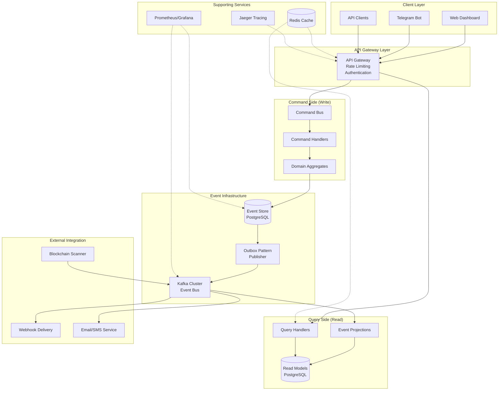

---

## Event Sourcing Architecture

### Event Flow Design

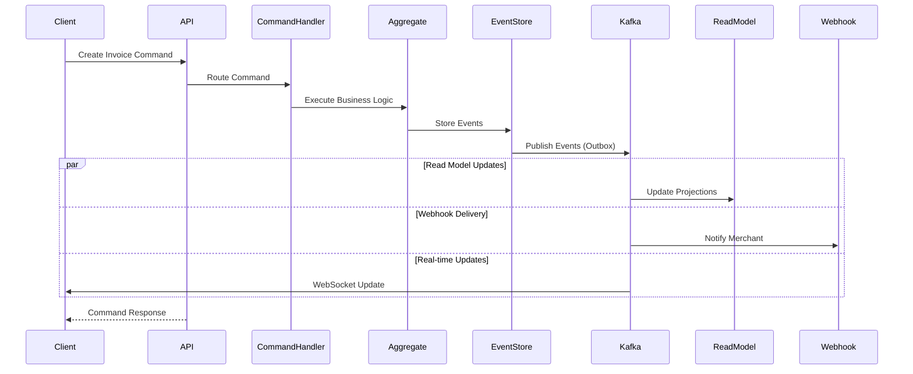

### Event Store Strategy

| Component               | Purpose                  | Technology        | Scalability               |
| ----------------------- | ------------------------ | ----------------- | ------------------------- |
| **Primary Event Store** | Immutable event log      | PostgreSQL JSONB  | Partitioned by time       |
| **Event Publishing**    | Guaranteed delivery      | Outbox pattern    | Transactional consistency |
| **Event Bus**           | Event distribution       | Kafka topics      | Horizontal scaling        |
| **Snapshots**           | Performance optimization | PostgreSQL tables | Periodic creation         |

### Event Processing Patterns

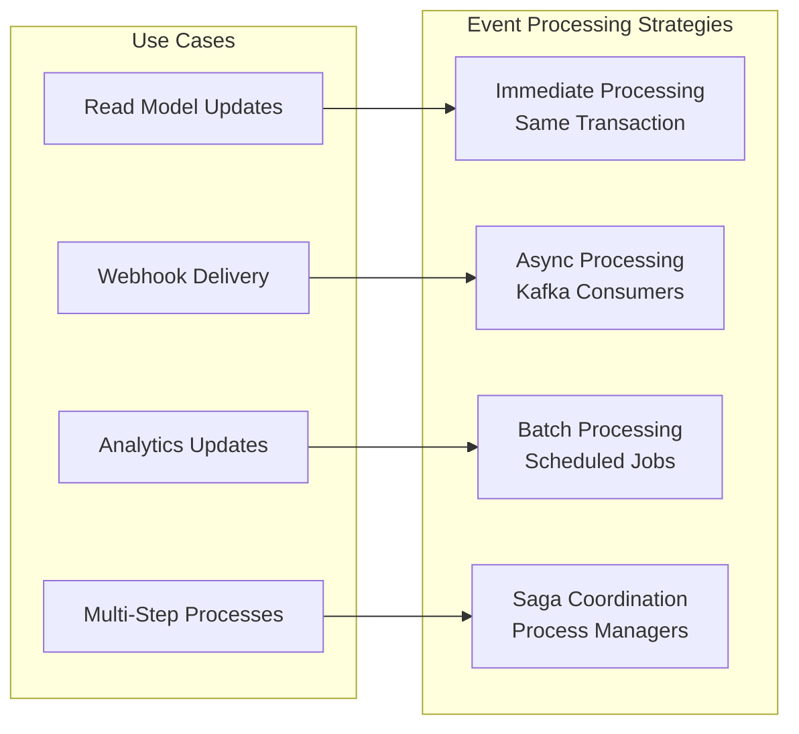

---

## CQRS Implementation Strategy

### Command and Query Separation

| Aspect          | Command Side (Write)  | Query Side (Read)        |
| --------------- | --------------------- | ------------------------ |
| **Data Model**  | Normalized aggregates | Denormalized views       |
| **Consistency** | Strong (ACID)         | Eventual                 |
| **Performance** | Optimized for writes  | Optimized for reads      |
| **Schema**      | Domain-driven         | Query-driven             |
| **Scaling**     | Vertical initially    | Horizontal read replicas |

### Aggregate Command Patterns

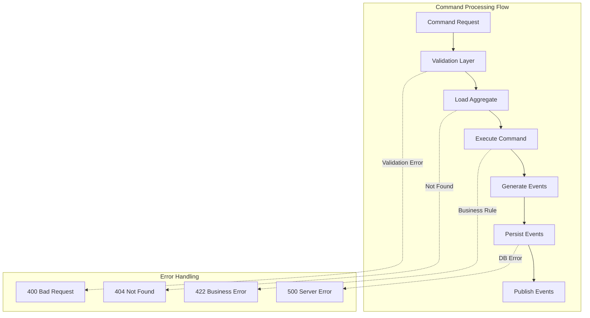

### Read Model Projection Strategy

| Read Model Type     | Update Frequency            | Consistency Model    | Use Case                        |
| ------------------- | --------------------------- | -------------------- | ------------------------------- |
| **Real-time Views** | Immediate (synchronous)     | Strong consistency   | Payment status, invoice details |
| **Dashboard Views** | Near real-time (< 1 second) | Eventual consistency | Merchant dashboards             |
| **Analytics Views** | Batch (5-15 minutes)        | Eventual consistency | Revenue reports, metrics        |
| **Archive Views**   | Daily/weekly                | Eventual consistency | Historical analysis             |

---

## Database Architecture

### Multi-Database Strategy

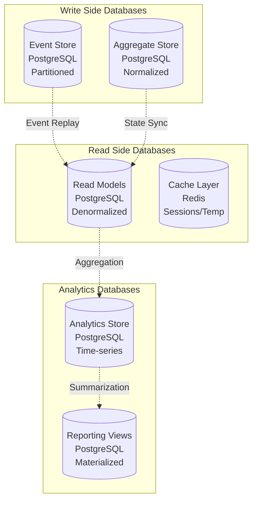

### Database Scaling Strategy

| Database Type   | Initial Setup     | Scale Trigger           | Scaling Approach   |
| --------------- | ----------------- | ----------------------- | ------------------ |
| **Event Store** | Single instance   | >1M events/day          | Partition by month |
| **Read Models** | Single instance   | >10K queries/hour       | Read replicas      |
| **Analytics**   | Shared with reads | Complex reporting needs | Dedicated instance |
| **Cache**       | Single Redis      | Memory pressure         | Redis cluster      |

---

## Kafka Event Bus Architecture

### Topic Design Strategy

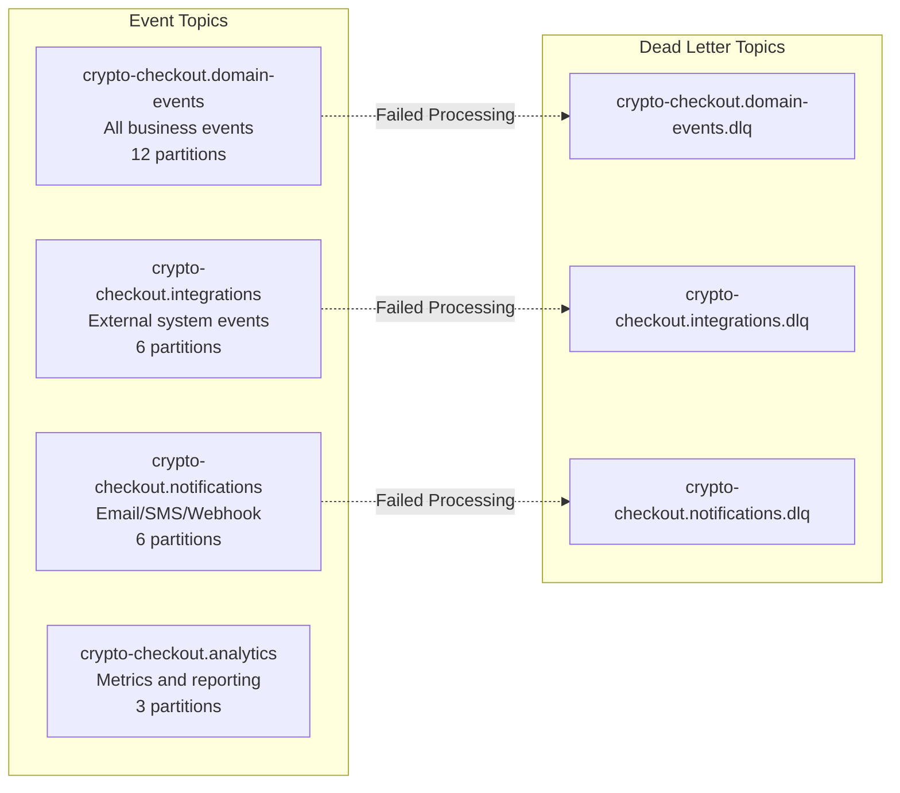

### Kafka Configuration Strategy

| Configuration Aspect     | Development | Production       | Reasoning            |
| ------------------------ | ----------- | ---------------- | -------------------- |
| **Broker Count**         | 1           | 3                | High availability    |
| **Replication Factor**   | 1           | 3                | Data durability      |
| **Min In-Sync Replicas** | 1           | 2                | Write availability   |
| **Retention Period**     | 7 days      | 30 days          | Compliance/debugging |
| **Compression**          | None        | LZ4              | Network efficiency   |
| **Cleanup Policy**       | Delete      | Delete + Compact | Event log + state    |

### Consumer Group Strategy

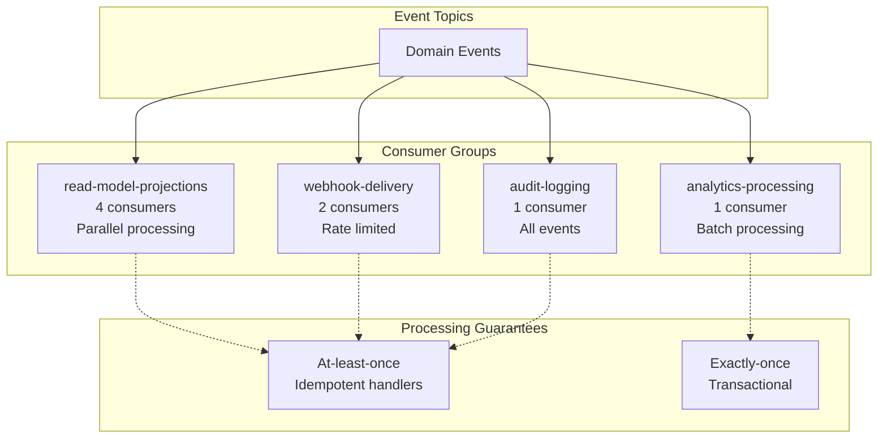

---

## Real-time Communication Architecture

### WebSocket Event Distribution

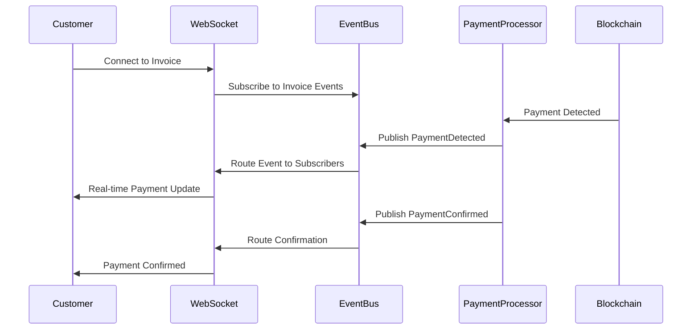

### Real-time Update Strategy

| Update Type                | User Type | Delivery Method | Latency Target | Fallback           |
| -------------------------- | --------- | --------------- | -------------- | ------------------ |
| **Payment Detection**      | Customer  | WebSocket       | <1 second      | Server-sent events |
| **Payment Confirmation**   | Customer  | WebSocket       | <1 second      | HTTP polling       |
| **Merchant Notifications** | Merchant  | Webhook         | <5 seconds     | Email backup       |
| **Dashboard Updates**      | Merchant  | WebSocket       | <10 seconds    | Manual refresh     |

---

## B2B2C Platform Architecture

### User Journey Overview

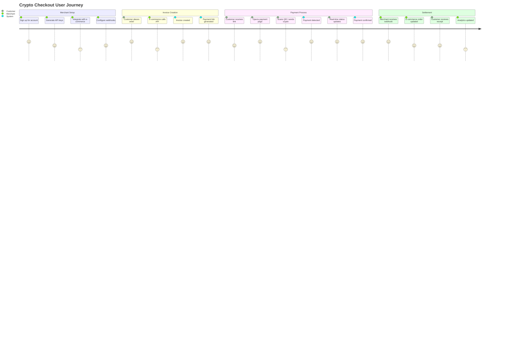

### Platform Value Proposition

| Stakeholder   | Value Delivered                 | Key Features                                   |
| ------------- | ------------------------------- | ---------------------------------------------- |
| **Merchants** | Easy crypto payment integration | API-first, webhook notifications, analytics    |
| **Customers** | Simple payment experience       | QR codes, real-time updates, mobile-friendly   |
| **Platform**  | Transaction fees, SaaS revenue  | Scalable architecture, compliance, reliability |

---

## Deployment Architecture

### Infrastructure Layout

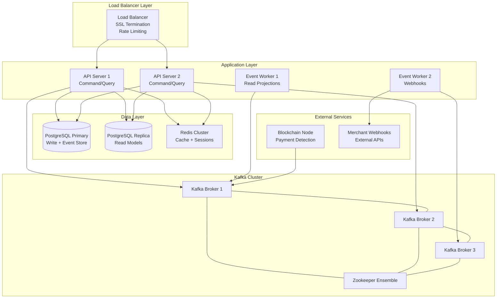

### Environment Strategy

| Environment     | Purpose             | Infrastructure      | Data Characteristics |
| --------------- | ------------------- | ------------------- | -------------------- |
| **Development** | Local development   | Docker Compose      | Synthetic test data  |
| **Staging**     | Integration testing | Minimal cloud setup | Production-like data |
| **Production**  | Live system         | Full redundancy     | Real customer data   |
| **DR**          | Disaster recovery   | Cross-region backup | Production replica   |

---

## Monitoring and Observability

### Monitoring Architecture

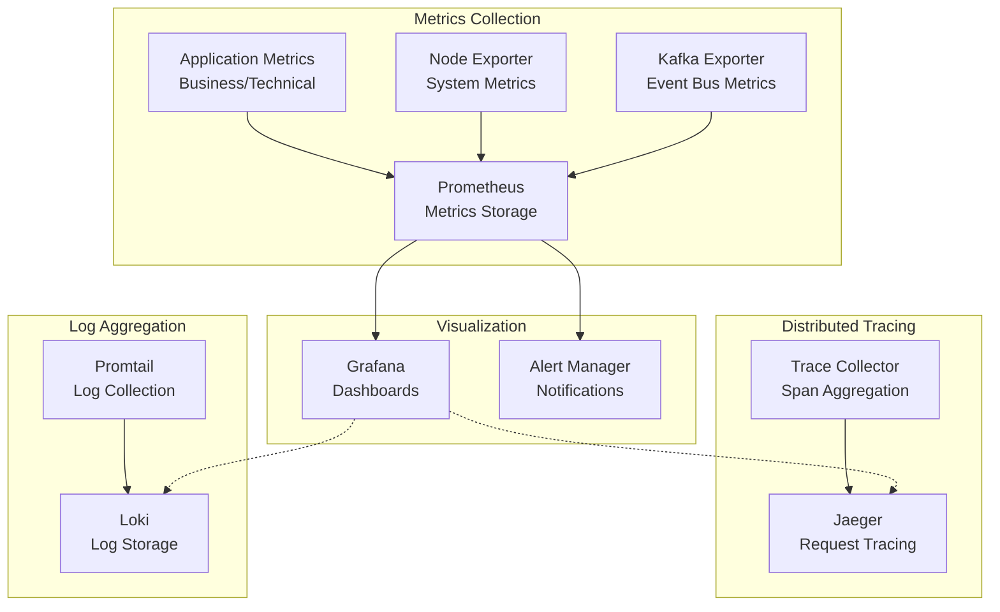

### Key Metrics Strategy

| Metric Category      | Key Indicators                                | Alert Thresholds         | Business Impact       |
| -------------------- | --------------------------------------------- | ------------------------ | --------------------- |
| **Business Metrics** | Invoice conversion rate, payment success rate | <95% success             | Revenue loss          |
| **API Performance**  | Request latency, error rate                   | >500ms p95, >1% errors   | User experience       |
| **Event Processing** | Event lag, processing rate                    | >1000 lag, <100/sec rate | System responsiveness |
| **Infrastructure**   | CPU, memory, disk usage                       | >80% sustained           | System stability      |

### Alerting Strategy

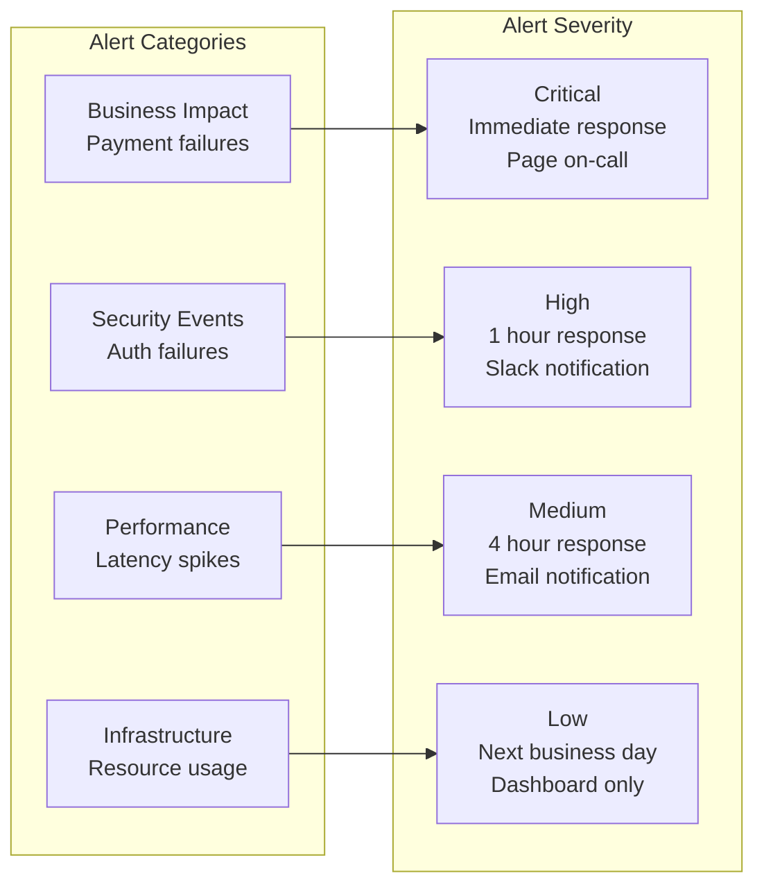

---

## Security Architecture

### Security Layers

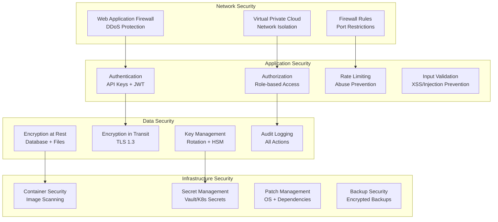

### Compliance Framework

| Regulation        | Scope                      | Implementation                   | Verification         |
| ----------------- | -------------------------- | -------------------------------- | -------------------- |
| **PCI DSS**       | Payment card data (future) | Network segmentation, encryption | Quarterly scans      |
| **GDPR**          | EU customer data           | Data minimization, consent       | Annual audit         |
| **SOC 2 Type II** | Security controls          | Access management, monitoring    | Annual assessment    |
| **ISO 27001**     | Information security       | ISMS implementation              | Annual certification |

---

## Performance and Scaling Strategy

### Scalability Architecture

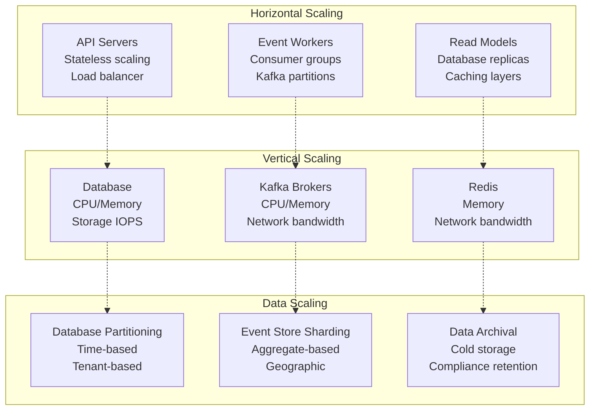

### Performance Targets

| Component              | Latency Target        | Throughput Target | Availability Target |
| ---------------------- | --------------------- | ----------------- | ------------------- |
| **API Endpoints**      | <200ms p95            | 1000 req/sec      | 99.9%               |
| **Payment Processing** | <30 seconds detection | 100 payments/sec  | 99.95%              |
| **Event Processing**   | <1 second lag         | 10K events/sec    | 99.9%               |
| **Webhook Delivery**   | <10 seconds           | 1K webhooks/sec   | 99.5%               |

