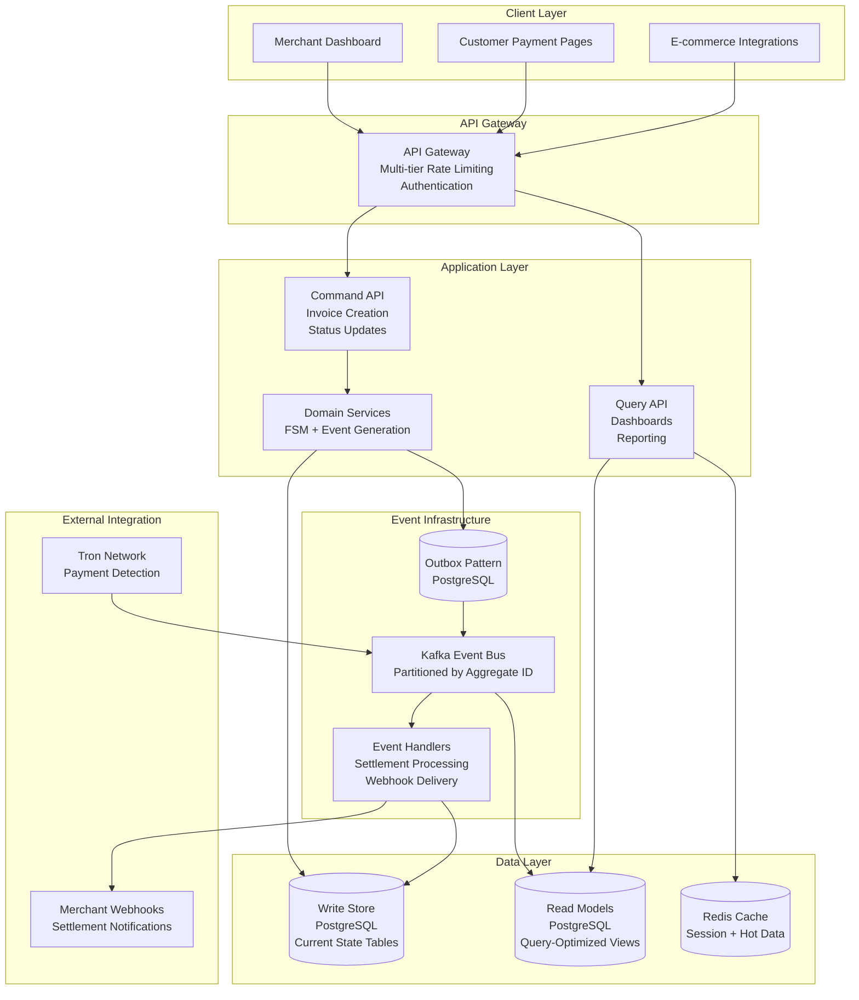
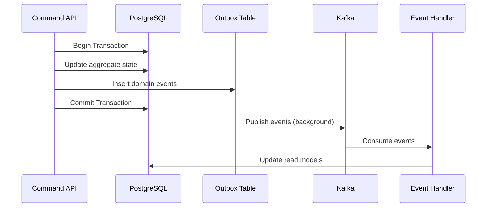
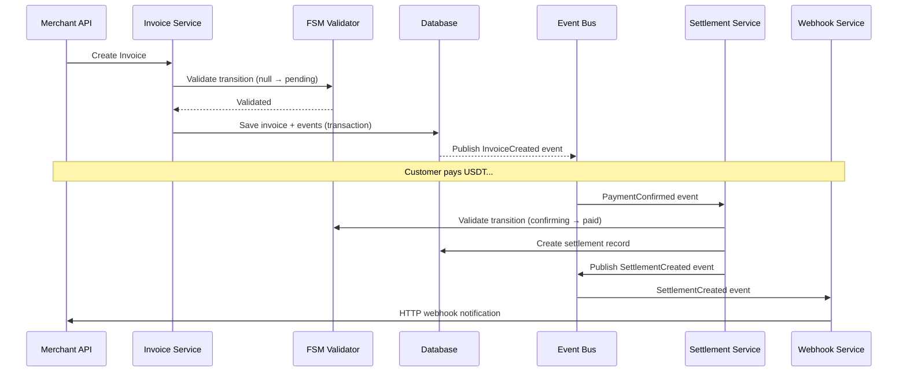
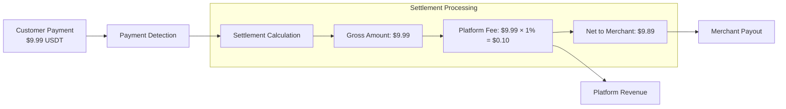
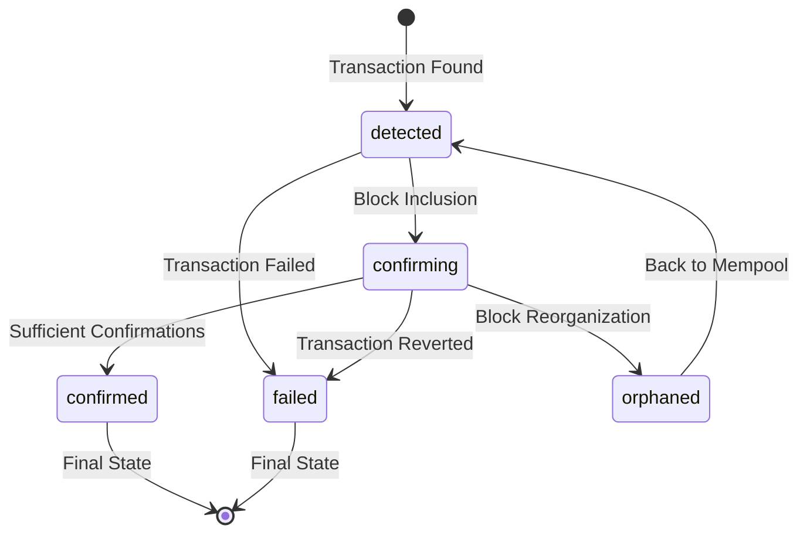
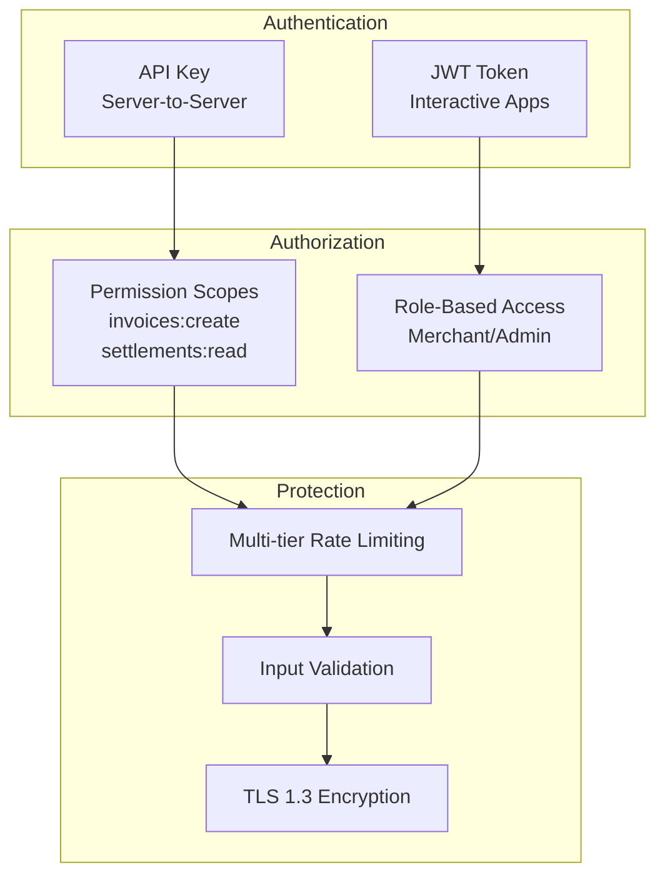

# Crypto Checkout - Consolidated Architecture

- [Crypto Checkout - Consolidated Architecture](#crypto-checkout---consolidated-architecture)
  - [Core Architecture Decisions](#core-architecture-decisions)
  - [System Architecture Overview](#system-architecture-overview)
  - [Data Architecture](#data-architecture)
    - [Event Store + State Store Hybrid](#event-store--state-store-hybrid)
    - [Outbox Pattern Implementation](#outbox-pattern-implementation)
    - [Table Structure](#table-structure)
  - [Core Business Flows](#core-business-flows)
    - [Invoice Creation \& Payment Processing](#invoice-creation--payment-processing)
    - [Platform Fee Processing](#platform-fee-processing)
  - [API Design Principles](#api-design-principles)
    - [Fee Transparency Rules](#fee-transparency-rules)
    - [Multi-Tier Rate Limiting](#multi-tier-rate-limiting)
  - [Payment Confirmation Strategy](#payment-confirmation-strategy)
    - [Amount-Based Confirmation Requirements](#amount-based-confirmation-requirements)
    - [Payment Status Transitions](#payment-status-transitions)
  - [Domain Model Implementation](#domain-model-implementation)
    - [FSM Integration Pattern](#fsm-integration-pattern)
    - [Service-Level Event Publication](#service-level-event-publication)
  - [Technology Stack](#technology-stack)
    - [Core Infrastructure](#core-infrastructure)
    - [Development Dependencies](#development-dependencies)
  - [Security Architecture](#security-architecture)
    - [Authentication \& Authorization](#authentication--authorization)
    - [Cryptographic Standards](#cryptographic-standards)
  - [Operational Considerations](#operational-considerations)
    - [Monitoring \& Alerting](#monitoring--alerting)
    - [Backup \& Recovery](#backup--recovery)

## Core Architecture Decisions

| Decision Area              | Choice                                        | Rationale                                                          |
| -------------------------- | --------------------------------------------- | ------------------------------------------------------------------ |
| **Architecture Pattern**   | Event Sourcing + CQRS                         | Audit requirements, scalability, eventual consistency needs        |
| **Data Storage**           | Hybrid: Kafka events + PostgreSQL read models | Performance optimization while maintaining event sourcing benefits |
| **Settlement Model**       | Near-real-time (< 30 seconds)                 | Balance between user experience and system reliability             |
| **Fee Model**              | Hidden from customers, visible to merchants   | Clean customer UX, transparent merchant reporting                  |
| **State Management**       | FSM validation + Domain event collection      | Type safety with clear separation of concerns                      |
| **Cryptocurrency Support** | USDT on Tron (TRC-20) only                    | Simplicity and low transaction costs                               |

---

## System Architecture Overview



---

## Data Architecture

### Event Store + State Store Hybrid

| Storage Type      | Technology | Purpose                                | Consistency Model        |
| ----------------- | ---------- | -------------------------------------- | ------------------------ |
| **Event Log**     | Kafka      | Immutable audit trail, event replay    | Append-only, partitioned |
| **Current State** | PostgreSQL | Transaction processing, business logic | ACID, normalized         |
| **Read Models**   | PostgreSQL | Query optimization, reporting          | Eventually consistent    |
| **Cache Layer**   | Redis      | Hot data, session management           | In-memory, volatile      |

### Outbox Pattern Implementation



### Table Structure

**Write Store (Current State)**
```sql
-- Core aggregates
invoices (id, merchant_id, status, amount, expires_at, ...)
payments (id, invoice_id, tx_hash, amount, status, confirmations, ...)
settlements (id, invoice_id, gross_amount, fee_amount, net_amount, ...)
merchants (id, business_name, fee_percentage, settings, ...)

-- Outbox for event publishing
outbox_events (id, aggregate_id, event_type, event_data, processed_at)
```

**Read Models (Query Optimization)**
```sql
-- Optimized for merchant dashboards
merchant_dashboard_view (merchant_id, total_revenue, transaction_count, ...)
invoice_summary_view (invoice_id, customer_display_data, payment_progress, ...)

-- Analytics and reporting
daily_settlement_metrics (merchant_id, date, gross_volume, fees_collected, ...)
payment_confirmation_stats (date, avg_confirmation_time, failure_rate, ...)
```

---

## Core Business Flows

### Invoice Creation & Payment Processing



### Platform Fee Processing



---

## API Design Principles

### Fee Transparency Rules

**Customer-Facing APIs** (Clean UX)
```json
// GET /api/v1/public/invoice/{id}
{
  "id": "inv_123",
  "total": 9.99,
  "usdt_amount": 9.99,
  "status": "pending"
  // No fee information exposed
}
```

**Merchant-Facing APIs** (Full Transparency)
```json
// GET /api/v1/settlements/{id}
{
  "id": "set_456",
  "invoice_id": "inv_123",
  "gross_amount": 9.99,
  "platform_fee_amount": 0.10,
  "platform_fee_percentage": 1.0,
  "net_amount": 9.89,
  "status": "completed"
}
```

### Multi-Tier Rate Limiting

| Tier           | Scope        | Limits                                                   | Purpose                   |
| -------------- | ------------ | -------------------------------------------------------- | ------------------------- |
| **API Key**    | Per merchant | Invoice creation: 1000/hour<br/>Status checks: 5000/hour | Business logic protection |
| **IP Address** | Per client   | 100 requests/minute                                      | Abuse prevention          |
| **Global**     | System-wide  | 1000 requests/second                                     | Infrastructure protection |

---

## Payment Confirmation Strategy

### Amount-Based Confirmation Requirements

```go
func GetRequiredConfirmations(amount decimal.Decimal, merchantOverride *int) int {
    if merchantOverride != nil {
        return *merchantOverride
    }
    
    // Default amount-based logic
    switch {
    case amount.LessThan(decimal.NewFromInt(100)):
        return 1   // < $100: 1 confirmation (~15 seconds)
    case amount.LessThan(decimal.NewFromInt(10000)):
        return 12  // $100-$10k: 12 confirmations (~3 minutes)
    default:
        return 19  // > $10k: 19 confirmations (~5 minutes)
    }
}
```

### Payment Status Transitions



---

## Domain Model Implementation

### FSM Integration Pattern

```go
// Aggregate with FSM validation
type Invoice struct {
    id            InvoiceID
    status        InvoiceStatus
    amount        Money
    fsm           *fsm.FSM
    pendingEvents []DomainEvent
}

func (i *Invoice) ProcessPayment() error {
    // FSM validates state transition
    if err := i.fsm.Event("payment_received"); err != nil {
        return fmt.Errorf("invalid transition: %w", err)
    }
    
    // Collect domain events for service publication
    i.pendingEvents = append(i.pendingEvents, PaymentProcessedEvent{
        InvoiceID: i.id,
        From: StatusPending,
        To: StatusConfirming,
        OccurredAt: time.Now(),
    })
    
    return nil
}

func (i *Invoice) GetPendingEvents() []DomainEvent {
    return i.pendingEvents
}
```

### Service-Level Event Publication

```go
func (s *InvoiceService) ProcessPayment(invoiceID InvoiceID) error {
    return s.db.WithTx(func(tx *gorm.DB) error {
        // Load aggregate
        invoice, err := s.repo.FindByID(invoiceID)
        if err != nil { return err }
        
        // Domain logic with FSM validation
        if err := invoice.ProcessPayment(); err != nil {
            return err
        }
        
        // Persist state changes
        if err := s.repo.Save(invoice); err != nil {
            return err
        }
        
        // Store events for outbox publication
        events := invoice.GetPendingEvents()
        for _, event := range events {
            if err := s.outbox.Store(event); err != nil {
                return err
            }
        }
        
        return nil
    })
}
```

---

## Technology Stack

### Core Infrastructure

| Component         | Technology | Version | Purpose                               |
| ----------------- | ---------- | ------- | ------------------------------------- |
| **Application**   | Go         | 1.21+   | Main application language             |
| **Database**      | PostgreSQL | 15+     | ACID transactions, JSON support       |
| **Event Bus**     | Kafka      | 3.5+    | Event streaming, durability           |
| **Cache**         | Redis      | 7+      | Session storage, hot data             |
| **Load Balancer** | Nginx      | 1.24+   | Traffic distribution, SSL termination |

### Development Dependencies

| Component        | Technology              | Purpose                         |
| ---------------- | ----------------------- | ------------------------------- |
| **ORM**          | GORM                    | Database operations, migrations |
| **FSM**          | looplab/fsm             | State machine validation        |
| **Kafka Client** | segmentio/kafka-go      | Event publishing/consuming      |
| **Validation**   | go-playground/validator | Input validation                |
| **Testing**      | testify/mock            | Unit testing, mocking           |

---

## Security Architecture

### Authentication & Authorization



### Cryptographic Standards

| Component       | Algorithm   | Key Size    | Purpose                 |
| --------------- | ----------- | ----------- | ----------------------- |
| **API Keys**    | HMAC-SHA256 | 256-bit     | Request authentication  |
| **Database**    | AES-256-GCM | 256-bit     | Encryption at rest      |
| **TLS**         | TLS 1.3     | ECDSA P-256 | Transport security      |
| **Wallet Keys** | secp256k1   | 256-bit     | Tron address generation |

---

## Operational Considerations

### Monitoring & Alerting

**Business Metrics**
- Settlement success rate (target: >99.5%)
- Average settlement time (target: <30 seconds)
- Payment confirmation time (target: <5 minutes)
- Platform fee collection accuracy (target: 100%)

**Technical Metrics**
- API response times (target: p95 <500ms)
- Event processing lag (target: <1000 messages)
- Database connection utilization (alert: >80%)
- Kafka consumer lag (alert: >5000 messages)

### Backup & Recovery

| Data Type         | Backup Frequency       | Retention | Recovery Target              |
| ----------------- | ---------------------- | --------- | ---------------------------- |
| **Database**      | Every 6 hours          | 30 days   | RTO: 1 hour, RPO: 15 minutes |
| **Kafka Events**  | Continuous replication | 7 days    | RTO: 5 minutes, RPO: 0       |
| **Configuration** | On change              | 90 days   | RTO: 10 minutes, RPO: 0      |


