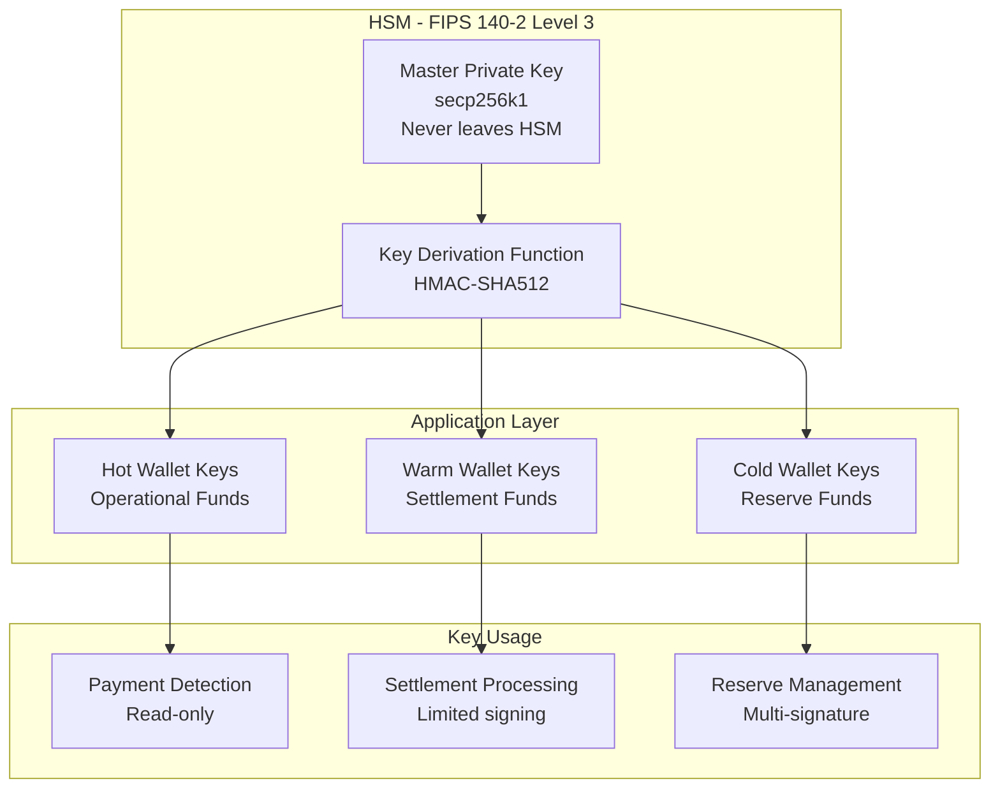
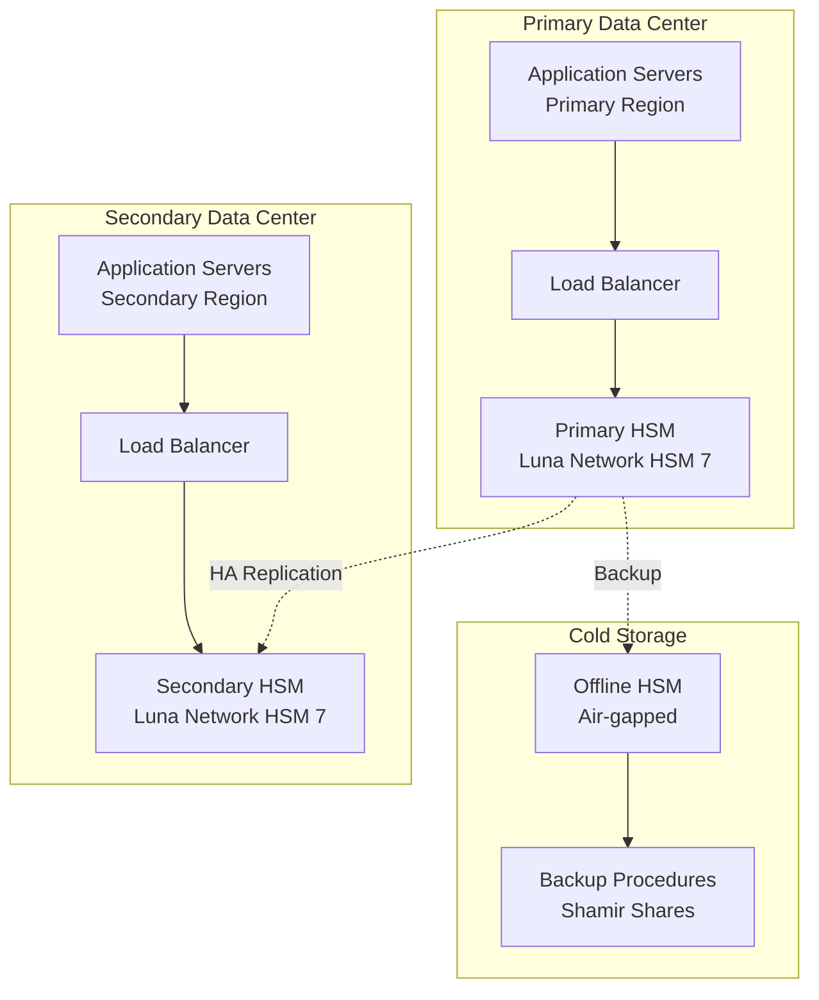
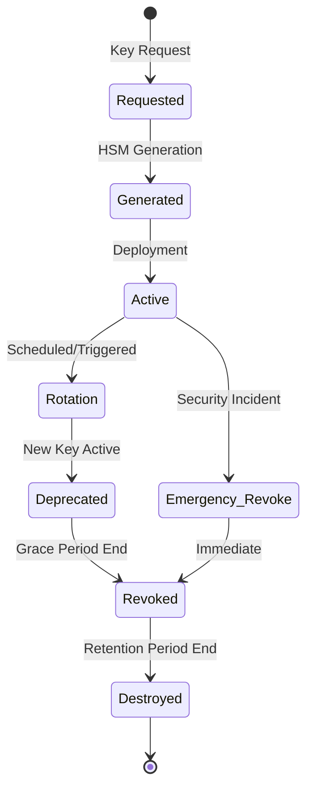
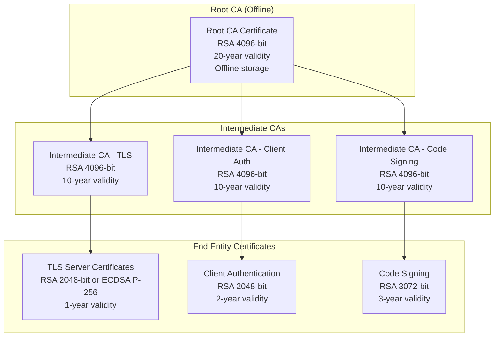

# Crypto Checkout - Cryptographic Implementation

- [Crypto Checkout - Cryptographic Implementation](#crypto-checkout---cryptographic-implementation)
  - [Architecture Principles](#architecture-principles)
  - [Wallet Private Key Management](#wallet-private-key-management)
    - [Key Generation Hierarchy](#key-generation-hierarchy)
    - [Master Key Generation Procedure](#master-key-generation-procedure)
    - [Hierarchical Deterministic (HD) Key Derivation](#hierarchical-deterministic-hd-key-derivation)
    - [Key Storage Tiers](#key-storage-tiers)
  - [HSM Integration Specifications](#hsm-integration-specifications)
    - [Hardware Security Module Architecture](#hardware-security-module-architecture)
    - [HSM Connection Configuration](#hsm-connection-configuration)
    - [PKCS#11 Interface Implementation](#pkcs11-interface-implementation)
    - [HSM High Availability Configuration](#hsm-high-availability-configuration)
  - [Encryption Key Management Workflows](#encryption-key-management-workflows)
    - [Key Lifecycle Management](#key-lifecycle-management)
    - [Database Encryption Key Management](#database-encryption-key-management)
    - [API Authentication Key Management](#api-authentication-key-management)
    - [Key Rotation Schedules](#key-rotation-schedules)
  - [Certificate Management Procedures](#certificate-management-procedures)
    - [Certificate Authority (CA) Hierarchy](#certificate-authority-ca-hierarchy)
    - [TLS Certificate Management](#tls-certificate-management)
    - [Client Certificate Authentication](#client-certificate-authentication)
    - [Certificate Revocation and OCSP](#certificate-revocation-and-ocsp)
  - [Security Monitoring and Incident Response](#security-monitoring-and-incident-response)
    - [Cryptographic Event Monitoring](#cryptographic-event-monitoring)
    - [Incident Response Procedures](#incident-response-procedures)
  - [Compliance and Audit Requirements](#compliance-and-audit-requirements)
    - [Key Management Audit Trail](#key-management-audit-trail)
    - [Compliance Frameworks](#compliance-frameworks)
    - [Regular Security Assessments](#regular-security-assessments)

## Architecture Principles

- **Defense in Depth**: Multiple layers of cryptographic protection
- **Zero Trust**: All communications and data encrypted regardless of location
- **Key Separation**: Different keys for different purposes with proper isolation
- **Hardware Security**: Critical keys stored and operated within HSMs
- **Compliance Ready**: FIPS 140-2 Level 3 and PCI DSS compliant procedures

---

## Wallet Private Key Management

### Key Generation Hierarchy



### Master Key Generation Procedure

| Step                         | Operation                         | Security Level     | Validation                 |
| ---------------------------- | --------------------------------- | ------------------ | -------------------------- |
| **1. Entropy Collection**    | Hardware RNG from HSM             | FIPS 140-2 Level 3 | NIST SP 800-90A compliance |
| **2. Master Seed Creation**  | 256-bit entropy → BIP32 seed      | HSM-internal       | Seed never exported        |
| **3. Master Key Derivation** | HMAC-SHA512(seed, "Bitcoin seed") | HSM-internal       | secp256k1 validation       |
| **4. Root Key Storage**      | HSM persistent storage            | Tamper-resistant   | Dual-person control        |

### Hierarchical Deterministic (HD) Key Derivation

**Derivation Path Structure**:
```
m / purpose' / coin_type' / account' / change / address_index

Where:
- purpose = 44' (BIP44)
- coin_type = 195' (Tron)
- account = 0', 1', 2', ... (merchant accounts)
- change = 0 (external), 1 (internal)
- address_index = 0, 1, 2, ... (sequential addresses)
```

**Example Derivation Paths**:
```
m/44'/195'/0'/0/0    # First payment address for account 0
m/44'/195'/0'/1/0    # First change address for account 0
m/44'/195'/1'/0/0    # First payment address for account 1
m/44'/195'/2'/0/100  # 101st payment address for account 2
```

### Key Storage Tiers

| Tier            | Storage Location                | Access Pattern        | Security Controls                |
| --------------- | ------------------------------- | --------------------- | -------------------------------- |
| **Hot Wallet**  | HSM + Application Memory        | Real-time operations  | HSM authentication, key rotation |
| **Warm Wallet** | HSM Only                        | Settlement operations | Dual-approval, time delays       |
| **Cold Wallet** | Offline HSM                     | Manual operations     | Air-gapped, multi-signature      |
| **Backup Keys** | Geographically distributed HSMs | Disaster recovery     | Shamir's Secret Sharing          |

---

## HSM Integration Specifications

### Hardware Security Module Architecture



### HSM Connection Configuration

**Primary HSM (Thales Luna Network HSM 7)**:
```go
// HSM Configuration Structure
type HSMConfig struct {
    ServerIP        string `json:"server_ip"`
    ServerPort      int    `json:"server_port"`
    ClientCertPath  string `json:"client_cert_path"`
    ClientKeyPath   string `json:"client_key_path"`
    ServerCertPath  string `json:"server_cert_path"`
    SlotID          int    `json:"slot_id"`
    PartitionLabel  string `json:"partition_label"`
    HAGroupID       int    `json:"ha_group_id"`
    RetryAttempts   int    `json:"retry_attempts"`
    TimeoutSeconds  int    `json:"timeout_seconds"`
}

// Production HSM Configuration
var ProductionHSMConfig = HSMConfig{
    ServerIP:        "10.0.1.100",
    ServerPort:      1792,
    ClientCertPath:  "/etc/ssl/certs/hsm-client.crt",
    ClientKeyPath:   "/etc/ssl/private/hsm-client.key",
    ServerCertPath:  "/etc/ssl/certs/hsm-server.crt",
    SlotID:          1,
    PartitionLabel:  "crypto-checkout-prod",
    HAGroupID:       1,
    RetryAttempts:   3,
    TimeoutSeconds:  30,
}
```

### PKCS#11 Interface Implementation

**Go HSM Client Library**:
```go
package hsm

import (
    "crypto"
    "crypto/rsa"
    "crypto/ecdsa"
    "github.com/miekg/pkcs11"
    "github.com/btcsuite/btcd/btcec/v2"
)

type HSMClient struct {
    ctx     *pkcs11.Ctx
    session pkcs11.SessionHandle
    config  HSMConfig
}

// Initialize HSM connection with failover
func NewHSMClient(config HSMConfig) (*HSMClient, error) {
    // Load PKCS#11 library
    ctx := pkcs11.New(config.LibraryPath)
    if ctx == nil {
        return nil, fmt.Errorf("failed to load PKCS#11 library")
    }
    
    // Initialize HSM
    if err := ctx.Initialize(); err != nil {
        return nil, fmt.Errorf("HSM initialization failed: %v", err)
    }
    
    // Open session with authentication
    session, err := ctx.OpenSession(uint(config.SlotID), 
        pkcs11.CKF_SERIAL_SESSION|pkcs11.CKF_RW_SESSION)
    if err != nil {
        return nil, fmt.Errorf("HSM session open failed: %v", err)
    }
    
    // Authenticate with partition password
    if err := ctx.Login(session, pkcs11.CKU_USER, config.Password); err != nil {
        return nil, fmt.Errorf("HSM authentication failed: %v", err)
    }
    
    return &HSMClient{
        ctx:     ctx,
        session: session,
        config:  config,
    }, nil
}

// Generate secp256k1 key pair for Tron addresses
func (h *HSMClient) GenerateSecp256k1KeyPair(label string) (*ecdsa.PublicKey, error) {
    // Key generation template
    publicKeyTemplate := []*pkcs11.Attribute{
        pkcs11.NewAttribute(pkcs11.CKA_CLASS, pkcs11.CKO_PUBLIC_KEY),
        pkcs11.NewAttribute(pkcs11.CKA_KEY_TYPE, pkcs11.CKK_EC),
        pkcs11.NewAttribute(pkcs11.CKA_TOKEN, true),
        pkcs11.NewAttribute(pkcs11.CKA_VERIFY, true),
        pkcs11.NewAttribute(pkcs11.CKA_LABEL, label),
        pkcs11.NewAttribute(pkcs11.CKA_EC_PARAMS, secp256k1OID),
    }
    
    privateKeyTemplate := []*pkcs11.Attribute{
        pkcs11.NewAttribute(pkcs11.CKA_CLASS, pkcs11.CKO_PRIVATE_KEY),
        pkcs11.NewAttribute(pkcs11.CKA_KEY_TYPE, pkcs11.CKK_EC),
        pkcs11.NewAttribute(pkcs11.CKA_TOKEN, true),
        pkcs11.NewAttribute(pkcs11.CKA_PRIVATE, true),
        pkcs11.NewAttribute(pkcs11.CKA_SENSITIVE, true),
        pkcs11.NewAttribute(pkcs11.CKA_EXTRACTABLE, false),
        pkcs11.NewAttribute(pkcs11.CKA_SIGN, true),
        pkcs11.NewAttribute(pkcs11.CKA_LABEL, label),
    }
    
    // Generate key pair in HSM
    pubKey, privKey, err := h.ctx.GenerateKeyPair(h.session,
        []*pkcs11.Mechanism{pkcs11.NewMechanism(pkcs11.CKM_EC_KEY_PAIR_GEN, nil)},
        publicKeyTemplate, privateKeyTemplate)
    if err != nil {
        return nil, fmt.Errorf("key generation failed: %v", err)
    }
    
    // Extract public key for address generation
    return h.extractPublicKey(pubKey)
}

// Sign transaction hash using HSM private key
func (h *HSMClient) SignHash(keyLabel string, hash []byte) ([]byte, error) {
    // Find private key by label
    privKey, err := h.findPrivateKey(keyLabel)
    if err != nil {
        return nil, err
    }
    
    // Initialize signing operation
    mechanism := []*pkcs11.Mechanism{
        pkcs11.NewMechanism(pkcs11.CKM_ECDSA, nil),
    }
    
    if err := h.ctx.SignInit(h.session, mechanism, privKey); err != nil {
        return nil, fmt.Errorf("sign initialization failed: %v", err)
    }
    
    // Perform signature
    signature, err := h.ctx.Sign(h.session, hash)
    if err != nil {
        return nil, fmt.Errorf("signing failed: %v", err)
    }
    
    return signature, nil
}
```

### HSM High Availability Configuration

| Component       | Primary            | Secondary            | Failover Strategy                        |
| --------------- | ------------------ | -------------------- | ---------------------------------------- |
| **HSM Cluster** | Thales Luna SA-7   | Thales Luna SA-7     | Automatic failover with 3-second timeout |
| **Network**     | Dedicated VLAN     | Dedicated VLAN       | Redundant network paths                  |
| **Application** | Primary datacenter | Secondary datacenter | Health check based routing               |
| **Monitoring**  | Real-time alerts   | Real-time alerts     | 24/7 NOC monitoring                      |

---

## Encryption Key Management Workflows

### Key Lifecycle Management



### Database Encryption Key Management

**Encryption Key Hierarchy**:
```go
type DatabaseEncryption struct {
    // Master key stored in HSM
    MasterKey struct {
        HSMLabel    string `json:"hsm_label"`
        KeyVersion  int    `json:"key_version"`
        Algorithm   string `json:"algorithm"` // AES-256-GCM
        CreatedAt   time.Time `json:"created_at"`
        ExpiresAt   time.Time `json:"expires_at"`
    }
    
    // Data encryption keys (DEKs) encrypted by master key
    DataKeys []struct {
        KeyID       string `json:"key_id"`
        Purpose     string `json:"purpose"` // table_name or column_name
        EncryptedDEK []byte `json:"encrypted_dek"`
        IV          []byte `json:"iv"`
        CreatedAt   time.Time `json:"created_at"`
        Status      string `json:"status"` // active, deprecated, revoked
    }
}

// Key rotation workflow
func (dm *DatabaseManager) RotateEncryptionKeys() error {
    // Generate new master key in HSM
    newMasterKey, err := dm.hsm.GenerateAESKey("db-master-v" + nextVersion)
    if err != nil {
        return fmt.Errorf("master key generation failed: %v", err)
    }
    
    // Re-encrypt all data encryption keys with new master key
    for _, table := range dm.encryptedTables {
        if err := dm.reencryptTableDEK(table, newMasterKey); err != nil {
            return fmt.Errorf("table %s re-encryption failed: %v", table, err)
        }
    }
    
    // Update key metadata
    dm.updateKeyMetadata(newMasterKey)
    
    // Schedule old key for deprecation
    dm.deprecateKey(dm.currentMasterKey, time.Now().Add(30*24*time.Hour))
    
    return nil
}
```

### API Authentication Key Management

**HMAC Key Structure**:
```go
type APIKeyMaterial struct {
    // Public identifier (sent in requests)
    KeyID       string    `json:"key_id"`       // sk_live_abc123...
    
    // Secret material (stored in HSM)
    HMACSecret  []byte    `json:"-"`            // 256-bit secret
    HSMLabel    string    `json:"hsm_label"`    // HSM key reference
    
    // Metadata
    MerchantID  string    `json:"merchant_id"`
    Permissions []string  `json:"permissions"`
    KeyType     string    `json:"key_type"`     // live, test
    Status      string    `json:"status"`       // active, revoked
    CreatedAt   time.Time `json:"created_at"`
    ExpiresAt   *time.Time `json:"expires_at"`
    LastUsedAt  *time.Time `json:"last_used_at"`
}

// Generate new API key with HSM-generated secret
func (am *APIKeyManager) GenerateAPIKey(merchantID string, permissions []string) (*APIKeyMaterial, error) {
    // Generate key ID
    keyID := fmt.Sprintf("sk_%s_%s", 
        am.environment, // live or test
        generateRandomString(32))
    
    // Generate HMAC secret in HSM
    hsmLabel := fmt.Sprintf("api-key-%s", keyID)
    secretBytes, err := am.hsm.GenerateHMACSecret(hsmLabel, 256)
    if err != nil {
        return nil, fmt.Errorf("HMAC secret generation failed: %v", err)
    }
    
    // Create key material structure
    keyMaterial := &APIKeyMaterial{
        KeyID:       keyID,
        HSMLabel:    hsmLabel,
        MerchantID:  merchantID,
        Permissions: permissions,
        KeyType:     am.environment,
        Status:      "active",
        CreatedAt:   time.Now(),
    }
    
    // Store metadata in database (secret stays in HSM)
    if err := am.db.StoreAPIKeyMetadata(keyMaterial); err != nil {
        return nil, fmt.Errorf("key metadata storage failed: %v", err)
    }
    
    return keyMaterial, nil
}

// Validate HMAC signature using HSM
func (am *APIKeyManager) ValidateHMACSignature(keyID, signature string, payload []byte) (bool, error) {
    // Retrieve key metadata
    keyMaterial, err := am.db.GetAPIKeyMetadata(keyID)
    if err != nil {
        return false, fmt.Errorf("key lookup failed: %v", err)
    }
    
    if keyMaterial.Status != "active" {
        return false, fmt.Errorf("key is not active")
    }
    
    // Validate signature using HSM
    valid, err := am.hsm.ValidateHMAC(keyMaterial.HSMLabel, payload, signature)
    if err != nil {
        return false, fmt.Errorf("HMAC validation failed: %v", err)
    }
    
    // Update last used timestamp
    am.db.UpdateLastUsed(keyID, time.Now())
    
    return valid, nil
}
```

### Key Rotation Schedules

| Key Type                | Rotation Frequency    | Trigger Conditions                          | Grace Period |
| ----------------------- | --------------------- | ------------------------------------------- | ------------ |
| **Master Database Key** | 1 year                | Version upgrade, security incident          | 30 days      |
| **API HMAC Keys**       | 2 years               | Merchant request, compromise                | 90 days      |
| **TLS Certificates**    | 1 year                | Certificate expiry, security best practices | 30 days      |
| **Wallet Private Keys** | Never (HD derivation) | Security compromise only                    | Immediate    |
| **HSM Authentication**  | 6 months              | Scheduled maintenance                       | 7 days       |

---

## Certificate Management Procedures

### Certificate Authority (CA) Hierarchy



### TLS Certificate Management

**Certificate Configuration**:
```go
type TLSCertificate struct {
    // Certificate identity
    CommonName       string   `json:"common_name"`
    SubjectAltNames  []string `json:"subject_alt_names"`
    Organization     string   `json:"organization"`
    OrganizationUnit string   `json:"organization_unit"`
    Country          string   `json:"country"`
    
    // Cryptographic parameters
    KeyAlgorithm     string   `json:"key_algorithm"`    // RSA or ECDSA
    KeySize          int      `json:"key_size"`         // 2048, 3072, 4096 for RSA
    SignatureAlgorithm string `json:"signature_algorithm"` // SHA256WithRSA
    
    // Validity and lifecycle
    ValidFrom        time.Time `json:"valid_from"`
    ValidTo          time.Time `json:"valid_to"`
    RenewalThreshold int       `json:"renewal_threshold"` // Days before expiry
    
    // Storage and deployment
    HSMKeyLabel      string   `json:"hsm_key_label"`
    CertificatePEM   string   `json:"certificate_pem"`
    CertificateChain []string `json:"certificate_chain"`
    
    // Metadata
    SerialNumber     string   `json:"serial_number"`
    Thumbprint       string   `json:"thumbprint"`
    Status           string   `json:"status"` // active, expiring, expired, revoked
}

// Automated certificate renewal
func (cm *CertificateManager) AutoRenewCertificates() error {
    // Find certificates expiring within threshold
    expiringCerts, err := cm.db.FindExpiringCertificates(30) // 30 days
    if err != nil {
        return fmt.Errorf("certificate lookup failed: %v", err)
    }
    
    for _, cert := range expiringCerts {
        // Generate new key pair in HSM
        newKeyLabel := fmt.Sprintf("%s-v%d", cert.HSMKeyLabel, cert.Version+1)
        publicKey, err := cm.hsm.GenerateRSAKeyPair(newKeyLabel, 2048)
        if err != nil {
            log.Errorf("Key generation failed for %s: %v", cert.CommonName, err)
            continue
        }
        
        // Generate certificate signing request
        csr, err := cm.generateCSR(cert, publicKey)
        if err != nil {
            log.Errorf("CSR generation failed for %s: %v", cert.CommonName, err)
            continue
        }
        
        // Submit to Certificate Authority
        newCert, err := cm.ca.SignCertificate(csr)
        if err != nil {
            log.Errorf("Certificate signing failed for %s: %v", cert.CommonName, err)
            continue
        }
        
        // Deploy new certificate
        if err := cm.deployCertificate(newCert); err != nil {
            log.Errorf("Certificate deployment failed for %s: %v", cert.CommonName, err)
            continue
        }
        
        // Update certificate status
        cm.db.UpdateCertificateStatus(cert.SerialNumber, "replaced")
        
        log.Infof("Successfully renewed certificate for %s", cert.CommonName)
    }
    
    return nil
}
```

### Client Certificate Authentication

**HSM Client Authentication**:
```go
type ClientAuthConfig struct {
    // Client certificate for HSM authentication
    ClientCert struct {
        CertificatePEM string `json:"certificate_pem"`
        HSMKeyLabel   string `json:"hsm_key_label"`
        CommonName    string `json:"common_name"`
        ValidUntil    time.Time `json:"valid_until"`
    }
    
    // Server certificate validation
    ServerCert struct {
        CertificateChain []string `json:"certificate_chain"`
        PinnedFingerprints []string `json:"pinned_fingerprints"`
        AllowedCNs       []string `json:"allowed_cns"`
    }
    
    // Connection parameters
    MinTLSVersion    string `json:"min_tls_version"`    // TLS 1.3
    CipherSuites     []string `json:"cipher_suites"`
    Timeout          int    `json:"timeout_seconds"`
}

// Establish mutual TLS connection to HSM
func (hsm *HSMClient) EstablishSecureConnection() (*tls.Conn, error) {
    // Load client certificate from HSM
    clientCert, err := hsm.loadClientCertificate()
    if err != nil {
        return nil, fmt.Errorf("client certificate loading failed: %v", err)
    }
    
    // Configure TLS with mutual authentication
    tlsConfig := &tls.Config{
        Certificates: []tls.Certificate{clientCert},
        RootCAs:      hsm.config.TrustedCAs,
        ServerName:   hsm.config.ServerName,
        MinVersion:   tls.VersionTLS13,
        CipherSuites: []uint16{
            tls.TLS_AES_256_GCM_SHA384,
            tls.TLS_CHACHA20_POLY1305_SHA256,
        },
        VerifyPeerCertificate: hsm.verifyServerCertificate,
    }
    
    // Establish connection with timeout
    conn, err := tls.DialWithDialer(
        &net.Dialer{Timeout: 30 * time.Second},
        "tcp",
        hsm.config.ServerAddress,
        tlsConfig,
    )
    if err != nil {
        return nil, fmt.Errorf("TLS connection failed: %v", err)
    }
    
    return conn, nil
}
```

### Certificate Revocation and OCSP

**Certificate Revocation List (CRL) Management**:
```go
type CRLManager struct {
    // CRL distribution points
    DistributionPoints []string `json:"distribution_points"`
    UpdateInterval     time.Duration `json:"update_interval"`
    
    // Local CRL cache
    LocalCRLStore map[string]*CRL `json:"-"`
    LastUpdate    time.Time `json:"last_update"`
    
    // OCSP configuration
    OCSPResponders []string `json:"ocsp_responders"`
    OCSPTimeout    time.Duration `json:"ocsp_timeout"`
}

// Validate certificate revocation status
func (crm *CRLManager) ValidateCertificate(cert *x509.Certificate) error {
    // Check local CRL cache first
    if revoked, err := crm.checkLocalCRL(cert); err != nil {
        return fmt.Errorf("local CRL check failed: %v", err)
    } else if revoked {
        return fmt.Errorf("certificate is revoked")
    }
    
    // Perform OCSP check
    if err := crm.performOCSPCheck(cert); err != nil {
        log.Warnf("OCSP check failed: %v", err)
        // Continue with CRL if OCSP fails
    }
    
    return nil
}

// Automated CRL updates
func (crm *CRLManager) UpdateCRLs() error {
    for _, url := range crm.DistributionPoints {
        crl, err := crm.downloadCRL(url)
        if err != nil {
            log.Errorf("CRL download failed from %s: %v", url, err)
            continue
        }
        
        // Verify CRL signature
        if err := crm.verifyCRLSignature(crl); err != nil {
            log.Errorf("CRL signature verification failed: %v", err)
            continue
        }
        
        // Update local cache
        crm.LocalCRLStore[url] = crl
    }
    
    crm.LastUpdate = time.Now()
    return nil
}
```

---

## Security Monitoring and Incident Response

### Cryptographic Event Monitoring

| Event Type                | Trigger Conditions                             | Alert Level | Response Time |
| ------------------------- | ---------------------------------------------- | ----------- | ------------- |
| **HSM Tamper Detection**  | Physical tampering, authentication failures    | Critical    | Immediate     |
| **Key Usage Anomalies**   | Unusual signing patterns, rate limits exceeded | High        | 15 minutes    |
| **Certificate Expiry**    | 30, 7, 1 days before expiration                | Medium      | 24 hours      |
| **Failed Authentication** | Multiple failed HSM logins                     | High        | 30 minutes    |
| **Backup Verification**   | Daily backup integrity checks                  | Low         | 24 hours      |

### Incident Response Procedures

**HSM Compromise Response**:
```go
type IncidentResponse struct {
    IncidentID   string `json:"incident_id"`
    Severity     string `json:"severity"`     // critical, high, medium, low
    AffectedKeys []string `json:"affected_keys"`
    
    // Response actions
    ContainmentActions []string `json:"containment_actions"`
    RecoverySteps     []string `json:"recovery_steps"`
    
    // Timeline
    DetectedAt time.Time `json:"detected_at"`
    ResponseStarted time.Time `json:"response_started"`
    ContainedAt    time.Time `json:"contained_at"`
    ResolvedAt     time.Time `json:"resolved_at"`
}

// Automated containment for critical incidents
func (ir *IncidentResponder) HandleHSMCompromise(incidentID string) error {
    // Immediate containment
    if err := ir.isolateCompromisedHSM(); err != nil {
        return fmt.Errorf("HSM isolation failed: %v", err)
    }
    
    // Revoke potentially compromised keys
    compromisedKeys, err := ir.identifyAffectedKeys()
    if err != nil {
        return fmt.Errorf("key identification failed: %v", err)
    }
    
    for _, keyLabel := range compromisedKeys {
        if err := ir.emergencyKeyRevocation(keyLabel); err != nil {
            log.Errorf("Emergency revocation failed for %s: %v", keyLabel, err)
        }
    }
    
    // Activate backup HSM
    if err := ir.activateBackupHSM(); err != nil {
        return fmt.Errorf("backup HSM activation failed: %v", err)
    }
    
    // Generate new keys from backup HSM
    if err := ir.regenerateCompromisedKeys(); err != nil {
        return fmt.Errorf("key regeneration failed: %v", err)
    }
    
    // Notify stakeholders
    ir.sendIncidentNotification(incidentID, "contained")
    
    return nil
}
```

---

## Compliance and Audit Requirements

### Key Management Audit Trail

| Audit Event         | Required Information                          | Retention Period | Access Control |
| ------------------- | --------------------------------------------- | ---------------- | -------------- |
| **Key Generation**  | HSM ID, key label, algorithm, operator ID     | 7 years          | SOC staff only |
| **Key Usage**       | Key label, operation type, timestamp, result  | 7 years          | Security team  |
| **Key Rotation**    | Old/new key labels, rotation reason, approval | 7 years          | SOC staff only |
| **Access Attempts** | User ID, HSM ID, operation, success/failure   | 2 years          | Security team  |

### Compliance Frameworks

| Framework                 | Requirements                                                | Implementation Status |
| ------------------------- | ----------------------------------------------------------- | --------------------- |
| **FIPS 140-2 Level 3**    | Hardware security boundaries, identity-based authentication | ✅ Implemented         |
| **PCI DSS**               | Cryptographic key management, secure key storage            | ✅ Implemented         |
| **SOC 2 Type II**         | Security controls audit, access logging                     | ✅ Implemented         |
| **Common Criteria EAL4+** | High assurance cryptographic modules                        | ✅ Planned             |

### Regular Security Assessments

| Assessment Type              | Frequency | Scope                               | External Auditor          |
| ---------------------------- | --------- | ----------------------------------- | ------------------------- |
| **Penetration Testing**      | Quarterly | HSM interfaces, key management      | Third-party security firm |
| **Cryptographic Review**     | Annually  | Algorithm selection, implementation | Cryptographic experts     |
| **Compliance Audit**         | Annually  | PCI DSS, SOC 2                      | Certified auditing firm   |
| **Vulnerability Assessment** | Monthly   | Infrastructure, applications        | Internal security team    |

This cryptographic implementation provides enterprise-grade security for the Crypto Checkout payment processing platform, with proper separation of duties, comprehensive audit trails, and compliance with industry standards for financial services.