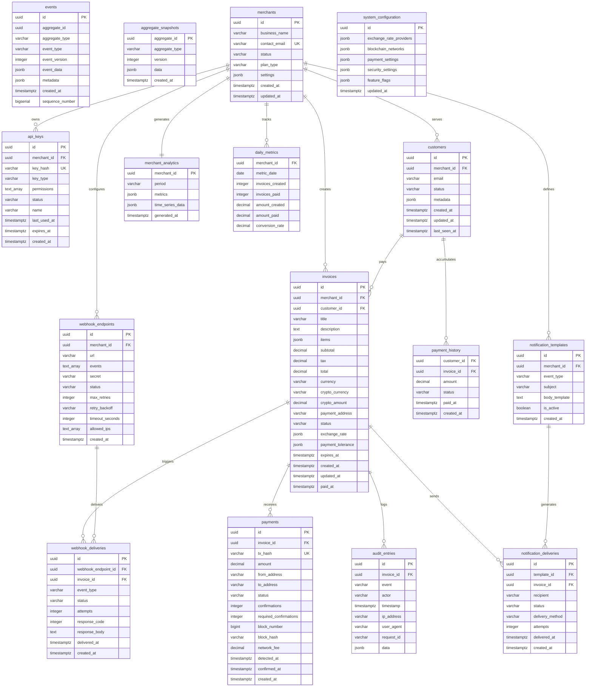
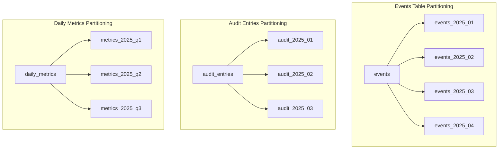
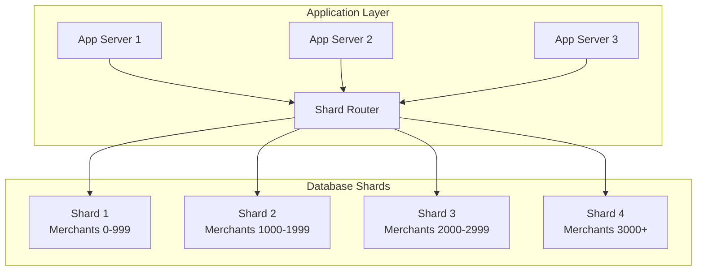
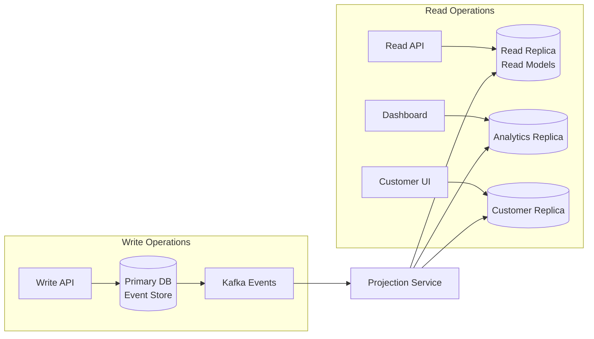
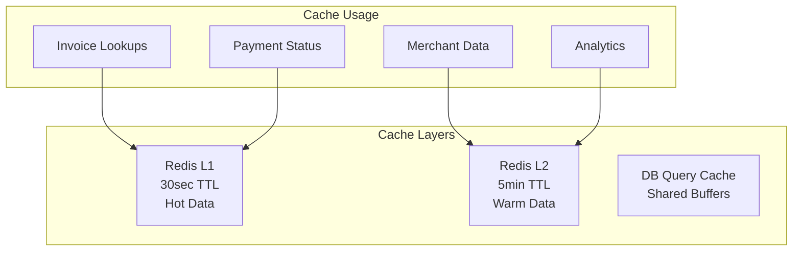

# Crypto Checkout Database Schema Design

- [Crypto Checkout Database Schema Design](#crypto-checkout-database-schema-design)
  - [Architecture Principles](#architecture-principles)
  - [Database Schema](#database-schema)
  - [Detailed Index Strategy](#detailed-index-strategy)
    - [Event Store Indexes](#event-store-indexes)
    - [Invoice Read Model Indexes](#invoice-read-model-indexes)
    - [Analytics Indexes](#analytics-indexes)
  - [Partitioning Strategy](#partitioning-strategy)
    - [Time-Based Partitioning](#time-based-partitioning)
    - [Partition Implementation](#partition-implementation)
  - [Sharding Strategy](#sharding-strategy)
    - [Horizontal Sharding by Merchant](#horizontal-sharding-by-merchant)
    - [Sharding Configuration](#sharding-configuration)
    - [Shard Key Strategy](#shard-key-strategy)
  - [Read Replica Strategy](#read-replica-strategy)
    - [Read/Write Separation](#readwrite-separation)
    - [Replica Configuration](#replica-configuration)
  - [Performance Optimization](#performance-optimization)
    - [Query Performance Targets](#query-performance-targets)
    - [Caching Strategy](#caching-strategy)
    - [Connection Pooling](#connection-pooling)
  - [Monitoring and Maintenance](#monitoring-and-maintenance)
    - [Key Metrics to Monitor](#key-metrics-to-monitor)
    - [Automated Maintenance](#automated-maintenance)

## Architecture Principles

- **Event Sourcing**: Immutable event log as source of truth
- **CQRS**: Separate read/write models optimized for their use cases
- **Eventual Consistency**: Read models updated asynchronously from events
- **Horizontal Scaling**: Sharding strategies for high-volume tables
- **Performance**: Strategic indexing and partitioning

---

## Database Schema



---

## Detailed Index Strategy

### Event Store Indexes

| Index Name                    | Type   | Columns                         | Purpose                  | Performance Impact             |
| ----------------------------- | ------ | ------------------------------- | ------------------------ | ------------------------------ |
| `idx_events_aggregate_lookup` | B-Tree | `(aggregate_id, event_version)` | Aggregate reconstruction | Critical for write performance |
| `idx_events_type_timeline`    | B-Tree | `(aggregate_type, created_at)`  | Event replay by type     | Projection rebuilding          |
| `idx_events_sequence`         | B-Tree | `(sequence_number)`             | Global ordering          | Kafka offset tracking          |
| `idx_events_created_at`       | B-Tree | `(created_at)`                  | Time-based queries       | Analytics and reporting        |
| `idx_events_metadata_gin`     | GIN    | `(metadata)`                    | Event metadata search    | Debugging and auditing         |

```sql
-- Critical Event Store Indexes
CREATE INDEX CONCURRENTLY idx_events_aggregate_lookup 
    ON events (aggregate_id, event_version);

CREATE INDEX CONCURRENTLY idx_events_type_timeline 
    ON events (aggregate_type, created_at DESC);

CREATE INDEX CONCURRENTLY idx_events_sequence 
    ON events (sequence_number);

CREATE INDEX CONCURRENTLY idx_events_metadata_gin 
    ON events USING gin (metadata);
```

### Invoice Read Model Indexes

| Index Name                     | Type   | Columns                                                     | Purpose                 | Query Pattern                                     |
| ------------------------------ | ------ | ----------------------------------------------------------- | ----------------------- | ------------------------------------------------- |
| `idx_invoices_merchant_status` | B-Tree | `(merchant_id, status, created_at)`                         | Merchant dashboard      | `WHERE merchant_id = ? AND status = ?`            |
| `idx_invoices_expires_pending` | B-Tree | `(expires_at, status)`                                      | Expiration cleanup      | `WHERE expires_at < NOW() AND status = 'pending'` |
| `idx_invoices_payment_address` | B-Tree | `(payment_address)`                                         | Payment detection       | `WHERE payment_address = ?`                       |
| `idx_invoices_text_search`     | GIN    | `(to_tsvector('english', title \|\| ' ' \|\| description))` | Full-text search        | `WHERE search_vector @@ plainto_tsquery(?)`       |
| `idx_payments_tx_hash`         | B-Tree | `(tx_hash)`                                                 | Blockchain tracking     | `WHERE tx_hash = ?`                               |
| `idx_payments_status_pending`  | B-Tree | `(status, detected_at)`                                     | Confirmation monitoring | `WHERE status IN ('detected', 'confirming')`      |

```sql
-- Invoice Performance Indexes
CREATE INDEX CONCURRENTLY idx_invoices_merchant_status 
    ON invoices (merchant_id, status, created_at DESC);

CREATE INDEX CONCURRENTLY idx_invoices_expires_pending 
    ON invoices (expires_at) 
    WHERE status IN ('pending', 'partial');

CREATE INDEX CONCURRENTLY idx_invoices_payment_address 
    ON invoices (payment_address);

-- Full-text search
CREATE INDEX CONCURRENTLY idx_invoices_text_search 
    ON invoices USING gin (to_tsvector('english', title || ' ' || coalesce(description, '')));

-- Payment tracking indexes
CREATE UNIQUE INDEX CONCURRENTLY idx_payments_tx_hash 
    ON payments (tx_hash);

CREATE INDEX CONCURRENTLY idx_payments_status_pending 
    ON payments (status, detected_at) 
    WHERE status IN ('detected', 'confirming');
```

### Analytics Indexes

| Index Name                        | Type   | Columns                      | Purpose             | Aggregation Type         |
| --------------------------------- | ------ | ---------------------------- | ------------------- | ------------------------ |
| `idx_daily_metrics_merchant_date` | B-Tree | `(merchant_id, metric_date)` | Merchant timeseries | Revenue trends           |
| `idx_daily_metrics_date_range`    | B-Tree | `(metric_date, merchant_id)` | Platform analytics  | Cross-merchant reporting |
| `idx_audit_entries_timeline`      | B-Tree | `(invoice_id, timestamp)`    | Audit trail         | Compliance queries       |
| `idx_webhook_deliveries_status`   | B-Tree | `(status, created_at)`       | Failure monitoring  | Retry processing         |

```sql
-- Analytics Performance Indexes
CREATE INDEX CONCURRENTLY idx_daily_metrics_merchant_date 
    ON daily_metrics (merchant_id, metric_date DESC);

CREATE INDEX CONCURRENTLY idx_daily_metrics_date_range 
    ON daily_metrics (metric_date DESC, merchant_id);

-- Audit and monitoring indexes
CREATE INDEX CONCURRENTLY idx_audit_entries_timeline 
    ON audit_entries (invoice_id, timestamp DESC);

CREATE INDEX CONCURRENTLY idx_webhook_deliveries_status 
    ON webhook_deliveries (status, created_at) 
    WHERE status IN ('failed', 'pending');
```

---

## Partitioning Strategy

### Time-Based Partitioning



### Partition Implementation

```sql
-- Events table partitioning by month
CREATE TABLE events (
    id UUID DEFAULT gen_random_uuid(),
    aggregate_id UUID NOT NULL,
    aggregate_type VARCHAR(50) NOT NULL,
    event_type VARCHAR(100) NOT NULL,
    event_version INTEGER NOT NULL,
    event_data JSONB NOT NULL,
    metadata JSONB,
    created_at TIMESTAMPTZ NOT NULL DEFAULT NOW(),
    sequence_number BIGSERIAL,
    PRIMARY KEY (id, created_at)
) PARTITION BY RANGE (created_at);

-- Monthly partitions
CREATE TABLE events_2025_01 PARTITION OF events
    FOR VALUES FROM ('2025-01-01') TO ('2025-02-01');

CREATE TABLE events_2025_02 PARTITION OF events
    FOR VALUES FROM ('2025-02-01') TO ('2025-03-01');

-- Quarterly partitions for metrics
CREATE TABLE daily_metrics (
    merchant_id UUID NOT NULL,
    metric_date DATE NOT NULL,
    invoices_created INTEGER DEFAULT 0,
    invoices_paid INTEGER DEFAULT 0,
    amount_created DECIMAL(15,2) DEFAULT 0,
    amount_paid DECIMAL(15,2) DEFAULT 0,
    conversion_rate DECIMAL(5,2) DEFAULT 0,
    PRIMARY KEY (merchant_id, metric_date)
) PARTITION BY RANGE (metric_date);

CREATE TABLE daily_metrics_2025_q1 PARTITION OF daily_metrics
    FOR VALUES FROM ('2025-01-01') TO ('2025-04-01');
```

---

## Sharding Strategy

### Horizontal Sharding by Merchant



### Sharding Configuration

| Shard       | Merchant Range     | Expected Load            | Hardware Profile   |
| ----------- | ------------------ | ------------------------ | ------------------ |
| **Shard 1** | 0-999 (Enterprise) | High volume, low latency | 32GB RAM, NVMe SSD |
| **Shard 2** | 1000-1999 (Pro)    | Medium volume            | 16GB RAM, SSD      |
| **Shard 3** | 2000-2999 (Free)   | Low volume, high count   | 8GB RAM, SSD       |
| **Shard 4** | 3000+ (Overflow)   | Variable                 | Auto-scaling       |

### Shard Key Strategy

```go
type ShardRouter struct {
    shards map[int]*sql.DB
}

func (sr *ShardRouter) GetShard(merchantID uuid.UUID) *sql.DB {
    // Hash-based sharding for even distribution
    hash := fnv.New32a()
    hash.Write(merchantID[:])
    shardID := int(hash.Sum32()) % len(sr.shards)
    return sr.shards[shardID]
}

func (sr *ShardRouter) GetShardForRange(start, end time.Time) []*sql.DB {
    // Cross-shard queries for analytics
    return getAllShards()
}
```

---

## Read Replica Strategy

### Read/Write Separation



### Replica Configuration

| Replica Type     | Purpose               | Lag Tolerance | Caching Strategy |
| ---------------- | --------------------- | ------------- | ---------------- |
| **Primary Read** | General queries       | <100ms        | Redis 1min TTL   |
| **Analytics**    | Reporting, dashboards | <5 seconds    | Redis 5min TTL   |
| **Customer**     | Payment pages         | <500ms        | Redis 30sec TTL  |
| **Archive**      | Historical data       | <1 hour       | No cache         |

---

## Performance Optimization

### Query Performance Targets

| Query Type           | Target Latency | Example          | Optimization        |
| -------------------- | -------------- | ---------------- | ------------------- |
| **Point Lookups**    | <10ms          | Invoice by ID    | Primary key indexes |
| **Range Queries**    | <100ms         | Invoices by date | Composite indexes   |
| **Full-Text Search** | <500ms         | Invoice search   | GIN indexes         |
| **Analytics**        | <2000ms        | Revenue reports  | Materialized views  |
| **Cross-Shard**      | <5000ms        | Platform metrics | Async aggregation   |

### Caching Strategy



### Connection Pooling

```go
type DatabaseConfig struct {
    MaxOpenConns    int           // 25 per shard
    MaxIdleConns    int           // 5 per shard  
    ConnMaxLifetime time.Duration // 5 minutes
    ConnMaxIdleTime time.Duration // 2 minutes
}

// Shard-aware connection pooling
type ShardedConnectionPool struct {
    pools map[string]*sql.DB
    config DatabaseConfig
}
```

---

## Monitoring and Maintenance

### Key Metrics to Monitor

| Metric Category       | Metric                | Alert Threshold | Action               |
| --------------------- | --------------------- | --------------- | -------------------- |
| **Query Performance** | Average query time    | >100ms          | Index optimization   |
| **Connection Pool**   | Active connections    | >80% pool size  | Scale connections    |
| **Partition Size**    | Partition row count   | >50M rows       | Create new partition |
| **Shard Balance**     | Shard size difference | >30% variation  | Rebalance data       |
| **Replication Lag**   | Primary-replica delay | >1 second       | Check network/load   |

### Automated Maintenance

```sql
-- Automated partition creation
CREATE OR REPLACE FUNCTION create_monthly_partitions()
RETURNS void AS $$
DECLARE
    start_date date;
    end_date date;
    partition_name text;
BEGIN
    start_date := date_trunc('month', CURRENT_DATE + interval '1 month');
    end_date := start_date + interval '1 month';
    partition_name := 'events_' || to_char(start_date, 'YYYY_MM');
    
    EXECUTE format('CREATE TABLE %I PARTITION OF events 
                    FOR VALUES FROM (%L) TO (%L)',
                   partition_name, start_date, end_date);
END;
$$ LANGUAGE plpgsql;

-- Schedule monthly partition creation
SELECT cron.schedule('create-partitions', '0 0 25 * *', 'SELECT create_monthly_partitions();');
```