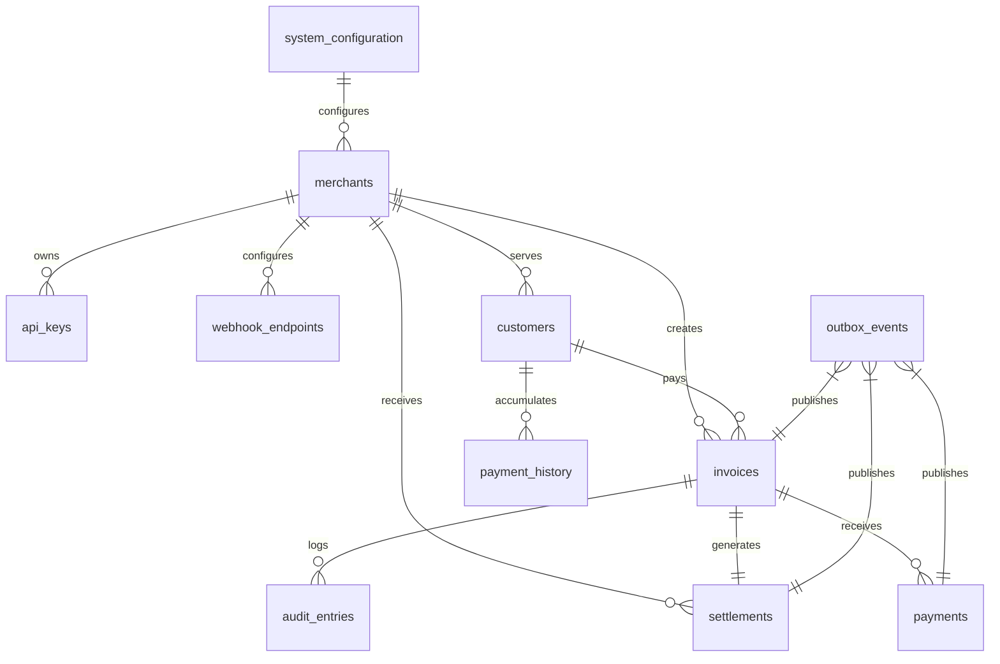
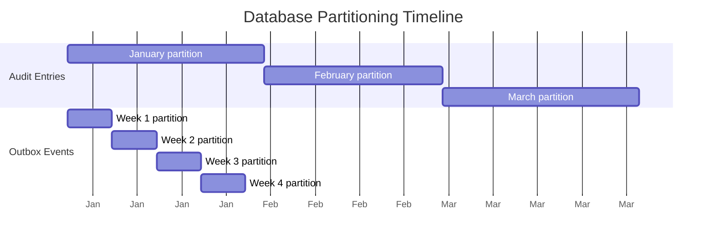

# Crypto Checkout Database Schema

- [Crypto Checkout Database Schema](#crypto-checkout-database-schema)
  - [Architecture Principles](#architecture-principles)
  - [Database Overview](#database-overview)
  - [Core Business Tables](#core-business-tables)
    - [Merchants Table](#merchants-table)
    - [API Keys Table](#api-keys-table)
    - [Webhook Endpoints Table](#webhook-endpoints-table)
    - [Invoices Table](#invoices-table)
    - [Payments Table](#payments-table)
    - [Settlements Table](#settlements-table)
  - [Event Sourcing Tables](#event-sourcing-tables)
    - [Outbox Events Table](#outbox-events-table)
    - [Audit Entries Table](#audit-entries-table)
  - [Supporting Tables](#supporting-tables)
    - [Customers Table](#customers-table)
    - [Payment History Table](#payment-history-table)
    - [System Configuration Table](#system-configuration-table)
  - [Partitioning Strategy](#partitioning-strategy)
    - [Time-Based Partitioning](#time-based-partitioning)
    - [Partition Timeline](#partition-timeline)
  - [Indexing Strategy](#indexing-strategy)
    - [Performance Indexes](#performance-indexes)
    - [Rate Limiting Indexes](#rate-limiting-indexes)
  - [Data Integrity](#data-integrity)
    - [Financial Constraints](#financial-constraints)
    - [Business Logic Constraints](#business-logic-constraints)
  - [Views for Query Optimization](#views-for-query-optimization)
    - [Merchant Dashboard View](#merchant-dashboard-view)
    - [Settlement Analytics View](#settlement-analytics-view)

## Architecture Principles

- **Event Sourcing + CQRS**: Current state tables for performance, outbox pattern for events
- **Financial Data Integrity**: DECIMAL types for monetary amounts, proper constraints
- **Partitioning Strategy**: Time-based partitioning for high-volume tables
- **Indexing**: Strategic indexes for query performance and rate limiting
- **Audit Trail**: Complete transaction history with immutable records

---

## Database Overview

---

## Core Business Tables

### Merchants Table

| Column            | Type         | Description          | Constraints                                     |
| ----------------- | ------------ | -------------------- | ----------------------------------------------- |
| **id**            | UUID         | Primary key          | Auto-generated                                  |
| **business_name** | VARCHAR(255) | Company name         | Required, 2-255 chars                           |
| **contact_email** | VARCHAR(255) | Primary contact      | Required, unique, valid email                   |
| **status**        | VARCHAR(50)  | Account status       | active, suspended, pending_verification, closed |
| **plan_type**     | VARCHAR(50)  | Subscription tier    | basic, pro, enterprise                          |
| **settings**      | JSONB        | Configuration object | Platform fee, tolerances, confirmations         |
| **created_at**    | TIMESTAMPTZ  | Account creation     | Auto-set                                        |
| **updated_at**    | TIMESTAMPTZ  | Last modification    | Auto-updated                                    |

**Business Rules**:
- Contact email must be unique across all merchants
- Platform fee percentage must be between 0.1% and 5.0%
- Settings include payment tolerance and confirmation overrides

**Key Indexes**:
- Status for filtering active merchants
- Email for uniqueness enforcement
- Created date for chronological queries
- GIN index on settings JSONB for configuration queries

### API Keys Table

| Column           | Type         | Description         | Constraints                 |
| ---------------- | ------------ | ------------------- | --------------------------- |
| **id**           | UUID         | Primary key         | Auto-generated              |
| **merchant_id**  | UUID         | Owner reference     | Foreign key to merchants    |
| **key_hash**     | VARCHAR(255) | SHA-256 hash of key | Unique                      |
| **key_type**     | VARCHAR(10)  | Environment         | live, test                  |
| **permissions**  | TEXT[]       | Access scopes       | Array of permission strings |
| **status**       | VARCHAR(20)  | Key status          | active, revoked, expired    |
| **name**         | VARCHAR(100) | User-friendly label | Optional                    |
| **last_used_at** | TIMESTAMPTZ  | Last request time   | For tracking usage          |
| **expires_at**   | TIMESTAMPTZ  | Expiration date     | Optional                    |
| **created_at**   | TIMESTAMPTZ  | Creation time       | Auto-set                    |

**Business Rules**:
- Each merchant can have multiple API keys
- Live keys require active merchant status
- Key hash must be unique for security
- Permissions control API access scope

### Webhook Endpoints Table

| Column              | Type          | Description            | Constraints              |
| ------------------- | ------------- | ---------------------- | ------------------------ |
| **id**              | UUID          | Primary key            | Auto-generated           |
| **merchant_id**     | UUID          | Owner reference        | Foreign key to merchants |
| **url**             | VARCHAR(2048) | Webhook destination    | Valid HTTPS URL          |
| **events**          | TEXT[]        | Subscribed event types | Array of event names     |
| **secret**          | VARCHAR(255)  | HMAC signature key     | For webhook verification |
| **status**          | VARCHAR(20)   | Endpoint status        | active, disabled, failed |
| **max_retries**     | INTEGER       | Retry limit            | 1-10, default 5          |
| **retry_backoff**   | VARCHAR(20)   | Retry strategy         | linear, exponential      |
| **timeout_seconds** | INTEGER       | Request timeout        | 5-60 seconds             |
| **allowed_ips**     | TEXT[]        | IP whitelist           | CIDR notation            |
| **created_at**      | TIMESTAMPTZ   | Creation time          | Auto-set                 |

**Business Rules**:
- Maximum 5 webhook endpoints per merchant
- URL must be HTTPS for security
- Secret used for HMAC signature verification

### Invoices Table

| Column                    | Type          | Description           | Constraints                   |
| ------------------------- | ------------- | --------------------- | ----------------------------- |
| **id**                    | UUID          | Primary key           | Auto-generated                |
| **merchant_id**           | UUID          | Owner reference       | Foreign key to merchants      |
| **customer_id**           | UUID          | Payer reference       | Optional foreign key          |
| **title**                 | VARCHAR(255)  | Invoice title         | Required                      |
| **description**           | TEXT          | Invoice description   | Optional                      |
| **items**                 | JSONB         | Line items array      | Required, structured data     |
| **subtotal**              | DECIMAL(15,2) | Pre-tax amount        | Positive                      |
| **tax**                   | DECIMAL(15,2) | Tax amount            | Non-negative                  |
| **total**                 | DECIMAL(15,2) | Final amount          | subtotal + tax                |
| **currency**              | VARCHAR(3)    | Fiat currency         | USD, EUR, etc.                |
| **crypto_currency**       | VARCHAR(10)   | Payment currency      | USDT                          |
| **crypto_amount**         | DECIMAL(15,8) | Locked conversion     | Positive, 8 decimal precision |
| **payment_address**       | VARCHAR(255)  | Blockchain address    | Unique per invoice            |
| **status**                | VARCHAR(20)   | Invoice state         | FSM-controlled transitions    |
| **exchange_rate**         | JSONB         | Locked rate data      | Rate, source, timestamps      |
| **payment_tolerance**     | JSONB         | Acceptance thresholds | Under/overpayment handling    |
| **confirmation_settings** | JSONB         | Confirmation config   | Merchant overrides            |
| **return_url**            | VARCHAR(2048) | Success redirect      | Optional                      |
| **cancel_url**            | VARCHAR(2048) | Cancel redirect       | Optional                      |
| **metadata**              | JSONB         | Custom data           | Merchant-specific             |
| **expires_at**            | TIMESTAMPTZ   | Expiration time       | Default 30 minutes            |
| **created_at**            | TIMESTAMPTZ   | Creation time         | Auto-set                      |
| **updated_at**            | TIMESTAMPTZ   | Last state change     | Auto-updated                  |
| **paid_at**               | TIMESTAMPTZ   | Payment completion    | Set when paid                 |

**Invoice Status Values**:
- `pending` - Awaiting payment
- `partial` - Partial payment received
- `confirming` - Full payment confirming
- `paid` - Payment confirmed
- `expired` - Timeout reached
- `cancelled` - Manually cancelled
- `refunded` - Payment refunded

**Business Rules**:
- Total must equal subtotal + tax
- Crypto amount locked at creation with exchange rate
- Payment address unique per invoice
- Status transitions controlled by FSM

### Payments Table

| Column                     | Type          | Description           | Constraints                |
| -------------------------- | ------------- | --------------------- | -------------------------- |
| **id**                     | UUID          | Primary key           | Auto-generated             |
| **invoice_id**             | UUID          | Parent invoice        | Foreign key to invoices    |
| **tx_hash**                | VARCHAR(255)  | Transaction hash      | Unique, immutable          |
| **amount**                 | DECIMAL(15,8) | Payment amount        | Positive, crypto precision |
| **from_address**           | VARCHAR(255)  | Sender address        | Blockchain address         |
| **to_address**             | VARCHAR(255)  | Recipient address     | Must match invoice         |
| **status**                 | VARCHAR(20)   | Confirmation state    | FSM-controlled             |
| **confirmations**          | INTEGER       | Current confirmations | 0 to network max           |
| **required_confirmations** | INTEGER       | Needed confirmations  | Amount-based or override   |
| **block_number**           | BIGINT        | Block inclusion       | Positive                   |
| **block_hash**             | VARCHAR(255)  | Block identifier      | Immutable                  |
| **network_fee**            | DECIMAL(15,8) | Transaction fee       | Network cost               |
| **detected_at**            | TIMESTAMPTZ   | Detection time        | Auto-set                   |
| **confirmed_at**           | TIMESTAMPTZ   | Confirmation time     | Set when confirmed         |
| **created_at**             | TIMESTAMPTZ   | Record creation       | Auto-set                   |

**Payment Status Values**:
- `detected` - Found in mempool/block
- `confirming` - Gaining confirmations
- `confirmed` - Sufficient confirmations
- `failed` - Transaction failed
- `orphaned` - Block reorganization

### Settlements Table

| Column                  | Type          | Description         | Constraints                |
| ----------------------- | ------------- | ------------------- | -------------------------- |
| **id**                  | UUID          | Primary key         | Auto-generated             |
| **invoice_id**          | UUID          | Source invoice      | Foreign key to invoices    |
| **merchant_id**         | UUID          | Recipient merchant  | Foreign key to merchants   |
| **gross_amount**        | DECIMAL(15,8) | Total received      | Customer payment amount    |
| **platform_fee_amount** | DECIMAL(15,8) | Fee deducted        | Calculated commission      |
| **net_amount**          | DECIMAL(15,8) | Merchant payout     | gross - platform_fee       |
| **fee_percentage**      | DECIMAL(5,3)  | Applied rate        | From merchant settings     |
| **currency**            | VARCHAR(10)   | Settlement currency | USDT                       |
| **status**              | VARCHAR(20)   | Settlement state    | pending, completed, failed |
| **payout_tx_hash**      | VARCHAR(255)  | Payout transaction  | Blockchain hash            |
| **payout_network_fee**  | DECIMAL(15,8) | Payout cost         | Network fee                |
| **failure_reason**      | TEXT          | Error description   | If status is failed        |
| **retry_count**         | INTEGER       | Retry attempts      | For failed settlements     |
| **created_at**          | TIMESTAMPTZ   | Settlement creation | Auto-set                   |
| **settled_at**          | TIMESTAMPTZ   | Completion time     | Set when completed         |

**Business Rules**:
- Net amount = Gross amount - Platform fee amount
- Platform fee amount = Gross amount × Fee percentage
- One settlement per paid invoice
- Automatic creation on invoice payment

---

## Event Sourcing Tables

### Outbox Events Table

| Column                  | Type         | Description        | Constraints                  |
| ----------------------- | ------------ | ------------------ | ---------------------------- |
| **id**                  | UUID         | Primary key        | Auto-generated               |
| **aggregate_id**        | UUID         | Source aggregate   | Invoice, Payment, etc.       |
| **aggregate_type**      | VARCHAR(50)  | Aggregate type     | Invoice, Payment, Settlement |
| **event_type**          | VARCHAR(100) | Event name         | PaymentConfirmed, etc.       |
| **event_data**          | JSONB        | Event payload      | Structured event data        |
| **metadata**            | JSONB        | Context data       | Request ID, actor, etc.      |
| **sequence_number**     | BIGSERIAL    | Global ordering    | Auto-incrementing            |
| **created_at**          | TIMESTAMPTZ  | Event time         | Auto-set                     |
| **processed_at**        | TIMESTAMPTZ  | Kafka publish time | Set when published           |
| **processing_attempts** | INTEGER      | Retry count        | For failed publishes         |

**Purpose**: Implements outbox pattern for reliable event publishing to Kafka

### Audit Entries Table

| Column             | Type         | Description          | Constraints                  |
| ------------------ | ------------ | -------------------- | ---------------------------- |
| **id**             | UUID         | Primary key          | Auto-generated               |
| **aggregate_id**   | UUID         | Subject aggregate    | Invoice, Payment, etc.       |
| **aggregate_type** | VARCHAR(50)  | Aggregate type       | Invoice, Payment, Settlement |
| **event_type**     | VARCHAR(100) | Audit event type     | Created, Updated, etc.       |
| **actor**          | VARCHAR(255) | Who performed action | API key, user, system        |
| **ip_address**     | INET         | Request origin       | Client IP address            |
| **user_agent**     | TEXT         | Client identifier    | Browser/app info             |
| **request_id**     | VARCHAR(255) | Request correlation  | For debugging                |
| **event_data**     | JSONB        | Audit details        | Action-specific data         |
| **timestamp**      | TIMESTAMPTZ  | Event time           | Auto-set                     |

**Purpose**: Immutable audit trail for compliance and debugging

---

## Supporting Tables

### Customers Table

| Column           | Type         | Description       | Constraints               |
| ---------------- | ------------ | ----------------- | ------------------------- |
| **id**           | UUID         | Primary key       | Auto-generated            |
| **merchant_id**  | UUID         | Merchant scope    | Foreign key to merchants  |
| **email**        | VARCHAR(255) | Customer email    | Valid email               |
| **status**       | VARCHAR(20)  | Account status    | active, blocked, inactive |
| **metadata**     | JSONB        | Custom data       | Merchant-defined          |
| **created_at**   | TIMESTAMPTZ  | Account creation  | Auto-set                  |
| **updated_at**   | TIMESTAMPTZ  | Last modification | Auto-updated              |
| **last_seen_at** | TIMESTAMPTZ  | Last activity     | Payment or visit          |

**Business Rules**:
- Email unique per merchant (not globally)
- Customer data scoped to merchant
- Metadata for merchant customization

### Payment History Table

| Column          | Type          | Description        | Constraints              |
| --------------- | ------------- | ------------------ | ------------------------ |
| **customer_id** | UUID          | Customer reference | Part of composite key    |
| **invoice_id**  | UUID          | Invoice reference  | Part of composite key    |
| **amount**      | DECIMAL(15,8) | Payment amount     | From settlement          |
| **status**      | VARCHAR(20)   | Final status       | paid, cancelled, expired |
| **paid_at**     | TIMESTAMPTZ   | Payment time       | From invoice             |
| **created_at**  | TIMESTAMPTZ   | Record creation    | Auto-set                 |

**Purpose**: Customer payment history for merchant analytics

### System Configuration Table

| Column           | Type         | Description        | Constraints         |
| ---------------- | ------------ | ------------------ | ------------------- |
| **id**           | UUID         | Primary key        | Auto-generated      |
| **config_key**   | VARCHAR(100) | Configuration name | Unique              |
| **config_value** | JSONB        | Configuration data | Structured settings |
| **description**  | TEXT         | Human description  | Documentation       |
| **is_active**    | BOOLEAN      | Enabled flag       | Default true        |
| **updated_at**   | TIMESTAMPTZ  | Last change        | Auto-updated        |

**Default Configuration**:
- Exchange rate providers (Coinbase Pro, Binance, Kraken)
- Blockchain networks (Tron for USDT)
- Payment settings (amount limits, confirmations)
- Feature flags (rate limiting, retries)

---

## Partitioning Strategy

### Time-Based Partitioning

| Table               | Partition Strategy   | Retention | Performance Benefit              |
| ------------------- | -------------------- | --------- | -------------------------------- |
| **audit_entries**   | Monthly partitions   | 2 years   | Query performance on recent data |
| **outbox_events**   | Weekly partitions    | 3 months  | Fast event processing            |
| **payment_history** | Quarterly partitions | 7 years   | Customer analytics performance   |

**Partition Management**:
- Automated partition creation for future periods
- Automated old partition dropping based on retention
- Partition pruning for query optimization

### Partition Timeline

---

## Indexing Strategy

### Performance Indexes

| Table           | Index Type | Columns                                           | Purpose                    |
| --------------- | ---------- | ------------------------------------------------- | -------------------------- |
| **invoices**    | Composite  | merchant_id, status, created_at                   | Merchant dashboard queries |
| **invoices**    | Partial    | expires_at WHERE status IN ('pending', 'partial') | Expiration cleanup         |
| **invoices**    | GIN        | to_tsvector(title, description)                   | Full-text search           |
| **payments**    | Unique     | tx_hash                                           | Blockchain uniqueness      |
| **payments**    | Composite  | status, confirmations                             | Confirmation tracking      |
| **settlements** | Composite  | merchant_id, created_at                           | Settlement reporting       |
| **api_keys**    | Hash       | key_hash                                          | Authentication lookup      |

### Rate Limiting Indexes

| Table             | Index               | Purpose                |
| ----------------- | ------------------- | ---------------------- |
| **api_keys**      | last_used_at        | API usage tracking     |
| **audit_entries** | actor, timestamp    | Rate limit enforcement |
| **outbox_events** | processing_attempts | Retry management       |

---

## Data Integrity

### Financial Constraints

| Constraint                        | Description                                         | Business Rule             |
| --------------------------------- | --------------------------------------------------- | ------------------------- |
| **Settlement Amount Calculation** | net_amount = gross_amount - platform_fee_amount     | Automatic fee deduction   |
| **Platform Fee Calculation**      | platform_fee_amount = gross_amount × fee_percentage | Percentage-based fees     |
| **Invoice Total Calculation**     | total = subtotal + tax                              | Tax calculation integrity |
| **Positive Amounts**              | All monetary amounts > 0                            | No negative transactions  |

### Business Logic Constraints

| Constraint                 | Description                      | Enforcement                 |
| -------------------------- | -------------------------------- | --------------------------- |
| **Unique Payment Address** | Each invoice gets unique address | Database constraint         |
| **Merchant Webhook Limit** | Maximum 5 webhooks per merchant  | Check constraint            |
| **Fee Percentage Range**   | Platform fee 0.1% - 5.0%         | JSON validation             |
| **Customer Email Scope**   | Email unique per merchant        | Composite unique constraint |

---

## Views for Query Optimization

### Merchant Dashboard View

| Column                 | Calculation                          | Purpose            |
| ---------------------- | ------------------------------------ | ------------------ |
| **total_invoices**     | COUNT(invoices)                      | Volume metrics     |
| **paid_invoices**      | COUNT WHERE status = 'paid'          | Success metrics    |
| **total_revenue**      | SUM(settlements.gross_amount)        | Gross revenue      |
| **platform_fees_paid** | SUM(settlements.platform_fee_amount) | Fees paid          |
| **net_earnings**       | SUM(settlements.net_amount)          | Actual earnings    |
| **conversion_rate**    | paid_invoices / total_invoices       | Success percentage |

### Settlement Analytics View

| Column                      | Calculation                            | Purpose             |
| --------------------------- | -------------------------------------- | ------------------- |
| **daily_volume**            | SUM(gross_amount) GROUP BY date        | Daily trends        |
| **daily_fee_collection**    | SUM(platform_fee_amount) GROUP BY date | Platform revenue    |
| **average_settlement_time** | AVG(settled_at - created_at)           | Performance metrics |
| **settlement_success_rate** | completed / total settlements          | Reliability metrics |

This database schema supports the Event Sourcing + CQRS architecture with proper financial data integrity, audit trails, and performance optimizations for a payment processing platform.