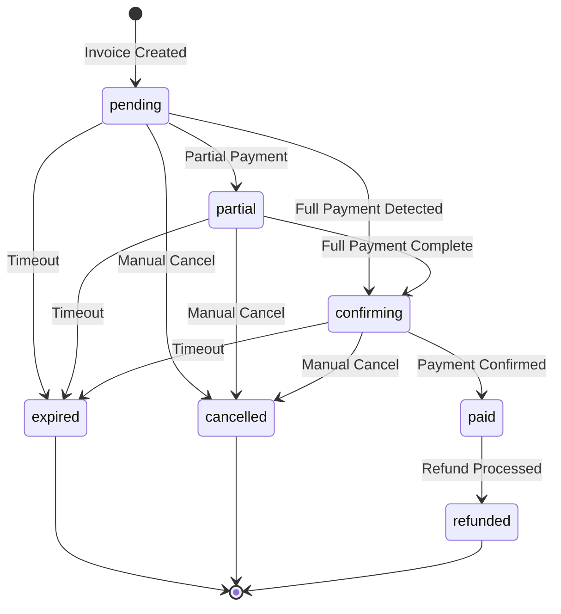
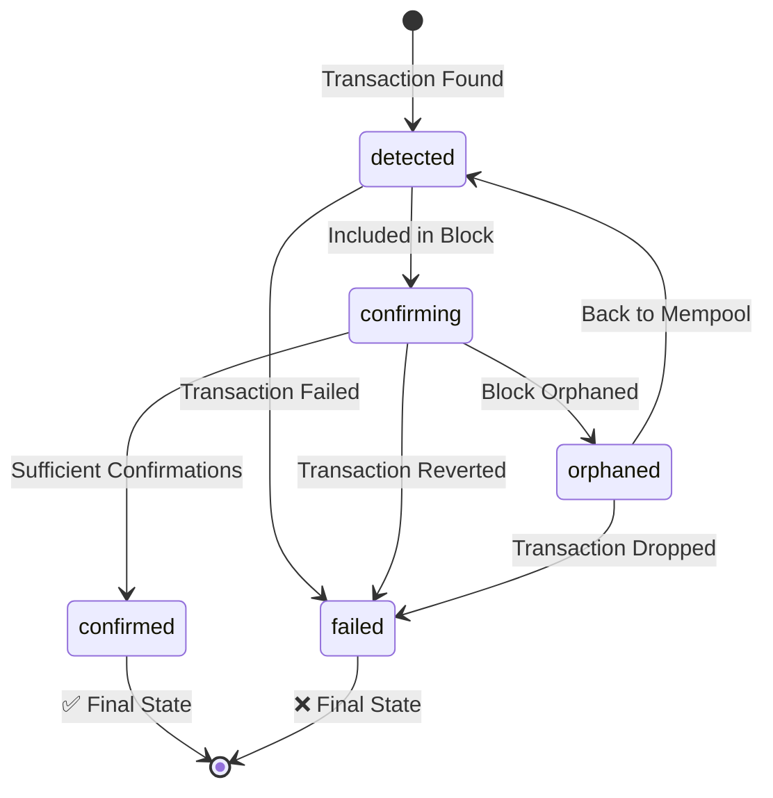
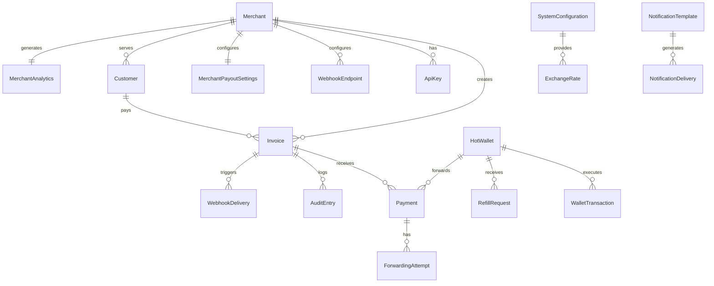

# Crypto Checkout Domain Models

- [Crypto Checkout Domain Models](#crypto-checkout-domain-models)
  - [Overview](#overview)
  - [Bounded Contexts](#bounded-contexts)
  - [Core Aggregates](#core-aggregates)
    - [1. Merchant Aggregate](#1-merchant-aggregate)
      - [Aggregate Root: Merchant](#aggregate-root-merchant)
      - [Entities within Merchant Aggregate](#entities-within-merchant-aggregate)
      - [Business Rules - Merchant Aggregate](#business-rules---merchant-aggregate)
    - [2. Invoice Aggregate](#2-invoice-aggregate)
      - [Aggregate Root: Invoice](#aggregate-root-invoice)
      - [Entities within Invoice Aggregate](#entities-within-invoice-aggregate)
      - [Invoice Status Transitions](#invoice-status-transitions)
      - [Payment Status Transitions](#payment-status-transitions)
      - [Business Rules - Invoice Aggregate](#business-rules---invoice-aggregate)
    - [3. Customer Aggregate](#3-customer-aggregate)
      - [Aggregate Root: Customer](#aggregate-root-customer)
      - [Entities within Customer Aggregate](#entities-within-customer-aggregate)
      - [Business Rules - Customer Aggregate](#business-rules---customer-aggregate)
    - [4. SystemConfiguration Aggregate](#4-systemconfiguration-aggregate)
      - [Aggregate Root: SystemConfiguration](#aggregate-root-systemconfiguration)
    - [5. MerchantAnalytics Aggregate](#5-merchantanalytics-aggregate)
      - [Aggregate Root: MerchantAnalytics](#aggregate-root-merchantanalytics)
    - [6. NotificationTemplate Aggregate](#6-notificationtemplate-aggregate)
      - [Aggregate Root: NotificationTemplate](#aggregate-root-notificationtemplate)
  - [Value Objects](#value-objects)
    - [Money](#money)
    - [PaymentAddress](#paymentaddress)
    - [ExchangeRate](#exchangerate)
    - [PaymentTolerance](#paymenttolerance)
    - [InvoicePricing](#invoicepricing)
  - [Domain Events](#domain-events)
    - [Invoice Events](#invoice-events)
    - [Payment Events](#payment-events)
    - [Merchant Events](#merchant-events)
  - [Domain Services](#domain-services)
    - [PaymentReconciliationService](#paymentreconciliationservice)
    - [ExchangeRateService](#exchangerateservice)
    - [MerchantOnboardingService](#merchantonboardingservice)
    - [WebhookDeliveryService](#webhookdeliveryservice)
  - [Repository Interfaces](#repository-interfaces)
    - [Core Repositories](#core-repositories)
    - [Query Patterns](#query-patterns)
  - [Aggregate Relationships](#aggregate-relationships)
    - [Cross-Aggregate References](#cross-aggregate-references)
  - [Domain Invariants](#domain-invariants)
    - [Global Invariants](#global-invariants)
    - [Aggregate-Specific Invariants](#aggregate-specific-invariants)

## Overview

The Crypto Checkout domain encompasses cryptocurrency payment processing for merchants, managing the complete lifecycle from invoice creation through payment confirmation and settlement. The domain is organized around **6 core aggregates** with clear boundaries, comprehensive business rules, and event-driven interactions.

---

## Bounded Contexts

| Bounded Context           | Responsibility                                     | Core Aggregates      | Key Integration Points                |
| ------------------------- | -------------------------------------------------- | -------------------- | ------------------------------------- |
| **Merchant Management**   | Business entity lifecycle, access control, billing | Merchant             | Identity providers, billing systems   |
| **Payment Processing**    | Invoice creation, payment detection, settlement    | Invoice, Customer    | Blockchain networks, webhook delivery |
| **System Configuration**  | Platform settings, feature flags, integrations     | SystemConfiguration  | External services, monitoring         |
| **Analytics & Reporting** | Usage metrics, business intelligence               | MerchantAnalytics    | Data warehouses, BI tools             |
| **Compliance & Audit**    | Transaction monitoring, regulatory compliance      | AuditLog             | Regulatory systems, fraud detection   |
| **Communication**         | Notification templates, delivery tracking          | NotificationTemplate | Email/SMS providers                   |

---

## Core Aggregates

### 1. Merchant Aggregate

**Purpose**: Manages business entities, their access credentials, operational settings, and billing

#### Aggregate Root: Merchant

| Attribute        | Type             | Description               | Constraints                                           |
| ---------------- | ---------------- | ------------------------- | ----------------------------------------------------- |
| **ID**           | MerchantID       | Unique identifier         | UUID, immutable                                       |
| **BusinessName** | String           | Company/business name     | 2-255 characters, required                            |
| **ContactEmail** | String           | Primary contact email     | Valid email, unique                                   |
| **Status**       | MerchantStatus   | Current account status    | Enum: active, suspended, pending_verification, closed |
| **PlanType**     | PlanType         | Subscription plan level   | Enum: free, pro, enterprise                           |
| **Settings**     | MerchantSettings | Configuration preferences | JSON object                                           |
| **CreatedAt**    | Timestamp        | Account creation time     | Immutable                                             |
| **UpdatedAt**    | Timestamp        | Last modification time    | Auto-updated                                          |

#### Entities within Merchant Aggregate

**ApiKey Entity**

| Attribute       | Type          | Description               | Constraints                    |
| --------------- | ------------- | ------------------------- | ------------------------------ |
| **ID**          | ApiKeyID      | Unique identifier         | UUID                           |
| **MerchantID**  | MerchantID    | Parent merchant reference | Foreign key                    |
| **KeyHash**     | String        | Hashed API key value      | SHA-256, unique                |
| **KeyType**     | KeyType       | Environment designation   | Enum: live, test               |
| **Permissions** | Permissions[] | Granted access rights     | Array of permission strings    |
| **Status**      | KeyStatus     | Current key status        | Enum: active, revoked, expired |
| **Name**        | String        | User-friendly identifier  | Optional, 1-100 characters     |
| **LastUsedAt**  | Timestamp     | Last request timestamp    | Nullable                       |
| **ExpiresAt**   | Timestamp     | Expiration date           | Nullable                       |
| **CreatedAt**   | Timestamp     | Key creation time         | Immutable                      |

**WebhookEndpoint Entity**

| Attribute        | Type              | Description               | Constraints                    |
| ---------------- | ----------------- | ------------------------- | ------------------------------ |
| **ID**           | WebhookEndpointID | Unique identifier         | UUID                           |
| **MerchantID**   | MerchantID        | Parent merchant reference | Foreign key                    |
| **URL**          | String            | Webhook destination URL   | Valid HTTPS URL                |
| **Events**       | EventType[]       | Subscribed event types    | Array of event names           |
| **Secret**       | String            | HMAC signature secret     | Min 32 characters              |
| **Status**       | EndpointStatus    | Delivery status           | Enum: active, disabled, failed |
| **MaxRetries**   | Integer           | Retry attempt limit       | 1-10, default 5                |
| **RetryBackoff** | BackoffStrategy   | Retry timing strategy     | Enum: linear, exponential      |
| **Timeout**      | Duration          | Request timeout           | 5-60 seconds                   |
| **AllowedIPs**   | String[]          | IP whitelist              | CIDR notation                  |

#### Business Rules - Merchant Aggregate

| Rule Category              | Rule                                                  | Enforcement | Exception Handling         |
| -------------------------- | ----------------------------------------------------- | ----------- | -------------------------- |
| **Plan Limits**            | Free: 2 API keys, Pro: 10 keys, Enterprise: unlimited | Hard limit  | Upgrade prompt             |
| **Status Requirements**    | Live API keys require active merchant status          | Hard limit  | Status correction required |
| **Webhook Limits**         | Free: 1 endpoint, Pro: 5, Enterprise: unlimited       | Hard limit  | Plan upgrade required      |
| **Permission Inheritance** | API key permissions ⊆ merchant plan permissions       | Hard limit  | Permission reduction       |
| **Email Uniqueness**       | Contact email must be unique across merchants         | Hard limit  | Registration rejection     |

### 2. Invoice Aggregate

**Purpose**: Manages payment requests and their complete payment lifecycle

#### Aggregate Root: Invoice

| Attribute            | Type             | Description                | Constraints                   |
| -------------------- | ---------------- | -------------------------- | ----------------------------- |
| **ID**               | InvoiceID        | Unique identifier          | UUID, immutable               |
| **MerchantID**       | MerchantID       | Owning merchant reference  | Foreign key, immutable        |
| **CustomerID**       | CustomerID       | Paying customer reference  | Optional foreign key          |
| **Title**            | String           | Invoice display title      | 1-255 characters              |
| **Description**      | String           | Invoice description        | Optional, max 1000 characters |
| **Items**            | InvoiceItem[]    | Line items                 | Min 1 item                    |
| **Pricing**          | InvoicePricing   | Amount calculations        | Immutable after creation      |
| **CryptoCurrency**   | CryptoCurrency   | Payment currency           | Enum: USDT, BTC, ETH          |
| **PaymentAddress**   | PaymentAddress   | Blockchain destination     | Generated, immutable          |
| **Status**           | InvoiceStatus    | Current lifecycle status   | State machine transitions     |
| **ExchangeRate**     | ExchangeRate     | Currency conversion rate   | Locked at creation            |
| **PaymentTolerance** | PaymentTolerance | Under/overpayment handling | Configurable thresholds       |
| **ExpiresAt**        | Timestamp        | Invoice expiration         | Default 30 minutes            |
| **CreatedAt**        | Timestamp        | Creation time              | Immutable                     |
| **UpdatedAt**        | Timestamp        | Last status change         | Auto-updated                  |
| **PaidAt**           | Timestamp        | Payment completion time    | Nullable                      |

#### Entities within Invoice Aggregate

**Payment Entity**

| Attribute                 | Type          | Description                 | Constraints                |
| ------------------------- | ------------- | --------------------------- | -------------------------- |
| **ID**                    | PaymentID     | Unique identifier           | UUID                       |
| **InvoiceID**             | InvoiceID     | Parent invoice reference    | Foreign key                |
| **TxHash**                | String        | Blockchain transaction hash | Unique, immutable          |
| **Amount**                | Money         | Payment amount              | Positive value             |
| **FromAddress**           | String        | Sender blockchain address   | Validated format           |
| **ToAddress**             | String        | Recipient address           | Must match invoice address |
| **Status**                | PaymentStatus | Confirmation status         | State machine transitions  |
| **Confirmations**         | Integer       | Blockchain confirmations    | 0-N, increasing            |
| **RequiredConfirmations** | Integer       | Confirmations needed        | Based on amount            |
| **BlockNumber**           | Integer       | Block inclusion number      | Positive                   |
| **BlockHash**             | String        | Block hash                  | Immutable                  |
| **NetworkFee**            | Money         | Transaction fee paid        | Positive                   |
| **DetectedAt**            | Timestamp     | First detection time        | Immutable                  |
| **ConfirmedAt**           | Timestamp     | Confirmation time           | Nullable                   |

**AuditEntry Entity**

| Attribute     | Type         | Description              | Constraints                          |
| ------------- | ------------ | ------------------------ | ------------------------------------ |
| **ID**        | AuditEntryID | Unique identifier        | UUID                                 |
| **InvoiceID** | InvoiceID    | Parent invoice reference | Foreign key                          |
| **Event**     | AuditEvent   | Event type               | Enum: created, paid, cancelled, etc. |
| **Actor**     | Actor        | Who triggered the event  | API key, system, customer            |
| **Timestamp** | Timestamp    | Event occurrence time    | Immutable                            |
| **IPAddress** | String       | Request origin IP        | IPv4/IPv6                            |
| **UserAgent** | String       | Client identification    | Optional                             |
| **RequestID** | String       | Request correlation ID   | For debugging                        |
| **Data**      | Map          | Event-specific data      | JSON object                          |

#### Invoice Status Transitions

#### Payment Status Transitions

#### Business Rules - Invoice Aggregate

| Rule Category           | Rule                                                   | Enforcement | Exception Handling                |
| ----------------------- | ------------------------------------------------------ | ----------- | --------------------------------- |
| **Immutability**        | Once created, only status and payments can change      | Hard limit  | Create new invoice                |
| **Payment Sufficiency** | Invoice paid when confirmed_payments ≥ required_amount | Automatic   | Tolerance thresholds apply        |
| **Expiration**          | Auto-expire after timeout if unpaid                    | Automatic   | Grace period for partial payments |
| **Exchange Rate**       | Rate must be valid when invoice created                | Hard limit  | Rate refresh required             |
| **Address Validation**  | Payment address must match network format              | Hard limit  | Address regeneration              |

### 3. Customer Aggregate

**Purpose**: Manages end-user payment sessions and transaction history

#### Aggregate Root: Customer

| Attribute      | Type           | Description               | Constraints                     |
| -------------- | -------------- | ------------------------- | ------------------------------- |
| **ID**         | CustomerID     | Unique identifier         | UUID                            |
| **Email**      | String         | Customer email address    | Valid email                     |
| **MerchantID** | MerchantID     | Owning merchant reference | Foreign key                     |
| **Status**     | CustomerStatus | Account status            | Enum: active, blocked, inactive |
| **CreatedAt**  | Timestamp      | Account creation time     | Immutable                       |
| **UpdatedAt**  | Timestamp      | Last modification time    | Auto-updated                    |
| **LastSeenAt** | Timestamp      | Last activity time        | Nullable                        |
| **Metadata**   | Map            | Custom merchant data      | JSON object                     |

#### Entities within Customer Aggregate

**PaymentHistory Entity**

| Attribute     | Type          | Description               | Constraints                    |
| ------------- | ------------- | ------------------------- | ------------------------------ |
| **InvoiceID** | InvoiceID     | Reference to paid invoice | Foreign key                    |
| **Amount**    | Money         | Payment amount            | Positive value                 |
| **Status**    | InvoiceStatus | Final invoice status      | Enum: paid, cancelled, expired |
| **PaidAt**    | Timestamp     | Payment completion time   | Nullable                       |
| **CreatedAt** | Timestamp     | Invoice creation time     | Immutable                      |

#### Business Rules - Customer Aggregate

| Rule Category            | Rule                                       | Enforcement | Exception Handling             |
| ------------------------ | ------------------------------------------ | ----------- | ------------------------------ |
| **Merchant Isolation**   | Customer belongs to single merchant        | Hard limit  | Separate customer per merchant |
| **History Immutability** | Payment history is append-only             | Hard limit  | No updates allowed             |
| **Status Enforcement**   | Blocked customers cannot make new payments | Hard limit  | Status change required         |
| **Privacy Protection**   | PII handling follows regulations           | Soft limit  | Data minimization              |

### 4. SystemConfiguration Aggregate

**Purpose**: Manages platform-wide settings and integrations

#### Aggregate Root: SystemConfiguration

| Attribute                 | Type             | Description               | Constraints             |
| ------------------------- | ---------------- | ------------------------- | ----------------------- |
| **ID**                    | ConfigID         | Configuration identifier  | UUID                    |
| **ExchangeRateProviders** | ProviderConfig[] | Currency rate sources     | Min 1 provider          |
| **BlockchainNetworks**    | NetworkConfig[]  | Supported networks        | Min 1 network           |
| **PaymentSettings**       | PaymentSettings  | Global payment config     | Validation rules        |
| **SecuritySettings**      | SecuritySettings | Security policies         | Compliance requirements |
| **FeatureFlags**          | FeatureFlag[]    | Feature toggles           | Boolean flags           |
| **UpdatedAt**             | Timestamp        | Last configuration change | Auto-updated            |

### 5. MerchantAnalytics Aggregate

**Purpose**: Provides business intelligence and performance metrics

#### Aggregate Root: MerchantAnalytics

| Attribute          | Type             | Description            | Constraints          |
| ------------------ | ---------------- | ---------------------- | -------------------- |
| **MerchantID**     | MerchantID       | Target merchant        | Foreign key          |
| **Period**         | TimePeriod       | Analysis time range    | Start < End          |
| **Metrics**        | AnalyticsMetrics | Calculated metrics     | Real-time computed   |
| **TimeSeriesData** | DataPoint[]      | Historical trends      | Ordered by timestamp |
| **GeneratedAt**    | Timestamp        | Report generation time | Immutable            |

### 6. NotificationTemplate Aggregate

**Purpose**: Manages communication templates and delivery tracking

#### Aggregate Root: NotificationTemplate

| Attribute        | Type       | Description              | Constraints                  |
| ---------------- | ---------- | ------------------------ | ---------------------------- |
| **ID**           | TemplateID | Template identifier      | UUID                         |
| **MerchantID**   | MerchantID | Owning merchant          | Foreign key                  |
| **EventType**    | EventType  | Triggering event         | Enum: payment_detected, etc. |
| **Subject**      | String     | Message subject          | 1-255 characters             |
| **BodyTemplate** | String     | Message content template | Variable substitution        |
| **IsActive**     | Boolean    | Template enabled status  | Default true                 |
| **CreatedAt**    | Timestamp  | Template creation time   | Immutable                    |

---

## Value Objects

### Money

| Attribute    | Type     | Description     | Validation                     |
| ------------ | -------- | --------------- | ------------------------------ |
| **Amount**   | Decimal  | Monetary amount | Positive, max 2 decimal places |
| **Currency** | Currency | Currency code   | Enum: USD, EUR, etc.           |

**Behavior**: Addition, subtraction, currency conversion with exchange rates

### PaymentAddress

| Attribute       | Type              | Description           | Validation                    |
| --------------- | ----------------- | --------------------- | ----------------------------- |
| **Address**     | String            | Blockchain address    | Network-specific format       |
| **Network**     | BlockchainNetwork | Blockchain network    | Enum: tron, ethereum, bitcoin |
| **GeneratedAt** | Timestamp         | Address creation time | Immutable                     |
| **ExpiresAt**   | Timestamp         | Address expiration    | Optional                      |

**Behavior**: Address validation, expiration checking, QR code generation

### ExchangeRate

| Attribute        | Type           | Description     | Validation          |
| ---------------- | -------------- | --------------- | ------------------- |
| **Rate**         | Decimal        | Conversion rate | Positive value      |
| **FromCurrency** | Currency       | Source currency | Fiat currency       |
| **ToCurrency**   | CryptoCurrency | Target currency | Crypto currency     |
| **Source**       | String         | Rate provider   | Provider identifier |
| **LockedAt**     | Timestamp      | Rate lock time  | Immutable           |
| **ExpiresAt**    | Timestamp      | Rate expiration | Must be future      |

**Behavior**: Rate validation, expiration checking, amount conversion

### PaymentTolerance

| Attribute                 | Type              | Description                    | Validation                   |
| ------------------------- | ----------------- | ------------------------------ | ---------------------------- |
| **UnderpaymentThreshold** | Decimal           | Minimum acceptable shortfall   | 0-1.00                       |
| **OverpaymentThreshold**  | Decimal           | Maximum acceptable overpayment | 0-100.00                     |
| **OverpaymentAction**     | OverpaymentAction | Handling strategy              | Enum: credit, refund, donate |

**Behavior**: Payment amount validation, tolerance checking

### InvoicePricing

| Attribute    | Type  | Description    | Validation     |
| ------------ | ----- | -------------- | -------------- |
| **Subtotal** | Money | Pre-tax amount | Positive       |
| **Tax**      | Money | Tax amount     | Non-negative   |
| **Total**    | Money | Final amount   | Subtotal + Tax |

**Behavior**: Price calculation validation, tax computation

---

## Domain Events

### Invoice Events

| Event                | Trigger                 | Payload                          | Consumers           |
| -------------------- | ----------------------- | -------------------------------- | ------------------- |
| **InvoiceCreated**   | New invoice created     | InvoiceID, MerchantID, Amount    | Analytics, Webhooks |
| **InvoiceExpired**   | Invoice timeout reached | InvoiceID, ExpiredAt             | Cleanup, Analytics  |
| **InvoiceCancelled** | Manual cancellation     | InvoiceID, Reason                | Webhooks, Analytics |
| **InvoicePaid**      | Payment confirmed       | InvoiceID, TotalReceived, PaidAt | Webhooks, Analytics |

### Payment Events

| Event                 | Trigger                  | Payload                      | Consumers                 |
| --------------------- | ------------------------ | ---------------------------- | ------------------------- |
| **PaymentDetected**   | Transaction found        | PaymentID, InvoiceID, Amount | Real-time UI, Webhooks    |
| **PaymentConfirming** | Gaining confirmations    | PaymentID, Confirmations     | Real-time UI              |
| **PaymentConfirmed**  | Sufficient confirmations | PaymentID, ConfirmedAt       | Invoice status, Webhooks  |
| **PaymentFailed**     | Transaction failed       | PaymentID, Reason            | Error handling, Analytics |

### Merchant Events

| Event                 | Trigger             | Payload                           | Consumers                     |
| --------------------- | ------------------- | --------------------------------- | ----------------------------- |
| **MerchantCreated**   | New merchant signup | MerchantID, PlanType              | Onboarding, Analytics         |
| **ApiKeyGenerated**   | New API key created | ApiKeyID, MerchantID, Permissions | Security, Audit               |
| **MerchantSuspended** | Account suspension  | MerchantID, Reason                | Access control, Notifications |

---

## Domain Services

### PaymentReconciliationService

**Purpose**: Handles payment amount validation and overpayment/underpayment logic

| Method                   | Purpose                 | Input                         | Output               |
| ------------------------ | ----------------------- | ----------------------------- | -------------------- |
| **ReconcilePayment**     | Validate payment amount | Invoice, Payment              | ReconciliationResult |
| **HandleOverpayment**    | Process excess payment  | Amount, Action                | ProcessingResult     |
| **ValidateUnderpayment** | Check minimum payment   | Required, Received, Tolerance | ValidationResult     |

### ExchangeRateService

**Purpose**: Manages currency conversion rates and price locking

| Method            | Purpose                 | Input                | Output       |
| ----------------- | ----------------------- | -------------------- | ------------ |
| **GetLockedRate** | Retrieve rate with lock | From, To, Duration   | ExchangeRate |
| **ConvertAmount** | Currency conversion     | Amount, ExchangeRate | Money        |
| **ValidateRate**  | Check rate validity     | ExchangeRate         | Boolean      |

### MerchantOnboardingService

**Purpose**: Handles merchant account creation and initial setup

| Method                      | Purpose                  | Input                  | Output             |
| --------------------------- | ------------------------ | ---------------------- | ------------------ |
| **CreateMerchant**          | New merchant signup      | BusinessInfo, PlanType | Merchant           |
| **GenerateInitialApiKey**   | Create first API key     | Merchant, Permissions  | ApiKey             |
| **SendWelcomeNotification** | Onboarding communication | Merchant, ApiKey       | NotificationResult |

### WebhookDeliveryService

**Purpose**: Manages reliable webhook delivery with retry logic

| Method                  | Purpose                   | Input           | Output           |
| ----------------------- | ------------------------- | --------------- | ---------------- |
| **DeliverWebhook**      | Send webhook notification | Endpoint, Event | DeliveryResult   |
| **RetryFailedDelivery** | Reattempt delivery        | DeliveryAttempt | DeliveryResult   |
| **ValidateEndpoint**    | Test webhook URL          | WebhookEndpoint | ValidationResult |

---

## Repository Interfaces

### Core Repositories

| Repository             | Primary Entity | Key Methods                       | Caching Strategy     |
| ---------------------- | -------------- | --------------------------------- | -------------------- |
| **MerchantRepository** | Merchant       | Save, FindByID, FindByEmail       | Redis 5min TTL       |
| **InvoiceRepository**  | Invoice        | Save, FindByID, FindByMerchant    | Redis 1min TTL       |
| **PaymentRepository**  | Payment        | Save, FindByTxHash, FindByInvoice | No cache (real-time) |
| **CustomerRepository** | Customer       | Save, FindByID, FindByEmail       | Redis 5min TTL       |
| **ApiKeyRepository**   | ApiKey         | Save, FindByHash, FindByMerchant  | Redis 10min TTL      |

### Query Patterns

| Query Type            | Example             | Index Requirements                 | Performance Target |
| --------------------- | ------------------- | ---------------------------------- | ------------------ |
| **Point Lookups**     | Invoice by ID       | Primary key                        | <10ms              |
| **Range Queries**     | Invoices by date    | Composite: merchant_id, created_at | <100ms             |
| **Search Queries**    | Invoice text search | Full-text index                    | <500ms             |
| **Analytics Queries** | Revenue by period   | Time-series index                  | <2000ms            |

---

## Aggregate Relationships

### Cross-Aggregate References

| Referencing Aggregate      | Referenced Aggregate | Reference Type        | Consistency Model                    |
| -------------------------- | -------------------- | --------------------- | ------------------------------------ |
| **Invoice**                | **Merchant**         | MerchantID            | Eventually consistent                |
| **Invoice**                | **Customer**         | CustomerID (optional) | Eventually consistent                |
| **Payment**                | **Invoice**          | InvoiceID             | Strongly consistent (same aggregate) |
| **Payment**                | **HotWallet**        | WalletAddress         | Eventually consistent                |
| **ApiKey**                 | **Merchant**         | MerchantID            | Strongly consistent (same aggregate) |
| **MerchantPayoutSettings** | **Merchant**         | MerchantID            | Strongly consistent (same aggregate) |
| **MerchantAnalytics**      | **Merchant**         | MerchantID            | Eventually consistent                |
| **WalletTransaction**      | **Payment**          | PaymentID (optional)  | Eventually consistent                |
| **ForwardingAttempt**      | **Payment**          | PaymentID             | Strongly consistent (same aggregate) |

---

## Domain Invariants

### Global Invariants

| Invariant            | Description                                 | Enforcement               |
| -------------------- | ------------------------------------------- | ------------------------- |
| **Unique Email**     | Merchant contact emails must be unique      | Database constraint       |
| **Positive Amounts** | All monetary amounts must be positive       | Value object validation   |
| **Valid Addresses**  | Payment addresses must match network format | Domain service validation |
| **Rate Expiration**  | Exchange rates must not be expired          | Business rule enforcement |

### Aggregate-Specific Invariants

| Aggregate    | Invariant                               | Enforcement             |
| ------------ | --------------------------------------- | ----------------------- |
| **Merchant** | API key permissions ⊆ plan permissions  | Business logic          |
| **Invoice**  | Total = Subtotal + Tax                  | Value object validation |
| **Payment**  | Confirmations ≥ 0 and ≤ network maximum | Entity validation       |
| **Customer** | Email unique within merchant scope      | Repository constraint   |

This domain model provides a comprehensive foundation for the Crypto Checkout platform, ensuring business rule enforcement, data consistency, and clear aggregate boundaries while supporting the full payment processing lifecycle.