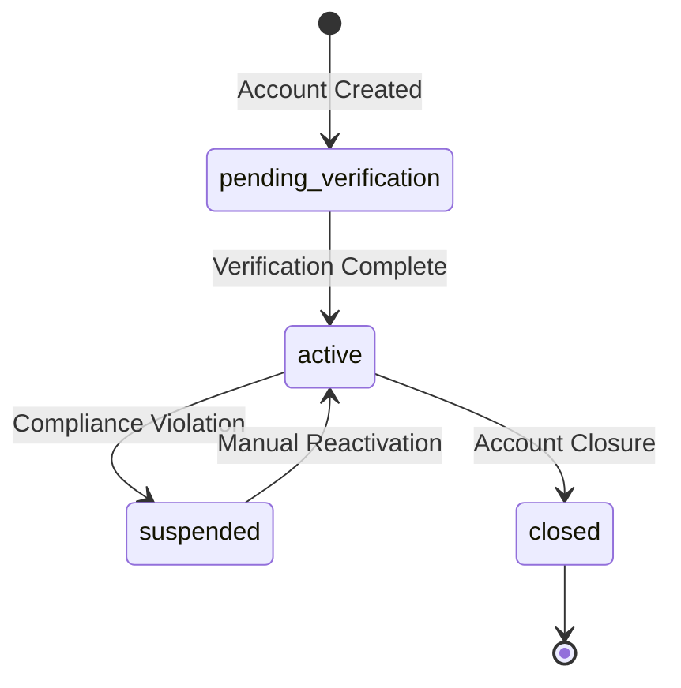
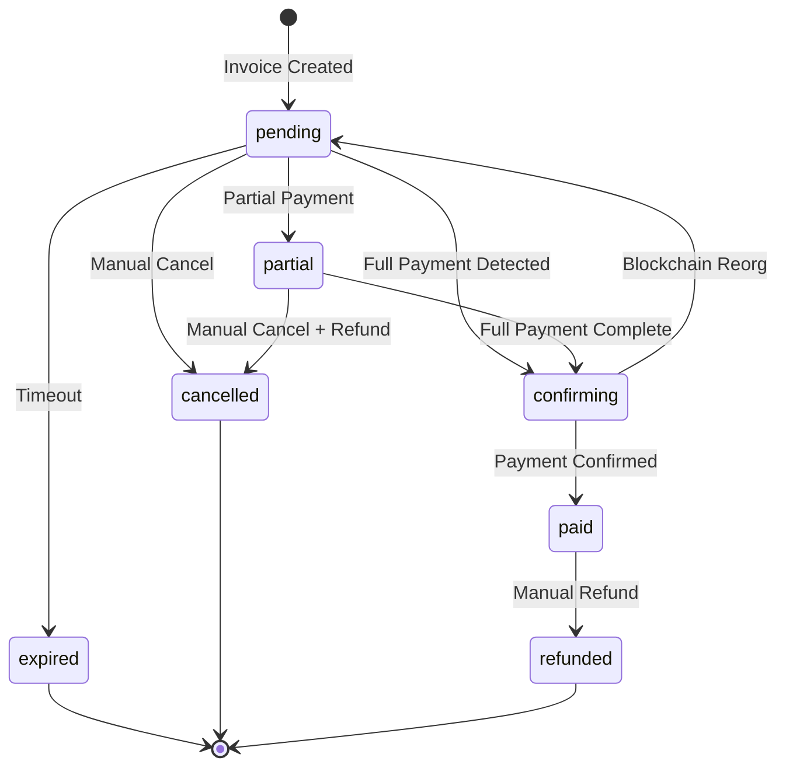
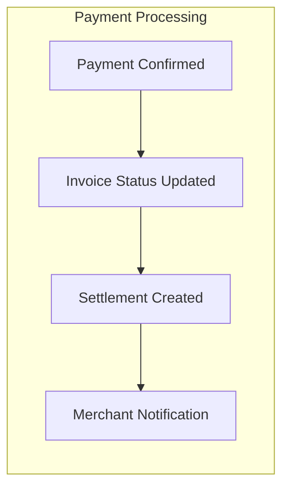
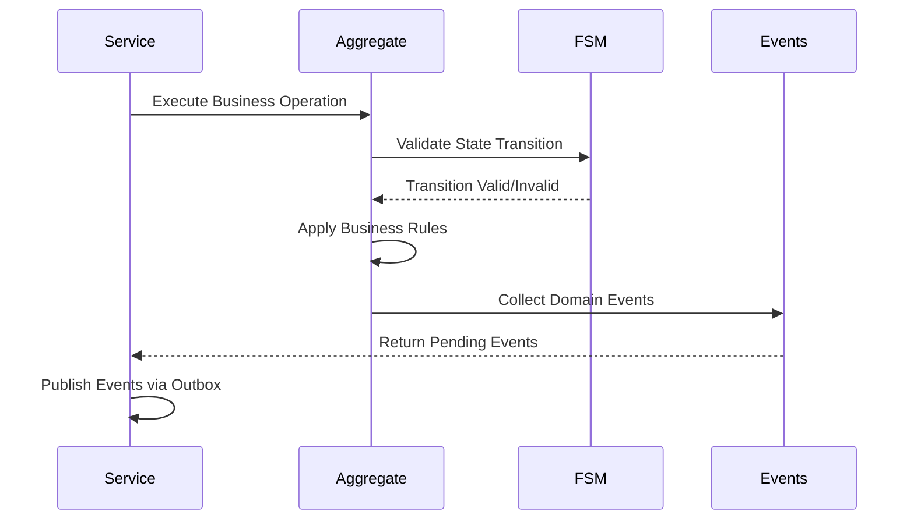
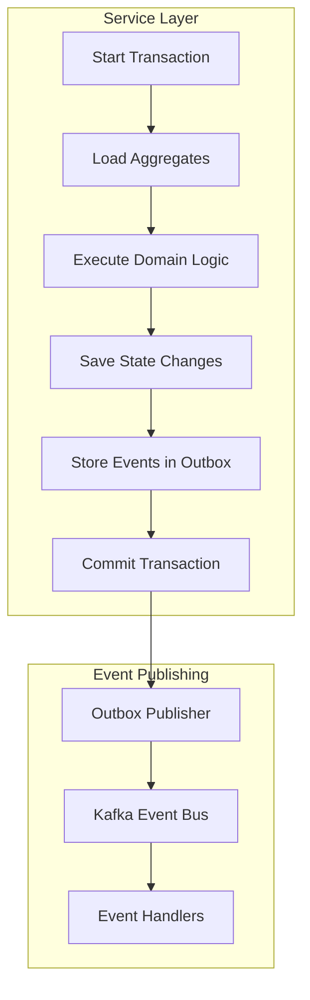

# Crypto Checkout Domain Model

- [Crypto Checkout Domain Model](#crypto-checkout-domain-model)
  - [Bounded Contexts](#bounded-contexts)
  - [Core Aggregates](#core-aggregates)
    - [1. Merchant Aggregate](#1-merchant-aggregate)
      - [Aggregate Root: Merchant](#aggregate-root-merchant)
      - [Merchant State Transitions](#merchant-state-transitions)
      - [Entities within Merchant Aggregate](#entities-within-merchant-aggregate)
      - [Business Rules - Merchant Aggregate](#business-rules---merchant-aggregate)
    - [2. Invoice Aggregate](#2-invoice-aggregate)
      - [Aggregate Root: Invoice](#aggregate-root-invoice)
      - [Invoice State Transitions](#invoice-state-transitions)
      - [Entities within Invoice Aggregate](#entities-within-invoice-aggregate)
      - [Business Rules - Invoice Aggregate](#business-rules---invoice-aggregate)
    - [3. Customer Aggregate](#3-customer-aggregate)
      - [Aggregate Root: Customer](#aggregate-root-customer)
      - [Entity: PaymentHistory](#entity-paymenthistory)
    - [4. SystemConfiguration Aggregate](#4-systemconfiguration-aggregate)
  - [Value Objects](#value-objects)
    - [Money](#money)
    - [PaymentAddress](#paymentaddress)
    - [ExchangeRate](#exchangerate)
    - [PaymentTolerance](#paymenttolerance)
    - [ConfirmationSettings](#confirmationsettings)
  - [Domain Events](#domain-events)
    - [Invoice Events](#invoice-events)
    - [Settlement Events](#settlement-events)
    - [Merchant Events](#merchant-events)
  - [Domain Services](#domain-services)
    - [PaymentReconciliationService](#paymentreconciliationservice)
    - [ExchangeRateService](#exchangerateservice)
    - [SettlementService](#settlementservice)
    - [MerchantOnboardingService](#merchantonboardingservice)
  - [Repository Interfaces](#repository-interfaces)
    - [Core Repository Operations](#core-repository-operations)
    - [Query Patterns](#query-patterns)
  - [Aggregate Relationships](#aggregate-relationships)
    - [Cross-Aggregate References](#cross-aggregate-references)
    - [Event-Driven Consistency Flow](#event-driven-consistency-flow)
  - [Domain Invariants](#domain-invariants)
    - [Global Invariants](#global-invariants)
    - [Business Logic Invariants](#business-logic-invariants)
  - [Implementation Patterns](#implementation-patterns)
    - [State Management Flow](#state-management-flow)
    - [Service Transaction Pattern](#service-transaction-pattern)

## Bounded Contexts

| Bounded Context         | Responsibility                                  | Core Aggregates                | Key Integration Points                |
| ----------------------- | ----------------------------------------------- | ------------------------------ | ------------------------------------- |
| **Merchant Management** | Business entity lifecycle, access control       | Merchant                       | Identity providers, billing systems   |
| **Payment Processing**  | Invoice creation, payment detection, settlement | Invoice, Payment               | Blockchain networks, webhook delivery |
| **Customer Management** | Customer sessions, payment history              | Customer                       | Merchant systems, analytics           |
| **Platform Operations** | Configuration, analytics, compliance            | SystemConfiguration, Analytics | External services, monitoring         |

---

## Core Aggregates

### 1. Merchant Aggregate

**Purpose**: Manages business entities, their access credentials, and platform fee configuration

#### Aggregate Root: Merchant

| Attribute        | Type             | Description               | Constraints                                           |
| ---------------- | ---------------- | ------------------------- | ----------------------------------------------------- |
| **ID**           | MerchantID       | Unique identifier         | UUID, immutable                                       |
| **BusinessName** | String           | Company/business name     | 2-255 characters, required                            |
| **ContactEmail** | String           | Primary contact email     | Valid email, unique                                   |
| **Status**       | MerchantStatus   | Current account status    | Enum: active, suspended, pending_verification, closed |
| **Settings**     | MerchantSettings | Configuration preferences | JSON object with fee settings                         |
| **CreatedAt**    | Timestamp        | Account creation time     | Immutable                                             |
| **UpdatedAt**    | Timestamp        | Last modification time    | Auto-updated                                          |

#### Merchant State Transitions

#### Entities within Merchant Aggregate

**ApiKey Entity**

| Attribute       | Type          | Description               | Constraints                    |
| --------------- | ------------- | ------------------------- | ------------------------------ |
| **ID**          | ApiKeyID      | Unique identifier         | UUID                           |
| **MerchantID**  | MerchantID    | Parent merchant reference | Foreign key                    |
| **KeyHash**     | String        | Hashed API key value      | SHA-256, unique                |
| **KeyType**     | KeyType       | Environment designation   | Enum: live, test               |
| **Permissions** | Permissions[] | Granted access rights     | Array of permission strings    |
| **Status**      | KeyStatus     | Current key status        | Enum: active, revoked, expired |
| **Name**        | String        | User-friendly identifier  | Optional, 1-100 characters     |
| **LastUsedAt**  | Timestamp     | Last request timestamp    | Nullable                       |
| **ExpiresAt**   | Timestamp     | Expiration date           | Nullable                       |

**WebhookEndpoint Entity**

| Attribute        | Type              | Description               | Constraints                    |
| ---------------- | ----------------- | ------------------------- | ------------------------------ |
| **ID**           | WebhookEndpointID | Unique identifier         | UUID                           |
| **MerchantID**   | MerchantID        | Parent merchant reference | Foreign key                    |
| **URL**          | String            | Webhook destination URL   | Valid HTTPS URL                |
| **Events**       | EventType[]       | Subscribed event types    | Array of event names           |
| **Secret**       | String            | HMAC signature secret     | Min 32 characters              |
| **Status**       | EndpointStatus    | Delivery status           | Enum: active, disabled, failed |
| **MaxRetries**   | Integer           | Retry attempt limit       | 1-10, default 5                |
| **RetryBackoff** | BackoffStrategy   | Retry timing strategy     | Enum: linear, exponential      |
| **Timeout**      | Duration          | Request timeout           | 5-60 seconds                   |

#### Business Rules - Merchant Aggregate

| Rule                     | Enforcement         | Description                                       |
| ------------------------ | ------------------- | ------------------------------------------------- |
| **Unique Email**         | Hard constraint     | Contact email must be unique across all merchants |
| **Fee Range**            | Business validation | Platform fee percentage must be 0.1% - 5.0%       |
| **Live Key Restriction** | Authorization       | Live API keys require active merchant status      |
| **Webhook Limits**       | Resource constraint | Maximum 5 webhook endpoints per merchant          |

### 2. Invoice Aggregate

**Purpose**: Manages payment requests through their complete lifecycle with automatic settlement

#### Aggregate Root: Invoice

| Attribute            | Type             | Description                 | Constraints                   |
| -------------------- | ---------------- | --------------------------- | ----------------------------- |
| **ID**               | InvoiceID        | Unique identifier           | UUID, immutable               |
| **MerchantID**       | MerchantID       | Owning merchant reference   | Foreign key, immutable        |
| **CustomerID**       | CustomerID       | Paying customer reference   | Optional foreign key          |
| **Title**            | String           | Invoice display title       | 1-255 characters              |
| **Description**      | String           | Invoice description         | Optional, max 1000 characters |
| **Items**            | InvoiceItem[]    | Line items                  | Min 1 item                    |
| **Subtotal**         | Money            | Pre-tax amount              | Positive value                |
| **Tax**              | Money            | Tax amount                  | Non-negative                  |
| **Total**            | Money            | Final amount                | Subtotal + Tax                |
| **Currency**         | String           | Fiat currency               | USD, EUR, etc.                |
| **CryptoCurrency**   | String           | Payment currency            | USDT only                     |
| **CryptoAmount**     | Money            | Locked exchange rate amount | Positive value                |
| **PaymentAddress**   | PaymentAddress   | Blockchain destination      | Generated, immutable          |
| **Status**           | InvoiceStatus    | Current lifecycle status    | State machine transitions     |
| **ExchangeRate**     | ExchangeRate     | Currency conversion rate    | Locked at creation            |
| **PaymentTolerance** | PaymentTolerance | Under/overpayment handling  | Configurable thresholds       |
| **ExpiresAt**        | Timestamp        | Invoice expiration          | Default 30 minutes            |
| **CreatedAt**        | Timestamp        | Creation time               | Immutable                     |
| **UpdatedAt**        | Timestamp        | Last status change          | Auto-updated                  |
| **PaidAt**           | Timestamp        | Payment completion time     | Nullable                      |

#### Invoice State Transitions

#### Entities within Invoice Aggregate

**Payment Entity**

| Attribute                 | Type          | Description                 | Constraints                |
| ------------------------- | ------------- | --------------------------- | -------------------------- |
| **ID**                    | PaymentID     | Unique identifier           | UUID                       |
| **InvoiceID**             | InvoiceID     | Parent invoice reference    | Foreign key                |
| **TxHash**                | String        | Blockchain transaction hash | Unique, immutable          |
| **Amount**                | Money         | Payment amount              | Positive value             |
| **FromAddress**           | String        | Sender blockchain address   | Validated format           |
| **ToAddress**             | String        | Recipient address           | Must match invoice address |
| **Status**                | PaymentStatus | Confirmation status         | State machine transitions  |
| **Confirmations**         | Integer       | Blockchain confirmations    | 0-N, increasing            |
| **RequiredConfirmations** | Integer       | Confirmations needed        | Based on amount            |
| **BlockNumber**           | Integer       | Block inclusion number      | Positive                   |
| **NetworkFee**            | Money         | Transaction fee paid        | Positive                   |
| **DetectedAt**            | Timestamp     | First detection time        | Immutable                  |
| **ConfirmedAt**           | Timestamp     | Confirmation time           | Nullable                   |

**Settlement Entity**

| Attribute             | Type             | Description              | Constraints                      |
| --------------------- | ---------------- | ------------------------ | -------------------------------- |
| **ID**                | SettlementID     | Unique identifier        | UUID                             |
| **InvoiceID**         | InvoiceID        | Parent invoice reference | Foreign key                      |
| **MerchantID**        | MerchantID       | Merchant reference       | Foreign key                      |
| **GrossAmount**       | Money            | Total customer payment   | Positive value                   |
| **PlatformFeeAmount** | Money            | Platform fee deducted    | Calculated amount                |
| **NetAmount**         | Money            | Amount to merchant       | GrossAmount - PlatformFeeAmount  |
| **FeePercentage**     | Decimal          | Applied fee rate         | From merchant settings           |
| **Status**            | SettlementStatus | Settlement status        | Enum: pending, completed, failed |
| **SettledAt**         | Timestamp        | Settlement completion    | Nullable                         |

#### Business Rules - Invoice Aggregate

| Rule                       | Description                                  | Enforcement              |
| -------------------------- | -------------------------------------------- | ------------------------ |
| **Amount Immutability**    | Once created, pricing cannot change          | Domain validation        |
| **Payment Sufficiency**    | Invoice paid when confirmed payments ≥ total | Event-driven calculation |
| **Expiration Protection**  | Partial payments prevent auto-expiration     | FSM validation           |
| **Exchange Rate Validity** | Rate must not be expired during creation     | Domain service           |
| **Settlement Calculation** | NetAmount = GrossAmount - PlatformFeeAmount  | Business logic           |

### 3. Customer Aggregate

**Purpose**: Manages customer payment sessions and transaction history per merchant

#### Aggregate Root: Customer

| Attribute      | Type           | Description               | Constraints                     |
| -------------- | -------------- | ------------------------- | ------------------------------- |
| **ID**         | CustomerID     | Unique identifier         | UUID                            |
| **MerchantID** | MerchantID     | Owning merchant reference | Foreign key                     |
| **Email**      | String         | Customer email address    | Valid email                     |
| **Status**     | CustomerStatus | Account status            | Enum: active, blocked, inactive |
| **Metadata**   | Map            | Custom merchant data      | JSON object                     |
| **CreatedAt**  | Timestamp      | Account creation time     | Immutable                       |
| **UpdatedAt**  | Timestamp      | Last modification time    | Auto-updated                    |
| **LastSeenAt** | Timestamp      | Last activity time        | Nullable                        |

#### Entity: PaymentHistory

| Attribute     | Type          | Description               | Constraints                    |
| ------------- | ------------- | ------------------------- | ------------------------------ |
| **InvoiceID** | InvoiceID     | Reference to paid invoice | Foreign key                    |
| **Amount**    | Money         | Payment amount            | Positive value                 |
| **Status**    | InvoiceStatus | Final invoice status      | Enum: paid, cancelled, expired |
| **PaidAt**    | Timestamp     | Payment completion time   | Nullable                       |
| **CreatedAt** | Timestamp     | Invoice creation time     | Immutable                      |

### 4. SystemConfiguration Aggregate

**Purpose**: Platform-wide settings and feature management

| Attribute                 | Type             | Description               | Constraints             |
| ------------------------- | ---------------- | ------------------------- | ----------------------- |
| **ID**                    | ConfigID         | Configuration identifier  | UUID                    |
| **ExchangeRateProviders** | ProviderConfig[] | Currency rate sources     | Min 1 provider          |
| **BlockchainNetworks**    | NetworkConfig[]  | Supported networks        | Min 1 network           |
| **PaymentSettings**       | PaymentSettings  | Global payment config     | Validation rules        |
| **SecuritySettings**      | SecuritySettings | Security policies         | Compliance requirements |
| **FeatureFlags**          | FeatureFlag[]    | Feature toggles           | Boolean flags           |
| **UpdatedAt**             | Timestamp        | Last configuration change | Auto-updated            |

---

## Value Objects

### Money

| Attribute    | Type     | Description     | Validation                     |
| ------------ | -------- | --------------- | ------------------------------ |
| **Amount**   | Decimal  | Monetary amount | Positive, max 2 decimal places |
| **Currency** | Currency | Currency code   | Enum: USD, EUR, USDT, etc.     |

**Behavior**: Addition, subtraction, currency conversion with exchange rates

### PaymentAddress

| Attribute     | Type              | Description           | Validation              |
| ------------- | ----------------- | --------------------- | ----------------------- |
| **Address**   | String            | Blockchain address    | Network-specific format |
| **Network**   | BlockchainNetwork | Blockchain network    | Enum: tron              |
| **Currency**  | String            | Currency type         | USDT                    |
| **CreatedAt** | Timestamp         | Address creation time | Immutable               |

**Behavior**: Address validation, expiration checking, QR code generation

### ExchangeRate

| Attribute        | Type           | Description     | Validation          |
| ---------------- | -------------- | --------------- | ------------------- |
| **Rate**         | Decimal        | Conversion rate | Positive value      |
| **FromCurrency** | Currency       | Source currency | Fiat currency       |
| **ToCurrency**   | CryptoCurrency | Target currency | Crypto currency     |
| **Source**       | String         | Rate provider   | Provider identifier |
| **LockedAt**     | Timestamp      | Rate lock time  | Immutable           |
| **ExpiresAt**    | Timestamp      | Rate expiration | Must be future      |

**Behavior**: Rate validation, expiration checking, amount conversion

### PaymentTolerance

| Attribute                 | Type              | Description                    | Validation                   |
| ------------------------- | ----------------- | ------------------------------ | ---------------------------- |
| **UnderpaymentThreshold** | Decimal           | Minimum acceptable shortfall   | 0-1.00                       |
| **OverpaymentThreshold**  | Decimal           | Maximum acceptable overpayment | 0-100.00                     |
| **OverpaymentAction**     | OverpaymentAction | Handling strategy              | Enum: credit, refund, donate |

**Behavior**: Payment amount validation, tolerance checking

### ConfirmationSettings

| Attribute               | Type    | Description                   | Validation       |
| ----------------------- | ------- | ----------------------------- | ---------------- |
| **MerchantOverride**    | Integer | Merchant-specific requirement | Optional, 1-50   |
| **DefaultSmallAmount**  | Integer | Default for <$100             | 1 confirmation   |
| **DefaultMediumAmount** | Integer | Default for $100-$10k         | 12 confirmations |
| **DefaultLargeAmount**  | Integer | Default for >$10k             | 19 confirmations |

**Logic**: Amount-based default with merchant override capability

---

## Domain Events

### Invoice Events

| Event                    | Trigger                   | Payload                       | Consumers              |
| ------------------------ | ------------------------- | ----------------------------- | ---------------------- |
| **InvoiceCreated**       | New invoice created       | InvoiceID, MerchantID, Amount | Analytics, Monitoring  |
| **PaymentDetected**      | Blockchain payment found  | PaymentID, Amount, TxHash     | Real-time UI, Webhooks |
| **InvoicePartiallyPaid** | Partial payment confirmed | InvoiceID, PartialAmount      | Payment tracking       |
| **InvoicePaid**          | Full payment confirmed    | InvoiceID, TotalReceived      | Settlement trigger     |
| **InvoiceExpired**       | Timeout reached           | InvoiceID, ExpiredAt          | Cleanup processes      |
| **InvoiceCancelled**     | Manual cancellation       | InvoiceID, Reason             | Webhooks, Analytics    |

### Settlement Events

| Event                    | Trigger           | Payload                          | Consumers             |
| ------------------------ | ----------------- | -------------------------------- | --------------------- |
| **SettlementCreated**    | Payment confirmed | SettlementID, GrossAmount        | Platform accounting   |
| **PlatformFeeCollected** | Fee calculation   | SettlementID, FeeAmount, FeeRate | Revenue tracking      |
| **SettlementCompleted**  | Payout processed  | SettlementID, NetAmount          | Merchant notification |
| **SettlementFailed**     | Payout failure    | SettlementID, FailureReason      | Operations alert      |

### Merchant Events

| Event                 | Trigger              | Payload                     | Consumers           |
| --------------------- | -------------------- | --------------------------- | ------------------- |
| **MerchantCreated**   | Account signup       | MerchantID, Settings        | Onboarding flow     |
| **ApiKeyGenerated**   | New API key          | ApiKeyID, Permissions       | Security monitoring |
| **SettingsUpdated**   | Configuration change | MerchantID, UpdatedSettings | Audit trail         |
| **MerchantSuspended** | Compliance action    | MerchantID, Reason          | Access control      |

---

## Domain Services

### PaymentReconciliationService

**Purpose**: Handles payment amount validation and tolerance logic

| Method                   | Purpose                 | Input                         | Output               |
| ------------------------ | ----------------------- | ----------------------------- | -------------------- |
| **ReconcilePayment**     | Validate payment amount | Invoice, Payment              | ReconciliationResult |
| **HandleOverpayment**    | Process excess payment  | Amount, Action                | ProcessingResult     |
| **ValidateUnderpayment** | Check minimum payment   | Required, Received, Tolerance | ValidationResult     |

**ReconciliationResult Structure**

| Field             | Type   | Description                       |
| ----------------- | ------ | --------------------------------- |
| **Status**        | String | "sufficient", "partial", "excess" |
| **ExcessAmount**  | Money  | Amount over requirement           |
| **DeficitAmount** | Money  | Amount under requirement          |
| **Action**        | String | Recommended action                |

### ExchangeRateService

**Purpose**: Currency conversion with rate locking

| Method            | Purpose                 | Input                | Output       |
| ----------------- | ----------------------- | -------------------- | ------------ |
| **GetLockedRate** | Retrieve rate with lock | From, To, Duration   | ExchangeRate |
| **ConvertAmount** | Currency conversion     | Amount, ExchangeRate | Money        |
| **ValidateRate**  | Check rate validity     | ExchangeRate         | Boolean      |

### SettlementService

**Purpose**: Platform fee calculation and merchant payouts

| Method                   | Purpose                    | Input                      | Output       |
| ------------------------ | -------------------------- | -------------------------- | ------------ |
| **CreateSettlement**     | Generate settlement record | Invoice, Payment, Merchant | Settlement   |
| **CalculatePlatformFee** | Compute platform fee       | GrossAmount, FeePercentage | Money        |
| **ProcessPayout**        | Execute merchant payout    | Settlement                 | PayoutResult |

**PayoutResult Structure**

| Field             | Type      | Description                 |
| ----------------- | --------- | --------------------------- |
| **Success**       | Boolean   | Payout success status       |
| **PayoutTxHash**  | String    | Blockchain transaction hash |
| **FailureReason** | String    | Error description if failed |
| **ProcessedAt**   | Timestamp | Processing completion time  |

### MerchantOnboardingService

**Purpose**: New merchant account setup

| Method                      | Purpose                  | Input                 | Output             |
| --------------------------- | ------------------------ | --------------------- | ------------------ |
| **CreateMerchant**          | New merchant signup      | CreateMerchantRequest | Merchant           |
| **GenerateInitialApiKey**   | Create first API key     | Merchant, Permissions | ApiKey             |
| **SendWelcomeNotification** | Onboarding communication | Merchant, ApiKey      | NotificationResult |

---

## Repository Interfaces

### Core Repository Operations

| Repository               | Primary Entity | Key Methods                         | Caching Strategy     |
| ------------------------ | -------------- | ----------------------------------- | -------------------- |
| **MerchantRepository**   | Merchant       | FindByID, FindByEmail, Save         | Redis 5min TTL       |
| **InvoiceRepository**    | Invoice        | FindByID, FindByMerchant, Save      | Redis 1min TTL       |
| **PaymentRepository**    | Payment        | FindByTxHash, FindByInvoice, Save   | No cache (real-time) |
| **SettlementRepository** | Settlement     | FindByInvoice, FindByMerchant, Save | Redis 5min TTL       |

### Query Patterns

| Query Type            | Example             | Index Requirements                 | Performance Target |
| --------------------- | ------------------- | ---------------------------------- | ------------------ |
| **Point Lookups**     | Invoice by ID       | Primary key                        | <10ms              |
| **Range Queries**     | Invoices by date    | Composite: merchant_id, created_at | <100ms             |
| **Search Queries**    | Invoice text search | Full-text index                    | <500ms             |
| **Analytics Queries** | Revenue by period   | Time-series index                  | <2000ms            |

---

## Aggregate Relationships

### Cross-Aggregate References

| Referencing Aggregate | Referenced Aggregate | Reference Type        | Consistency Model                    |
| --------------------- | -------------------- | --------------------- | ------------------------------------ |
| **Invoice**           | **Merchant**         | MerchantID            | Eventually consistent                |
| **Invoice**           | **Customer**         | CustomerID (optional) | Eventually consistent                |
| **Payment**           | **Invoice**          | InvoiceID             | Strongly consistent (same aggregate) |
| **Settlement**        | **Invoice**          | InvoiceID             | Eventually consistent                |
| **Settlement**        | **Merchant**         | MerchantID            | Eventually consistent                |

### Event-Driven Consistency Flow

---

## Domain Invariants

### Global Invariants

| Invariant            | Description                                 | Enforcement               |
| -------------------- | ------------------------------------------- | ------------------------- |
| **Positive Amounts** | All monetary amounts must be positive       | Value object validation   |
| **Unique Emails**    | Merchant contact emails must be unique      | Repository constraint     |
| **Valid Addresses**  | Payment addresses must match network format | Domain service validation |
| **Rate Expiration**  | Exchange rates must not be expired          | Business rule enforcement |

### Business Logic Invariants

| Aggregate      | Invariant                                       | Enforcement              |
| -------------- | ----------------------------------------------- | ------------------------ |
| **Invoice**    | Total = Subtotal + Tax                          | Value object validation  |
| **Payment**    | Confirmations ≥ 0 and ≤ network maximum         | Entity validation        |
| **Settlement** | NetAmount = GrossAmount - PlatformFeeAmount     | Business logic           |
| **Settlement** | PlatformFeeAmount = GrossAmount × FeePercentage | Calculation validation   |
| **Merchant**   | Platform fee must be 0.1% - 5.0%                | Business rule validation |

---

## Implementation Patterns

### State Management Flow

### Service Transaction Pattern

This domain model provides a comprehensive foundation for the Crypto Checkout platform, ensuring proper separation of concerns, event-driven consistency, and robust business rule enforcement while supporting the near-real-time settlement requirements.