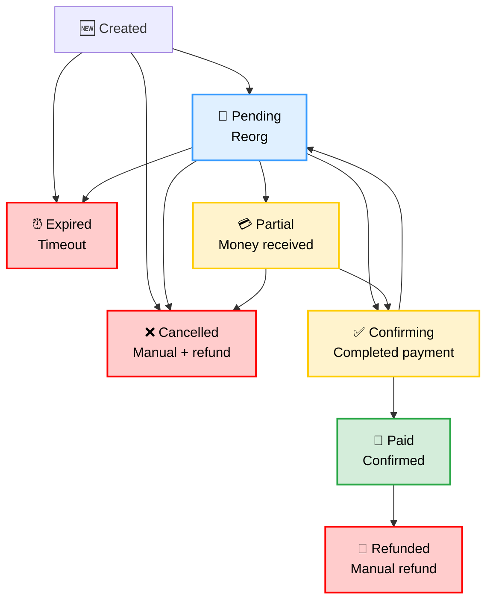

# Invoice Status Management

- [Invoice Status Management](#invoice-status-management)
  - [Overview](#overview)
  - [Status Definitions](#status-definitions)
  - [State Transitions](#state-transitions)
    - [Valid Transitions](#valid-transitions)
    - [Forbidden Transitions](#forbidden-transitions)
  - [Transition Triggers](#transition-triggers)
    - [Automatic Triggers](#automatic-triggers)
    - [Manual Triggers](#manual-triggers)
  - [Business Rules](#business-rules)
    - [Money Protection Rules](#money-protection-rules)
    - [Timeout Behavior](#timeout-behavior)
    - [Error Handling](#error-handling)
  - [Customer Communication](#customer-communication)
    - [Status Messages](#status-messages)
    - [Notification Points](#notification-points)
  - [Monitoring \& Alerting](#monitoring--alerting)
    - [Key Metrics](#key-metrics)
    - [Alerts](#alerts)

## Overview

Crypto Checkout uses a finite state machine (FSM) pattern to manage invoice statuses, ensuring valid state transitions and preventing business logic errors. Each invoice follows a predictable lifecycle from creation to completion.

## Status Definitions

| Status       | Description                                             | User-Facing Display        | Notes                    |
| ------------ | ------------------------------------------------------- | -------------------------- | ------------------------ |
| `created`    | Invoice just created, not yet viewed                    | "Processing..."            | Internal state only      |
| `pending`    | Waiting for payment                                     | "Pending Payment"          | Customer can pay         |
| `partial`    | Partial payment received                                | "Partial Payment Received" | Requires completion      |
| `confirming` | Full payment received, awaiting blockchain confirmation | "Confirming Payment..."    | Usually 1-3 minutes      |
| `paid`       | Payment fully confirmed                                 | "Payment Successful"       | ✅ Terminal success state |
| `expired`    | Invoice expired without payment                         | "Expired"                  | ❌ Terminal failure state |
| `cancelled`  | Manually cancelled                                      | "Cancelled"                | ❌ Terminal failure state |
| `refunded`   | Payment refunded after completion                       | "Refunded"                 | ❌ Terminal state         |

## State Transitions



### Valid Transitions

```
created → pending     (customer viewed invoice)
created → expired     (timeout without viewing)
created → cancelled   (manual cancellation)

pending → partial     (partial payment received)
pending → confirming  (full payment received)
pending → expired     (timeout without payment)
pending → cancelled   (manual cancellation)

partial → confirming  (remaining payment received)
partial → cancelled   (manual cancellation + refund)

confirming → paid     (blockchain confirmation received)
confirming → pending  (blockchain reorganization)

paid → refunded       (manual refund processed)
```

### Forbidden Transitions

**❌ `partial → expired`**
- **Why forbidden**: Customer already sent money
- **Business rule**: Never automatically expire invoices with received funds
- **Resolution**: Manual intervention required (refund or completion)

**❌ Direct transitions to terminal states**
- Must follow proper lifecycle
- Example: `created` cannot go directly to `paid`

**❌ Transitions from terminal states**
- `expired`, `cancelled`, `refunded` are final
- Only `paid` can transition (to `refunded`)

## Transition Triggers

### Automatic Triggers

| Trigger                   | From Status          | To Status    | Condition            |
| ------------------------- | -------------------- | ------------ | -------------------- |
| Customer views invoice    | `created`            | `pending`    | First page load      |
| Payment timeout           | `created`, `pending` | `expired`    | 30 minutes default   |
| Partial payment detected  | `pending`            | `partial`    | Amount < total       |
| Full payment detected     | `pending`, `partial` | `confirming` | Amount ≥ total       |
| Blockchain confirmation   | `confirming`         | `paid`       | 1+ confirmations     |
| Blockchain reorganization | `confirming`         | `pending`    | Chain reorg detected |

### Manual Triggers

| Action           | Available From                  | To Status   | Access Level   |
| ---------------- | ------------------------------- | ----------- | -------------- |
| Cancel invoice   | `created`, `pending`, `partial` | `cancelled` | Admin/Merchant |
| Process refund   | `paid`                          | `refunded`  | Admin only     |
| Force completion | `partial`                       | `paid`      | Admin only     |

## Business Rules

### Money Protection Rules
1. **Partial payments never expire automatically** - protects customer funds
2. **Confirming payments can revert** - handles blockchain reorganizations
3. **Terminal states are final** - except `paid → refunded` for business needs

### Timeout Behavior
- **Created invoices**: 30 minutes to first view
- **Pending invoices**: 30 minutes to receive payment  
- **Partial invoices**: No automatic timeout (manual intervention required)
- **Confirming invoices**: Wait indefinitely for blockchain confirmation

### Error Handling
- **Invalid transitions**: Return error, don't change state
- **Race conditions**: Use database transactions for state changes
- **Audit trail**: Log all state changes with timestamp and reason

## Customer Communication

### Status Messages
- `pending`: "Send exact amount to complete payment"
- `partial`: "Partial payment received. Send remaining amount to complete."
- `confirming`: "Payment received! Confirming on blockchain..."
- `paid`: "Payment confirmed! Thank you for your purchase."
- `expired`: "Payment window expired. Please request a new invoice."

### Notification Points
- ✅ **Send webhook** on: `confirming`, `paid`, `expired`
- ⚠️ **Manual handling** for: `partial`, `cancelled`
- 📧 **Customer email** on: `paid`, `expired` (if configured)

## Monitoring & Alerting

### Key Metrics

| Metric                                | Formula / Definition                      | Why It Matters                                            |
| ------------------------------------- | ----------------------------------------- | --------------------------------------------------------- |
| **Customer conversion rate**          | `paid / (paid + expired)`                 | Tracks how often customers complete payment after viewing |
| **Overall success rate**              | `paid / (paid + expired + cancelled)`     | Measures true business success including manual cancels   |
| **Unviewed rate**                     | `expired(created) / created`              | Detects invoices that were never opened by customers      |
| **Viewed abandonment rate**           | `expired(pending) / pending`              | Detects customers who viewed invoice but did not pay      |
| **Partial payment rate**              | `partial / (partial + confirming + paid)` | Identifies underpayment issues or poor wallet UX          |
| **Median confirmation time**          | `median(confirming → paid)`               | Typical blockchain confirmation delay                     |
| **95th percentile confirmation time** | `p95(confirming → paid)`                  | Outlier cases, useful for SLA monitoring                  |

### Alerts

- 🚨 **High priority**
  - **Stuck confirmations**: Invoices in `confirming` > **1 hour** → possible blockchain congestion or system issue
  - **Unviewed spike**: `unviewed rate` > **20%** of created invoices in last 15 min → integration issue (customers not receiving invoice links)

- ⚠️ **Medium priority**
  - **High abandonment**: `viewed abandonment rate` > **30%** in last 1 hour → checkout UX or network fee issues
  - **Partial surge**: `partial payment rate` > **5%** sustained for 30 min → customers underpaying, likely wallet rounding/UX error
  - **Slow confirmations**: Median `confirming → paid` > **10 min** or p95 > **30 min** → possible blockchain/network issue

- 📊 **Low priority**
  - **Conversion drop**: Customer conversion rate falls below **70%** (short-term) or **80%** (daily average)
  - **Success drop**: Overall success rate below **90%** → too many cancels/expired
  - **Trend monitoring**: Gradual increase in abandonment rate over 24h → signals creeping UX or fee problems
  - Median confirmation time significantly higher than usual
