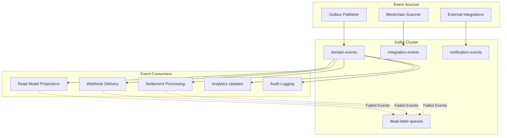
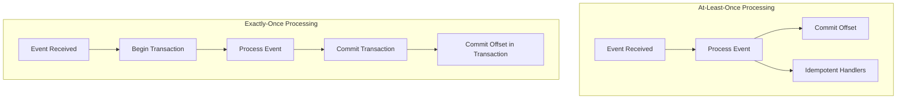
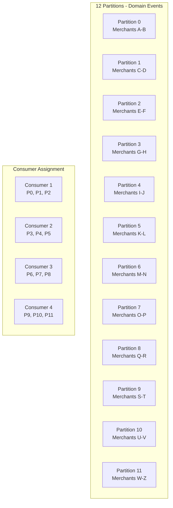
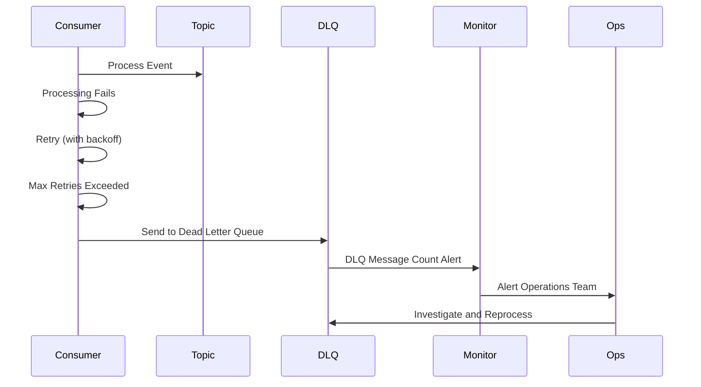

# Crypto Checkout - Kafka Event Bus Configuration

- [Crypto Checkout - Kafka Event Bus Configuration](#crypto-checkout---kafka-event-bus-configuration)
  - [Architecture Role](#architecture-role)
  - [Kafka Cluster Configuration](#kafka-cluster-configuration)
    - [Environment Specifications](#environment-specifications)
    - [Cluster Settings](#cluster-settings)
  - [Topic Design Strategy](#topic-design-strategy)
    - [Core Topics](#core-topics)
    - [Dead Letter Topics](#dead-letter-topics)
    - [Topic Naming Convention](#topic-naming-convention)
  - [Event Schema Design](#event-schema-design)
    - [Domain Event Structure](#domain-event-structure)
    - [Event Types by Aggregate](#event-types-by-aggregate)
    - [Event Payload Examples](#event-payload-examples)
  - [Consumer Group Strategy](#consumer-group-strategy)
    - [Consumer Group Configuration](#consumer-group-configuration)
    - [Consumer Processing Models](#consumer-processing-models)
    - [Consumer Configuration Settings](#consumer-configuration-settings)
  - [Partitioning Strategy](#partitioning-strategy)
    - [Partition Key Selection](#partition-key-selection)
    - [Partition Distribution](#partition-distribution)
  - [Delivery Guarantees](#delivery-guarantees)
    - [Producer Configuration](#producer-configuration)
    - [Idempotency Strategy](#idempotency-strategy)
  - [Error Handling \& Dead Letter Queues](#error-handling--dead-letter-queues)
    - [Error Classification](#error-classification)
    - [Retry Configuration](#retry-configuration)
    - [DLQ Processing Flow](#dlq-processing-flow)
  - [Monitoring \& Alerting](#monitoring--alerting)
    - [Key Metrics](#key-metrics)
    - [Consumer Group Monitoring](#consumer-group-monitoring)
    - [Operational Dashboards](#operational-dashboards)
  - [Operational Procedures](#operational-procedures)
    - [Topic Management](#topic-management)
    - [Consumer Group Management](#consumer-group-management)
    - [Disaster Recovery](#disaster-recovery)

## Architecture Role



---

## Kafka Cluster Configuration

### Environment Specifications

| Environment     | Brokers | Replication Factor | Min In-Sync Replicas | Retention | Purpose             |
| --------------- | ------- | ------------------ | -------------------- | --------- | ------------------- |
| **Development** | 1       | 1                  | 1                    | 7 days    | Local development   |
| **Staging**     | 3       | 3                  | 2                    | 14 days   | Integration testing |
| **Production**  | 3       | 3                  | 2                    | 30 days   | Live system         |
| **DR**          | 3       | 3                  | 2                    | 30 days   | Disaster recovery   |

### Cluster Settings

| Configuration           | Development  | Production       | Reasoning                                       |
| ----------------------- | ------------ | ---------------- | ----------------------------------------------- |
| **Compression**         | None         | LZ4              | Network efficiency in production                |
| **Cleanup Policy**      | Delete       | Delete + Compact | Event log + state snapshots                     |
| **Segment Size**        | 100MB        | 1GB              | Smaller segments for dev, larger for production |
| **Log Retention Hours** | 168 (7 days) | 720 (30 days)    | Compliance and debugging needs                  |
| **Max Message Size**    | 1MB          | 1MB              | Event payload size limit                        |

---

## Topic Design Strategy

### Core Topics

| Topic Name                              | Partitions | Purpose                    | Key Strategy   | Retention |
| --------------------------------------- | ---------- | -------------------------- | -------------- | --------- |
| **crypto-checkout.domain-events**       | 12         | All business domain events | Aggregate ID   | 30 days   |
| **crypto-checkout.integration-events**  | 6          | External system events     | Source system  | 14 days   |
| **crypto-checkout.notification-events** | 6          | Email/SMS/webhook events   | Recipient ID   | 7 days    |
| **crypto-checkout.analytics-events**    | 3          | Metrics and reporting      | Date partition | 90 days   |

### Dead Letter Topics

| Topic Name                                  | Purpose                        | Source Topics       | Retention |
| ------------------------------------------- | ------------------------------ | ------------------- | --------- |
| **crypto-checkout.domain-events.dlq**       | Failed domain event processing | domain-events       | 30 days   |
| **crypto-checkout.integration-events.dlq**  | Failed integration processing  | integration-events  | 14 days   |
| **crypto-checkout.notification-events.dlq** | Failed notification delivery   | notification-events | 7 days    |

### Topic Naming Convention

**Pattern**: `{system}.{context}.{event-type}`

**Examples**:
- `crypto-checkout.domain-events` - Core business events
- `crypto-checkout.integration-events` - External system events
- `crypto-checkout.notification-events` - Communication events
- `crypto-checkout.analytics-events` - Metrics and reporting

---

## Event Schema Design

### Domain Event Structure

| Field              | Type    | Description             | Required |
| ------------------ | ------- | ----------------------- | -------- |
| **event_id**       | UUID    | Unique event identifier | Yes      |
| **aggregate_id**   | UUID    | Source aggregate ID     | Yes      |
| **aggregate_type** | String  | Type of aggregate       | Yes      |
| **event_type**     | String  | Type of event           | Yes      |
| **event_version**  | Integer | Event schema version    | Yes      |
| **event_data**     | JSON    | Event payload           | Yes      |
| **metadata**       | JSON    | Context information     | Yes      |
| **timestamp**      | ISO8601 | Event occurrence time   | Yes      |
| **correlation_id** | UUID    | Request correlation     | No       |
| **causation_id**   | UUID    | Causing event ID        | No       |

### Event Types by Aggregate

| Aggregate      | Event Types                                                         | Partition Key |
| -------------- | ------------------------------------------------------------------- | ------------- |
| **Invoice**    | InvoiceCreated, InvoiceExpired, InvoicePaid, InvoiceCancelled       | invoice_id    |
| **Payment**    | PaymentDetected, PaymentConfirming, PaymentConfirmed, PaymentFailed | invoice_id    |
| **Settlement** | SettlementCreated, SettlementCompleted, SettlementFailed            | merchant_id   |
| **Merchant**   | MerchantCreated, MerchantSuspended, SettingsUpdated                 | merchant_id   |

### Event Payload Examples

**InvoiceCreated Event**:
```json
{
  "event_id": "evt_123",
  "aggregate_id": "inv_456", 
  "aggregate_type": "Invoice",
  "event_type": "InvoiceCreated",
  "event_version": 1,
  "event_data": {
    "merchant_id": "mer_789",
    "total_amount": 16.49,
    "currency": "USD",
    "crypto_amount": 16.49,
    "crypto_currency": "USDT",
    "expires_at": "2025-01-15T10:30:00Z"
  },
  "metadata": {
    "actor": "api_key:sk_live_abc123",
    "ip_address": "192.168.1.100",
    "user_agent": "MyApp/1.0",
    "request_id": "req_xyz789"
  },
  "timestamp": "2025-01-15T10:00:00Z",
  "correlation_id": "corr_abc123"
}
```

**SettlementCompleted Event**:
```json
{
  "event_id": "evt_456",
  "aggregate_id": "set_789",
  "aggregate_type": "Settlement", 
  "event_type": "SettlementCompleted",
  "event_version": 1,
  "event_data": {
    "invoice_id": "inv_456",
    "merchant_id": "mer_789",
    "gross_amount": 16.49,
    "platform_fee_amount": 0.16,
    "net_amount": 16.33,
    "fee_percentage": 1.0,
    "settled_at": "2025-01-15T10:18:30Z"
  },
  "metadata": {
    "actor": "system:settlement-processor",
    "source": "payment-confirmation"
  },
  "timestamp": "2025-01-15T10:18:30Z",
  "causation_id": "evt_123"
}
```

---

## Consumer Group Strategy

### Consumer Group Configuration

| Consumer Group             | Topics                          | Consumers | Processing Guarantee | Purpose                |
| -------------------------- | ------------------------------- | --------- | -------------------- | ---------------------- |
| **read-model-projections** | domain-events                   | 4         | At-least-once        | Update read models     |
| **webhook-delivery**       | domain-events                   | 2         | At-least-once        | Send merchant webhooks |
| **settlement-processing**  | domain-events                   | 2         | Exactly-once         | Process settlements    |
| **analytics-aggregation**  | domain-events, analytics-events | 1         | Exactly-once         | Update metrics         |
| **audit-logging**          | domain-events                   | 1         | At-least-once        | Compliance logging     |
| **notification-delivery**  | notification-events             | 3         | At-least-once        | Email/SMS delivery     |

### Consumer Processing Models



### Consumer Configuration Settings

| Setting                | Read Models | Webhooks | Settlement | Analytics |
| ---------------------- | ----------- | -------- | ---------- | --------- |
| **Auto Commit**        | false       | false    | false      | false     |
| **Batch Size**         | 500         | 100      | 50         | 1000      |
| **Max Poll Records**   | 500         | 100      | 50         | 1000      |
| **Session Timeout**    | 30s         | 30s      | 45s        | 60s       |
| **Heartbeat Interval** | 3s          | 3s       | 3s         | 3s        |
| **Retry Backoff**      | 100ms       | 1s       | 500ms      | 100ms     |

---

## Partitioning Strategy

### Partition Key Selection

| Event Type            | Partition Key | Reasoning                           |
| --------------------- | ------------- | ----------------------------------- |
| **Invoice Events**    | invoice_id    | Event ordering per invoice          |
| **Payment Events**    | invoice_id    | Payment events follow invoice order |
| **Settlement Events** | merchant_id   | Merchant-specific processing        |
| **Merchant Events**   | merchant_id   | Merchant state consistency          |

### Partition Distribution



---

## Delivery Guarantees

### Producer Configuration

| Setting                                   | Value      | Purpose                       |
| ----------------------------------------- | ---------- | ----------------------------- |
| **acks**                                  | all (-1)   | Wait for all in-sync replicas |
| **retries**                               | 2147483647 | Maximum retry attempts        |
| **max.in.flight.requests.per.connection** | 5          | Ordering with retries         |
| **enable.idempotence**                    | true       | Prevent duplicate messages    |
| **compression.type**                      | lz4        | Network efficiency            |
| **batch.size**                            | 16384      | Batch efficiency              |
| **linger.ms**                             | 10         | Batch latency                 |

### Idempotency Strategy

| Consumer Type   | Idempotency Method  | Implementation                |
| --------------- | ------------------- | ----------------------------- |
| **Read Models** | Upsert operations   | Database UPSERT with event_id |
| **Webhooks**    | Delivery tracking   | webhook_deliveries table      |
| **Settlements** | Transaction ID      | Unique settlement per invoice |
| **Analytics**   | Event deduplication | Processed event tracking      |

---

## Error Handling & Dead Letter Queues

### Error Classification

| Error Type                | Handling Strategy              | Destination       |
| ------------------------- | ------------------------------ | ----------------- |
| **Transient Errors**      | Retry with exponential backoff | Same topic        |
| **Schema Errors**         | Log and skip                   | Dead letter queue |
| **Business Logic Errors** | Retry limited times, then DLQ  | Dead letter queue |
| **Infrastructure Errors** | Circuit breaker, then retry    | Same topic        |

### Retry Configuration

| Consumer Group             | Max Retries | Backoff Strategy                   | DLQ Threshold |
| -------------------------- | ----------- | ---------------------------------- | ------------- |
| **read-model-projections** | 3           | Exponential (1s, 2s, 4s)           | 3 failures    |
| **webhook-delivery**       | 5           | Exponential (2s, 4s, 8s, 16s, 32s) | 5 failures    |
| **settlement-processing**  | 10          | Linear (5s intervals)              | 10 failures   |
| **analytics-aggregation**  | 2           | Fixed (10s)                        | 2 failures    |

### DLQ Processing Flow



---

## Monitoring & Alerting

### Key Metrics

| Metric Category  | Metrics                            | Alert Thresholds    |
| ---------------- | ---------------------------------- | ------------------- |
| **Throughput**   | Messages per second per topic      | < 100/sec sustained |
| **Latency**      | End-to-end processing time         | > 5 seconds p95     |
| **Consumer Lag** | Messages behind per consumer group | > 1000 messages     |
| **Error Rate**   | Failed message processing rate     | > 1% of messages    |
| **DLQ Volume**   | Messages in dead letter queues     | > 10 messages/hour  |

### Consumer Group Monitoring

| Consumer Group             | Lag Alert       | Processing Time Alert | Error Rate Alert |
| -------------------------- | --------------- | --------------------- | ---------------- |
| **read-model-projections** | > 500 messages  | > 2 seconds           | > 0.5%           |
| **webhook-delivery**       | > 100 messages  | > 10 seconds          | > 2%             |
| **settlement-processing**  | > 10 messages   | > 30 seconds          | > 0.1%           |
| **analytics-aggregation**  | > 1000 messages | > 60 seconds          | > 1%             |

### Operational Dashboards

**Kafka Cluster Health**:
- Broker availability and disk usage
- Topic partition distribution
- Replication lag across brokers
- Network throughput and errors

**Event Processing Health**:
- Consumer group lag by topic
- Processing rate per consumer group
- Error rate and DLQ volume
- End-to-end latency metrics

---

## Operational Procedures

### Topic Management

| Operation             | Procedure                | Automation Level |
| --------------------- | ------------------------ | ---------------- |
| **Topic Creation**    | Infrastructure as Code   | Fully automated  |
| **Partition Scaling** | Manual approval required | Semi-automated   |
| **Retention Changes** | Configuration management | Automated        |
| **Topic Deletion**    | Manual process only      | Manual           |

### Consumer Group Management

| Operation                 | Procedure                     | Frequency      |
| ------------------------- | ----------------------------- | -------------- |
| **Lag Monitoring**        | Automated alerts              | Continuous     |
| **Partition Rebalancing** | Automatic on consumer changes | As needed      |
| **Offset Reset**          | Manual operation only         | Emergency only |
| **Consumer Scaling**      | Deployment pipeline           | On demand      |

### Disaster Recovery

| Scenario                  | Recovery Procedure     | RTO          | RPO          |
| ------------------------- | ---------------------- | ------------ | ------------ |
| **Single Broker Failure** | Automatic failover     | < 30 seconds | 0            |
| **Cluster Failure**       | Failover to DR cluster | < 5 minutes  | < 30 seconds |
| **Data Center Outage**    | Cross-region failover  | < 15 minutes | < 2 minutes  |
| **Topic Corruption**      | Restore from backup    | < 2 hours    | < 15 minutes |

This Kafka configuration supports the Event Sourcing + CQRS architecture with reliable event delivery, proper partitioning for scale, comprehensive monitoring, and robust error handling for a payment processing platform.