# Payment Status Management

## Overview

While invoice statuses track business logic, payment statuses track individual blockchain transactions. One invoice can have multiple payments (partial payments, overpayments), each with their own blockchain lifecycle.

## Payment vs Invoice Status

| Aspect        | Payment Status                    | Invoice Status                    |
| ------------- | --------------------------------- | --------------------------------- |
| **Scope**     | Individual transaction            | Overall invoice state             |
| **Lifecycle** | Blockchain confirmation           | Business workflow                 |
| **Count**     | Multiple per invoice              | One per invoice                   |
| **Concerns**  | Technical (confirmations, reorgs) | Business (completion, expiration) |

## Payment Status Definitions

| Status       | Description                           | Confirmations | Duration               | Notes                 |
| ------------ | ------------------------------------- | ------------- | ---------------------- | --------------------- |
| `detected`   | Transaction found in mempool or block | 0             | 0-15 seconds           | Not yet confirmed     |
| `confirming` | Transaction included in block         | 1-11          | 15 seconds - 3 minutes | Gaining confirmations |
| `confirmed`  | Sufficient confirmations received     | 12+           | Permanent              | ✅ Final success state |
| `failed`     | Transaction failed or reverted        | N/A           | Permanent              | ❌ Technical failure   |
| `orphaned`   | Block containing tx was orphaned      | N/A           | Temporary              | Reverts to `detected` |

## Payment State Transitions

```mermaid
stateDiagram-v2
    [*] --> detected: 👀 Transaction found
    
    detected --> confirming: ⛓ Included in block
    detected --> failed: ❌ Transaction invalid
    
    confirming --> confirmed: ✅ Sufficient confirmations
    confirming --> orphaned: 🔄 Block reorg / orphaned
    confirming --> failed: ❌ Transaction reverted
    
    orphaned --> detected: ⏪ Back to mempool
    orphaned --> failed: 🗑 Dropped permanently
    
    confirmed --> [*]: 🎉 Final state
    failed --> [*]: ❌ Final state
    
    %% Styling
    classDef success fill:#d4edda,stroke:#155724,stroke-width:2px
    classDef failure fill:#f8d7da,stroke:#721c24,stroke-width:2px
    classDef temporary fill:#fff3cd,stroke:#856404,stroke-width:2px
    classDef processing fill:#cce5ff,stroke:#004085,stroke-width:2px
    
    class confirmed success
    class failed failure
    class orphaned temporary
    class detected,confirming processing
    
    state confirmed <<terminal>>
    state failed <<terminal>>
```



### Valid Transitions

```
detected → confirming    (included in block)
detected → failed        (transaction failed)

confirming → confirmed   (sufficient confirmations)
confirming → orphaned    (block orphaned)
confirming → failed      (transaction reverted)

orphaned → detected      (transaction back in mempool)
orphaned → failed        (transaction dropped)
```

### Forbidden Transitions

**❌ From terminal states**
- `confirmed` and `failed` are final
- `orphaned` is temporary and must transition

**❌ Skipping confirmation process**
- Cannot go directly `detected → confirmed`
- Must gain confirmations incrementally

## Confirmation Requirements

### Tron Network (TRC-20 USDT)

| Confirmation Level | Blocks | Time  | Use Case                |
| ------------------ | ------ | ----- | ----------------------- |
| **Detected**       | 0      | 0s    | Show "payment detected" |
| **Safe**           | 1      | ~15s  | Small amounts (<$100)   |
| **Secure**         | 12     | ~3min | Standard amounts        |
| **Final**          | 19     | ~5min | Large amounts (>$10k)   |

```go
const (
    MinConfirmationsSmall  = 1   // <$100
    MinConfirmationsStandard = 12  // $100-$10k  
    MinConfirmationsLarge  = 19  // >$10k
)

func GetRequiredConfirmations(amount decimal.Decimal) int {
    if amount.LessThan(decimal.NewFromInt(100)) {
        return MinConfirmationsSmall
    }
    if amount.LessThan(decimal.NewFromInt(10000)) {
        return MinConfirmationsStandard
    }
    return MinConfirmationsLarge
}
```

## Monitoring & Alerts

### Payment-Specific Metrics

| Metric                  | Description                         | Alert Threshold |
| ----------------------- | ----------------------------------- | --------------- |
| **Confirmation Time**   | Average time `detected → confirmed` | >10 minutes     |
| **Failed Payment Rate** | `failed` / total payments           | >5%             |
| **Orphaned Block Rate** | `orphaned` payments frequency       | >1%             |
| **Stuck Payments**      | Payments in `confirming` >1 hour    | Any occurrence  |


## Payment Processing Flow

### 1. Transaction Detection
```
Blockchain Scanner → Payment.detected → Invoice.partial/confirming
```

### 2. Confirmation Tracking
```
Block Scanner → Payment.confirmations++ → Check thresholds
```

### 3. Final Confirmation
```
Payment.confirmed → Invoice.paid → Webhook notification
```

### 4. Failure Handling
```
Payment.failed → Remove from invoice calculations → Update invoice status
```

This dual-status system (invoice + payment) provides complete visibility into both business workflow and technical blockchain status, enabling precise payment tracking and reliable invoice completion detection.