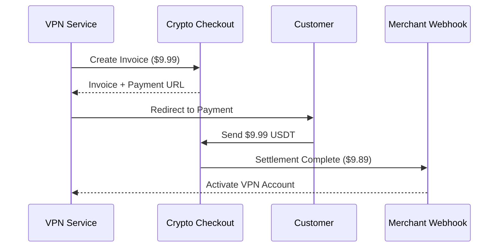

# Crypto Checkout User Scenarios & Domain Operations

- [Crypto Checkout User Scenarios \& Domain Operations](#crypto-checkout-user-scenarios--domain-operations)
  - [Merchant Scenarios](#merchant-scenarios)
    - [1. Merchant Onboarding](#1-merchant-onboarding)
    - [2. Adjust Platform Fee Rate](#2-adjust-platform-fee-rate)
    - [3. View Settlement Dashboard](#3-view-settlement-dashboard)
  - [Customer Payment Scenarios](#customer-payment-scenarios)
    - [4. Successful Payment with Real-time Settlement](#4-successful-payment-with-real-time-settlement)
    - [5. Partial Payment Handling](#5-partial-payment-handling)
  - [Developer Integration Scenarios](#developer-integration-scenarios)
    - [6. E-commerce Integration](#6-e-commerce-integration)
    - [7. Settlement Reporting API](#7-settlement-reporting-api)
  - [Platform Administrator Scenarios](#platform-administrator-scenarios)
    - [8. Revenue Analytics Dashboard](#8-revenue-analytics-dashboard)
    - [9. Failed Settlement Recovery](#9-failed-settlement-recovery)
  - [Error \& Edge Case Scenarios](#error--edge-case-scenarios)
    - [10. Exchange Rate Expiration](#10-exchange-rate-expiration)
    - [11. Settlement Failure Cascade](#11-settlement-failure-cascade)

## Merchant Scenarios

### 1. Merchant Onboarding

**Scenario**: New VPN service provider registers for crypto payment processing

**User Journey**:
1. **Merchant visits platform** and clicks "Sign Up"
2. **Fills registration form** with business details
3. **System creates merchant account** with default 1% platform fee
4. **Initial API key generated** automatically
5. **Welcome email sent** with getting started guide

**Domain Operations**:
- Create merchant account with default settings
- Generate initial API key with invoice permissions
- Send welcome notification with integration guide
- Collect platform fee configuration (1% default)

**Events Emitted**:
- `MerchantCreated` with merchant ID and settings
- `ApiKeyGenerated` with key ID and permissions
- `WelcomeNotificationSent` for onboarding tracking

**Outcome**: Merchant ready to integrate with API key and documentation

---

### 2. Adjust Platform Fee Rate

**Scenario**: Platform admin negotiates custom fee rate with high-volume merchant

**User Journey**:
1. **Admin reviews merchant volume** (>$100k/month)
2. **Negotiates reduced rate** from 1% to 0.7%
3. **Updates merchant settings** in admin panel
4. **Merchant receives notification** of new rate
5. **New rate applies to future settlements**

**Domain Operations**:
- Validate new fee rate within allowed range (0.1% - 5.0%)
- Update merchant settings with custom fee percentage
- Notify merchant of rate change
- Apply new rate to all future settlements

**Events Emitted**:
- `SettingsUpdated` with merchant ID and new fee rate
- `FeeRateNegotiated` for admin audit trail
- `MerchantNotified` for communication tracking

**Outcome**: Merchant receives reduced fee rate, improving their profit margins

---

### 3. View Settlement Dashboard

**Scenario**: Merchant checks earnings and fee breakdown

**User Journey**:
1. **Merchant logs into dashboard**
2. **Views settlements page** with fee breakdown
3. **Sees gross/fee/net amounts** for each payment
4. **Downloads settlement report** for accounting
5. **Reviews platform fee percentage**

**Domain Operations**:
- Retrieve settlement history for merchant
- Calculate total gross amount, fees collected, net payouts
- Generate fee breakdown showing platform commission
- Provide downloadable reports for accounting

**Data Displayed**:
- Gross Amount: Total customer payments
- Platform Fee: Amount deducted (1% default)
- Net Amount: Actual merchant payout
- Settlement success rate and timing metrics

**Outcome**: Merchant has full transparency into fee structure and earnings

---

## Customer Payment Scenarios

### 4. Successful Payment with Real-time Settlement

**Scenario**: Customer pays $9.99 for VPN subscription, settlement processed immediately

**User Journey**:
1. **Customer visits payment page** from merchant redirect
2. **Scans QR code** and sends $9.99 USDT
3. **Payment detected** on blockchain
4. **Payment confirmed** after sufficient confirmations
5. **Settlement created** automatically
6. **Platform deducts 1% fee** ($0.10)
7. **Merchant receives $9.89** within 30 seconds
8. **Customer redirected** to success page

**Domain Operations**:
- Payment confirmation triggers settlement creation
- Calculate platform fee: $9.99 × 1% = $0.10
- Calculate net amount: $9.99 - $0.10 = $9.89
- Process real-time payout to merchant
- Update invoice status to paid

**Settlement Calculation**:
| Component        | Amount | Description            |
| ---------------- | ------ | ---------------------- |
| **Gross Amount** | $9.99  | Customer payment       |
| **Platform Fee** | $0.10  | 1% platform commission |
| **Net Amount**   | $9.89  | Merchant receives      |

**Events Emitted**:
- `PaymentConfirmed` with payment details
- `InvoicePaid` with total received
- `SettlementCreated` with gross amount
- `PlatformFeeCollected` with fee amount
- `SettlementCompleted` with net payout

**Outcome**: Customer completes payment, merchant receives funds minus platform fee

---

### 5. Partial Payment Handling

**Scenario**: Customer sends $5.00 instead of $9.99, then completes payment

**User Journey**:
1. **First payment detected** ($5.00 USDT)
2. **Invoice status updated** to "partial"
3. **Customer sees progress** (50% paid)
4. **Second payment sent** ($4.99 USDT)
5. **Total payment confirmed** ($9.99 total)
6. **Settlement processed** for full amount

**Domain Operations**:
- First payment updates invoice to partial status
- Track payment progress (received vs required)
- Second payment completes the invoice
- Create settlement for total received amount
- Apply platform fee to full $9.99

**Payment Timeline**:

```mermaid
gantt
    title Payment Timeline
    dateFormat  HH:mm
    axisFormat %H:%M
    
    section Payment 1
    Payment detected    :10:00, 10:01
    Confirmations       :10:01, 10:03
    
    section Payment 2  
    Payment detected    :10:15, 10:16
    Confirmations       :10:16, 10:18
    Settlement          :10:18, 10:19
```

**Events Emitted**:
- `PaymentDetected` for first $5.00 payment
- `InvoicePartiallyPaid` with partial amount
- `PaymentDetected` for second $4.99 payment
- `InvoicePaid` with total $9.99 received
- `SettlementCompleted` with $9.89 net amount

**Outcome**: Customer can pay in multiple transactions, merchant still receives full amount minus platform fee

---

## Developer Integration Scenarios

### 6. E-commerce Integration

**Scenario**: VPN service integrates payment processing into their checkout flow

**User Journey**:
1. **Customer completes VPN signup** on merchant site
2. **Merchant backend calls API** to create invoice
3. **Customer redirected** to payment page
4. **Payment processed** and settled
5. **Webhook delivered** to merchant
6. **VPN account activated** automatically

**Integration Steps**:
1. **Invoice Creation**: Merchant calls `POST /api/v1/invoices`
2. **Exchange Rate Lock**: System locks USD/USDT rate for 30 minutes
3. **Payment Address**: Generate unique Tron address for payment
4. **Customer Redirect**: Send customer to payment page URL
5. **Webhook Delivery**: Notify merchant when settlement completes

**API Flow**:

**Events Emitted**:
- `InvoiceCreated` with merchant and amount details
- `PaymentDetected` with blockchain transaction
- `SettlementCompleted` with net payout
- `WebhookDelivered` for integration tracking

**Outcome**: Seamless integration allowing automatic account activation upon payment

---

### 7. Settlement Reporting API

**Scenario**: Merchant queries settlement data for accounting integration

**User Journey**:
1. **Accounting system calls API** monthly
2. **Requests settlement data** with date range
3. **Receives detailed breakdown** of all transactions
4. **Processes fee information** for tax reporting
5. **Reconciles payments** with gross/net amounts

**API Endpoints Used**:
- `GET /api/v1/settlements` - List settlements with filters
- `GET /api/v1/analytics` - Aggregate metrics and summaries
- Response includes complete fee breakdown for accounting

**Settlement Report Structure**:
| Field                   | Value     | Purpose                      |
| ----------------------- | --------- | ---------------------------- |
| **Total Gross Volume**  | $2,500.00 | Customer payments received   |
| **Total Platform Fees** | $25.00    | Platform commission (1%)     |
| **Total Net Payouts**   | $2,475.00 | Actual merchant earnings     |
| **Transaction Count**   | 250       | Number of completed payments |
| **Average Fee Rate**    | 1.0%      | Effective commission rate    |

**Outcome**: Merchant has detailed financial data for tax reporting and accounting

---

## Platform Administrator Scenarios

### 8. Revenue Analytics Dashboard

**Scenario**: Platform admin monitors revenue and merchant performance

**User Journey**:
1. **Admin accesses analytics** dashboard
2. **Views platform fee collection** by time period
3. **Analyzes merchant volume** and fee rates
4. **Identifies high-volume merchants** for rate negotiation
5. **Tracks settlement success rates**

**Analytics Metrics**:
| Metric                      | Value      | Insight                   |
| --------------------------- | ---------- | ------------------------- |
| **Total Platform Revenue**  | $10,000    | Monthly fee collection    |
| **Total Merchant Volume**   | $1,000,000 | Gross payment volume      |
| **Average Fee Rate**        | 1.0%       | Effective commission rate |
| **Settlement Success Rate** | 99.8%      | System reliability        |
| **Active Merchants**        | 1,250      | Platform growth           |

**High-Volume Merchant Analysis**:
- Merchants with >$100k monthly volume
- Current fee rates vs suggested rates
- Revenue impact of rate negotiations
- Growth opportunities and retention

**Outcome**: Platform admin can optimize fee structures and identify growth opportunities

---

### 9. Failed Settlement Recovery

**Scenario**: Admin handles failed settlement and retry processing

**User Journey**:
1. **Settlement fails** due to wallet issue
2. **Alert sent** to operations team
3. **Admin investigates** payout failure
4. **Updates merchant wallet** address
5. **Retries settlement** manually

**Failure Scenarios**:
| Failure Type             | Cause                  | Resolution               |
| ------------------------ | ---------------------- | ------------------------ |
| **Insufficient Balance** | Platform wallet empty  | Refill hot wallet        |
| **Invalid Address**      | Merchant address error | Update merchant settings |
| **Network Congestion**   | Blockchain overload    | Retry with higher fee    |
| **Technical Error**      | System malfunction     | Manual intervention      |

**Recovery Process**:
1. **Identify Root Cause**: Analyze failure reason
2. **Resolve Issue**: Fix underlying problem
3. **Retry Settlement**: Process failed payouts
4. **Verify Success**: Confirm merchant received funds
5. **Update Status**: Mark settlement as completed

**Events Emitted**:
- `SettlementFailed` with failure reason
- `SettlementRetried` for tracking attempts
- `SettlementCompleted` upon successful recovery

**Outcome**: Failed settlements recovered, merchants receive their payouts

---

## Error & Edge Case Scenarios

### 10. Exchange Rate Expiration

**Scenario**: Exchange rate expires during payment process

**User Journey**:
1. **Invoice created** with 30-minute rate lock
2. **Customer delays payment** beyond expiry
3. **Rate expires** while payment in transit
4. **System detects expired rate**
5. **Payment processed** with tolerance check

**Rate Expiration Handling**:
- Check current USD/USDT rate against locked rate
- Apply payment tolerance thresholds (±1% default)
- Accept payment if within tolerance range
- Handle overpayment according to merchant settings

**Tolerance Calculation**:
| Scenario           | Expected | Received | Action                     |
| ------------------ | -------- | -------- | -------------------------- |
| **Rate Increased** | $9.99    | $10.50   | Accept (within tolerance)  |
| **Rate Decreased** | $9.99    | $9.50    | Accept (within tolerance)  |
| **Major Change**   | $9.99    | $12.00   | Requires merchant approval |

**Events Emitted**:
- `ExchangeRateExpired` with old and new rates
- `PaymentReconciled` with tolerance application
- `OverpaymentHandled` if customer sent excess

**Outcome**: Payment processed despite rate changes, with appropriate tolerance handling

---

### 11. Settlement Failure Cascade

**Scenario**: Multiple settlements fail due to platform wallet issue

**User Journey**:
1. **Platform hot wallet** runs out of funds
2. **Multiple settlements fail** simultaneously
3. **Monitoring alerts** operations team
4. **Hot wallet refilled** from cold storage
5. **Failed settlements retried** in batch

**Cascade Impact**:
- 50+ settlements fail within 10 minutes
- Total value: $50,000 in merchant payouts
- Immediate alert to operations team
- Automatic retry queue management

**Recovery Timeline**:

```mermaid
gantt
    title Settlement Recovery Timeline
    dateFormat  HH:mm
    axisFormat %H:%M
    
    section Failure
    Settlements fail    :09:00, 09:10
    Alerts triggered    :09:10, 09:15
    
    section Recovery
    Investigation       :09:15, 09:30
    Wallet refill       :09:30, 09:45
    Batch retry         :09:45, 10:00
    Verification        :10:00, 10:15
```

**Batch Recovery Process**:
1. **Identify Failed Settlements**: Query all failed status
2. **Group by Failure Type**: Wallet vs network vs other
3. **Resolve Root Cause**: Refill wallet, fix network
4. **Batch Retry**: Process all failed settlements
5. **Monitor Success**: Verify all payouts completed

**Events Emitted**:
- `BatchSettlementFailure` with failure count
- `PlatformWalletRefilled` for operations tracking
- `BatchSettlementRetryCompleted` with success/failure counts

**Outcome**: All failed settlements recovered, merchants receive delayed but complete payouts

---
